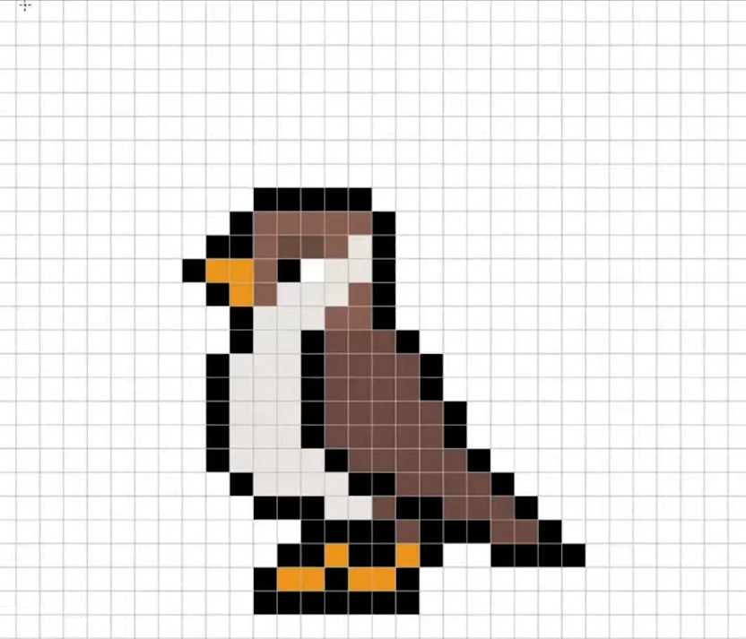
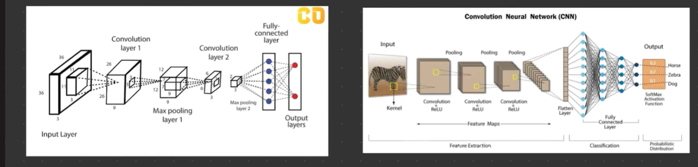
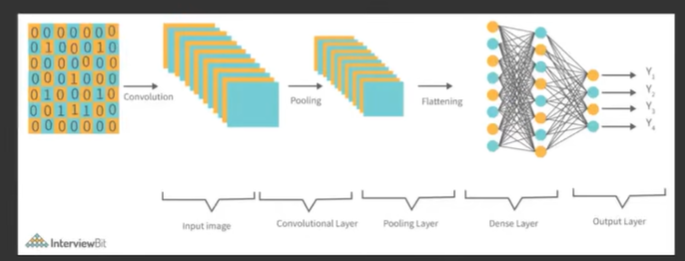
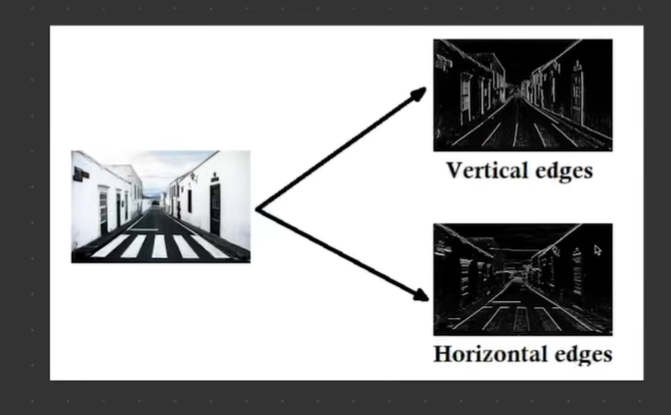
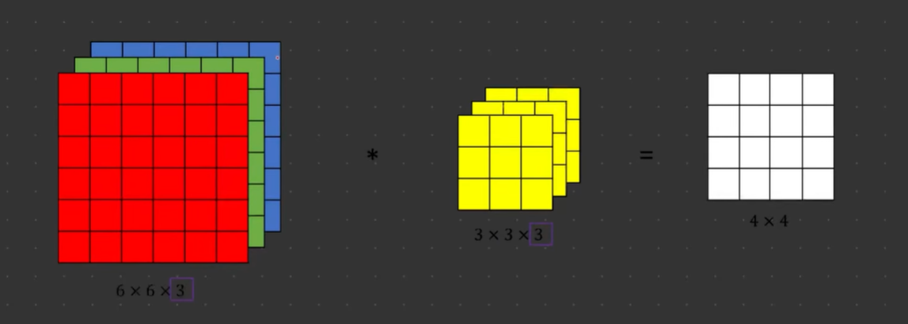
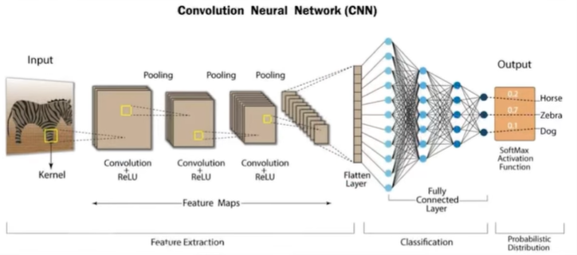
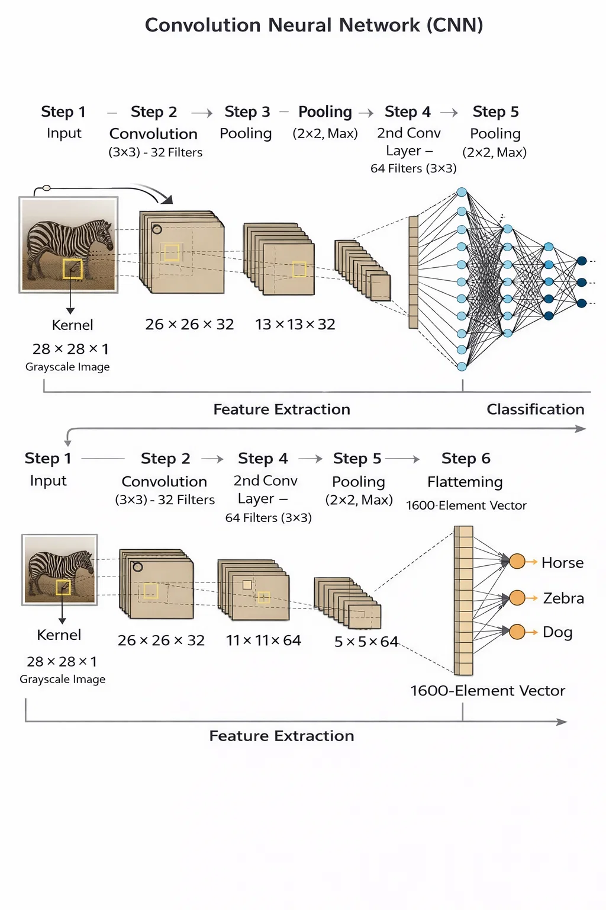

# Convolutional Neural Network (CNN) — Notes

---

## 1. Why Can't We Just Use an ANN for Images?

Before we understand what a CNN is, we need to understand why a regular ANN (the kind we built before) breaks down completely when dealing with images.



An image is just a grid of pixels. Each pixel has a value — for a grayscale image it's a number between 0 (black) and 255 (white). For a colour image, each pixel has 3 values (Red, Green, Blue).

So a tiny **28×28 grayscale image** (like the handwritten digit images we use later) gives you:

```
28 × 28 = 784 pixels
```

Each pixel becomes one input neuron. Not too bad yet.

But now imagine a regular photo. A **200×200 colour image**:

```
200 × 200 × 3 (RGB channels) = 120,000 inputs
```

If the first hidden layer has just 1,000 neurons:

```
120,000 inputs × 1,000 neurons = 120,000,000 weights to learn
```

That is 120 million weights — just in the first layer alone.

### The 3 Big Problems with using ANN on images

**Problem 1 — Too many weights (high computational cost)**

As we just saw, even a medium-sized image creates an insane number of weights. Training becomes very slow and expensive. A modern high-resolution photo would be completely impractical.

**Problem 2 — Spatial arrangement is lost**

When an ANN takes an image as input, it flattens the whole grid into one long line of numbers:

```
Original image (3×3):          Flattened input to ANN:
  [10, 20, 30]
  [40, 50, 60]    →   [10, 20, 30, 40, 50, 60, 70, 80, 90]
  [70, 80, 90]
```

The moment you flatten it, the network loses all spatial information — it no longer knows that pixel 1 and pixel 2 were next to each other, or that pixel 1 and pixel 4 were directly above and below each other. Neighbours that were close together in the image are treated the same as pixels that were far apart. A cat's ear could be anywhere in the flattened list — the ANN has no idea.

**Problem 3 — Overfitting**

With 120 million weights, the ANN has way more "memory" than it needs. Instead of learning real patterns (e.g., "pointy ears = cat"), it just memorises every training image by heart. When you show it a new image it's never seen, it guesses wrong. This is called **overfitting** — the model is too good at training data and bad at everything else.

---

## 2. How Does a Computer Even See an Image? (Grayscale vs Colour)

Before we get into how CNNs work, we need to understand what an image actually looks like to a computer — because it doesn't "see" pictures the way we do. It only sees numbers.

### Grayscale Images — One number per pixel

A grayscale image is just black, white, and every shade of grey in between. There's no colour involved.

For every single pixel, the computer stores **one number** — ranging from 0 to 255:

```
0   = completely black
255 = completely white
128 = medium grey (right in the middle)
```

So a grayscale image is essentially a **2D grid of numbers**:

```
Grayscale image (5×5 patch, simplified):
  0    0   50   0    0
  0   80  255  80    0
 50  255  255  255  50
  0   80  255  80    0
  0    0   50   0    0
```

That patch would look like a bright white diamond shape on a dark background.

The whole image is just that — a big grid. A 28×28 image is a grid of 28 rows and 28 columns, giving **784 numbers total**. That's the entire image as far as the computer is concerned.

```
Grayscale image structure:
  Width × Height × 1 channel

  28 × 28 × 1 = 784 numbers
```




The "1 channel" just means there is one number per pixel (the brightness). Only one thing to track per pixel.

---

### Colour Images — Three numbers per pixel (RGB)

Now add colour. Every colour you see on screen is made by mixing three things: **Red, Green, and Blue** — this is called **RGB**.

Your eyes work the same way — you have three types of colour-sensing cells (cones) that detect red, green, and blue light, and your brain mixes them to produce every colour you see.

So for a colour image, every single pixel now has **three numbers** instead of one:

```
One pixel of colour:
  Red   = 255   (full red)
  Green = 0     (no green)
  Blue  = 0     (no blue)
  → That pixel is bright red

Another pixel:
  Red   = 255
  Green = 165
  Blue  = 0
  → That pixel is orange

Another pixel:
  Red   = 0
  Green = 0
  Blue  = 255
  → That pixel is bright blue
```

So a colour image has **3 layers stacked on top of each other** — one layer of red values, one layer of green values, one layer of blue values. These layers are called **channels**.

```
Colour image structure:
  Width × Height × 3 channels

  28 × 28 × 3 = 2,352 numbers  (same size image, 3× more data)
```

Visualising those 3 channels:

```
Red channel:      Green channel:    Blue channel:
  255  200  10      0   50  10       0   0  200
  180  255  30      20  80  50       0   0  180
  ...               ...              ...

→ All 3 stacked together = the full colour image
```

Each channel is its own grid of numbers from 0–255, and the three grids together represent the complete colour picture.

---

### What this means for the CNN

When a CNN processes a grayscale image, it has **1 grid** to look at per pixel position. When it processes a colour image, it has **3 grids** to look at per pixel position (red, green, blue).

The filter (the small sliding window we'll talk about next) adjusts for this automatically:

```
Grayscale:  filter is 3×3×1  →  9 numbers in the filter
Colour:     filter is 3×3×3  →  27 numbers in the filter
                                  (one set per colour channel)
```

The filter scans all three colour channels at once and combines them into one feature map output. From that point on, the CNN works the same way regardless of whether the input was grayscale or colour.

---

## 3. What Actually Is a CNN?

Think about how **you** look at a photo. You don't stare at all 120,000 pixels at once and somehow absorb the whole thing in one go. You scan small areas — you notice a pair of eyes, then a nose, then whiskers — and your brain slowly pieces together "that's a cat."

**That's exactly how a CNN works.**

A CNN looks at small patches of the image at a time, finds clues in those patches, and then slowly builds up the full picture from those clues. It doesn't need to look at every pixel independently — it reuses the same small scanner again and again across the whole image.

```
Human looking at an image:
  "I see pointy ears..." + "I see whiskers..." + "I see fur..." → "It's a cat!"

CNN looking at an image:
  Scans patch 1 → edge found
  Scans patch 2 → curve found
  Scans patch 3 → texture found  →  "70% cat, 20% dog, 10% rabbit"
  ...
```

A CNN has four main steps:

```
Input Image
     ↓
Convolutional Layer  ←  scans the image for features (edges, shapes)
     ↓
Pooling Layer        ←  shrinks the data, keeps only the important bits
     ↓
(Repeat the above a few times)
     ↓
Fully Connected Layer  ←  makes the final decision (like a regular ANN)
     ↓
Output (class probabilities)
```

---

## 3. Step 1 — The Convolutional Layer (The Detective with a Magnifying Glass)

This is the heart of a CNN.

Imagine you have a **magnifying glass** that you slide slowly across a photo. As you do, you're looking for specific things — maybe you're trained to spot edges, or curves, or a particular texture. That magnifying glass is called a **filter** (also called a **kernel**).

### How a Filter Works

A filter is just a tiny grid of numbers — typically **3×3**. It slides across your image, one small patch at a time. At each position, it does a simple multiplication: every number in the filter is multiplied by the matching pixel under it, then all the results are added up into one number.

```
Image patch:              Filter (3×3):          Result:
  1  2  3                  1  0  1
  4  5  6      ×           0  1  0      →  (sum of all multiplications) = one number
  7  8  9                  1  0  1
```

This single result number tells you "how much does this patch of the image match what this filter is looking for?"

The filter slides across the entire image — left to right, top to bottom — producing a new smaller grid of numbers. This output grid is called a **feature map** (or activation map). It shows where in the image the filter found its pattern.

```
Original Image    →    Feature Map (one filter slides across)
  (28 × 28)                (26 × 26)   ← slightly smaller because the filter needs room to slide
```

### You Use Many Filters at Once

You don't just use one filter. You use maybe 32 or 64 filters all at once, each trained to look for something different:

```
Filter 1  →  looks for horizontal edges
Filter 2  →  looks for vertical edges
Filter 3  →  looks for diagonal lines
Filter 4  →  looks for curved shapes
...
Filter 32 →  looks for some complex texture
```

Each filter produces its own feature map. So if you have 32 filters, you get 32 feature maps — one per filter. Together, they describe the image in terms of "where are the edges, where are the curves, where is that texture."

**Key point:** the filter is reused across the entire image. The same 3×3 filter scans every patch — this is why CNNs need far fewer weights than ANNs. You don't need a separate weight for every pixel in every position. One filter is 9 numbers (3×3) — and it covers the whole image.

---

## 4. Step 2 — The Pooling Layer (The "Good Enough" Shortcut)

After the convolutional layer finds features, we have a lot of data — 32 feature maps of size 26×26 for example. We don't need all of that detail. We just need to know "was this feature present in this region?" — not the exact pixel position.

**Pooling shrinks the feature maps down while keeping the most important information.**

### Max Pooling (most common type)

You take a small 2×2 window and slide it across the feature map. In each window, you keep only the **maximum value** and throw away the rest.

```
Feature Map (4×4):                After Max Pooling (2×2 window):

  1   3   2   4                         3   4
  5   6   1   2     →  (take max)       6   8
  7   2   8   3
  1   4   2   6
```

You went from a 4×4 grid (16 numbers) to a 2×2 grid (4 numbers). Half the size, but the biggest values — the strongest signals — are preserved.

### Why is this useful?

- **Reduces size** — less data to process in the next layer
- **Makes it robust to small shifts** — if a feature is slightly to the left or right in one image vs another, max pooling still captures it. The exact pixel location doesn't matter, just whether the feature was present.
- **Reduces overfitting** — fewer numbers = less chance of memorising noise

---

## 5. Step 3 — Stacking Layers (Simple → Complex)

A real CNN doesn't just have one conv layer and one pooling layer. It stacks several of them. This is where CNNs become powerful.

**Every single conv layer is always followed by a pooling layer.** That pairing (Conv → Pool) is the standard building block. You stack as many of these pairs as you need.

### Layer 1 always does edge detection — primitive features

The very first convolutional layer only ever learns the most basic things: **edges**. Horizontal edges, vertical edges, diagonal edges, colour boundaries. That's it. Nothing more complex than a line or a border.

This is not a coincidence — it happens in every CNN, on every dataset. The first layer always picks up these primitive features because edges are the most basic information hiding inside any image.

```
Layer 1 (Conv + Pool):  Primitive features
  → horizontal edges, vertical edges, diagonal lines, colour blobs

  Conv Layer 1 → "I found a horizontal edge here, a vertical edge there"
  Pool Layer 1 → shrink it down, keep the strongest edge signals
```

### Layer 2 merges edges into better features

Now that the network knows where the edges are, the second layer combines those edges to build something more meaningful. When a horizontal edge meets a vertical edge, that's a corner. Two curves meeting make a circle. Multiple edges together form a shape.

**Layer 2 takes the primitive edges from Layer 1 and merges them into richer features.**

```
Layer 2 (Conv + Pool):  Edges merged → shapes
  → corners, curves, simple textures, blobs with structure

  Conv Layer 2 → "I see a corner here (where two edges from Layer 1 met)"
  Pool Layer 2 → shrink again, keep the important shape signals
```

### And it keeps going — each layer builds on the last

```
Layer 3 (Conv + Pool):  Shapes merged → object parts
  → eyes, ears, wheels, windows, wings

Layer 4 (Conv + Pool):  Object parts merged → whole objects
  → face, car, aeroplane
```

It's like building with LEGO — first you make individual bricks (edges), then combine them into walls (shapes), then those walls become a house (object). Each layer builds on what the previous layer found.

```
Input Image
     ↓
Conv Layer 1 + ReLU  →  [edges, lines]              → feature maps (32 filters)
     ↓
Pooling Layer 1      →  [smaller, edge signals kept]
     ↓
Conv Layer 2 + ReLU  →  [edges merged → shapes]     → feature maps (64 filters)
     ↓
Pooling Layer 2      →  [smaller, shape signals kept]
     ↓
Conv Layer 3 + ReLU  →  [shapes merged → object parts] → feature maps (128 filters)
     ↓
Pooling Layer 3      →  [compact representation]
     ↓
     ...
```

By the end of all the conv/pooling pairs, the network has compressed the image into a small but rich set of numbers that describe everything meaningful — from the primitive edges in Layer 1 all the way up to full object parts in the deeper layers.

---

## 6. Step 4 — The Fully Connected Layer (The Decision Maker)

After all the convolution and pooling, the CNN has extracted the important features. Now it needs to make a decision: what class does this image belong to?

This is exactly where a regular ANN takes over. The feature maps get **flattened** into one long list of numbers, and that list is fed into a standard set of fully connected layers (Dense layers — same as what we used in the ANN project).

```
Final Feature Maps                Flattened               Fully Connected Layers
(e.g. 7 × 7 × 128)    →   [6272 numbers]    →    [Dense 256, ReLU]  →  [Dense 10, Softmax]
```

The last Dense layer uses **Softmax** (for multi-class problems) which converts raw scores into probabilities that add up to 1:

```
Output:
  Class 0 (digit "0"): 2%
  Class 1 (digit "1"): 1%
  Class 2 (digit "2"): 3%
  Class 3 (digit "3"): 1%
  ...
  Class 7 (digit "7"): 91%   ← winner
  ...
  Class 9 (digit "9"): 1%

→ Prediction: "7"
```

The class with the highest probability wins.

---

## 7. Full Architecture — How It All Fits Together

```
INPUT IMAGE (e.g. 28×28 grayscale)
     ↓
┌──────────────────────────────────────────┐
│  FEATURE EXTRACTION (CNN does this part) │
│                                          │
│  Conv Layer  →  Activation (ReLU)        │  ← finds edges/lines
│       ↓                                  │
│  Pooling Layer                           │  ← shrinks, keeps signals
│       ↓                                  │
│  Conv Layer  →  Activation (ReLU)        │  ← finds shapes
│       ↓                                  │
│  Pooling Layer                           │  ← shrinks again
│       ↓                                  │
│  (more layers if needed)                 │
│                                          │
└──────────────────────────────────────────┘
     ↓
┌──────────────────────────────────────────┐
│  CLASSIFICATION (ANN takes over)         │
│                                          │
│  Flatten                                 │  ← turns feature maps into one list
│       ↓                                  │
│  Dense Layer (ReLU)                      │  ← combines features, finds patterns
│       ↓                                  │
│  Dense Layer (Softmax)                   │  ← outputs probabilities per class
│                                          │
└──────────────────────────────────────────┘
     ↓
OUTPUT: [class probabilities]
```

---

## 8. Key Concepts — Quick Reference

| Concept              | What it does                                                                        |
| -------------------- | ----------------------------------------------------------------------------------- |
| Filter / Kernel      | A small grid (e.g. 3×3) that slides across the image looking for a specific feature |
| Feature Map          | The output of applying one filter to an image — shows "where" the feature appeared  |
| Convolution          | The sliding + multiply + add operation that a filter performs on the image          |
| Stride               | How many pixels the filter jumps each step (stride 1 = move one pixel at a time)    |
| Padding              | Adding a border of zeros around the image so the filter can scan edge pixels too    |
| Max Pooling          | Keeps only the biggest value in each small window — shrinks data, keeps signals     |
| ReLU                 | Activation function after conv layers — turns negative values to zero               |
| Softmax              | Activation function in the output layer — converts scores to probabilities          |
| Flatten              | Converts the 2D feature maps into a 1D list so a Dense layer can process it         |
| Fully Connected (FC) | Standard Dense layers at the end that make the final classification decision        |

---

## 9. ANN vs CNN — Side by Side

|                               | ANN                               | CNN                                          |
| ----------------------------- | --------------------------------- | -------------------------------------------- |
| Best for                      | Tabular data (rows and columns)   | Images, video, spatial data                  |
| How it sees input             | One flat list of numbers          | Small patches, scanned across the image      |
| Handles spatial info?         | ❌ No — flattening destroys it    | ✅ Yes — filters preserve spatial structure  |
| Number of weights             | Huge (every pixel × every neuron) | Small (one filter shared across whole image) |
| Risk of overfitting on images | Very high                         | Much lower                                   |

---

## 10. Understanding CNNs with Handwritten Digits (MNIST)

The classic example to understand CNNs is the **MNIST dataset** — a collection of 70,000 handwritten digit images, each 28×28 pixels, labelled 0 through 9.


The task: look at a handwritten digit image → predict which number (0–9) it is.

### Why this is a good learning example

- Small images (28×28) — easy to visualise
- 10 clear classes (digits 0–9)
- Grayscale — only one channel, simpler than colour
- Enough variation in handwriting to make it challenging

### What the CNN learns layer by layer on MNIST

```
Layer 1 filters learn:     →  short strokes, curves, horizontal/vertical lines

Layer 2 filters learn:     →  loops (like in 0, 6, 9), straight lines (like in 1, 7),
                               combinations of strokes (like the crossing in 4)

Final FC layers decide:    →  "this combination of loops + lines = digit 8"
```

---

## 11. Summary

1. **ANN fails for images** because flattening destroys spatial info, creates too many weights, and overfits easily
2. **CNN solves this** by scanning small patches with shared filters — preserving spatial structure with far fewer weights
3. **Convolutional layers** learn to detect features (edges → shapes → objects) using sliding filters
4. **Pooling layers** compress the data down while keeping the strongest signals
5. **Stacking layers** allows the network to build up from simple to complex features
6. **Fully connected layers** at the end take those features and make a final classification decision

The whole thing boils down to: **scan for clues → compress → stack layers until patterns emerge → decide.**

---

## Coming Next

- [x] CNN implementation — handwritten digit classifier using MNIST (see `cnn.py`)
- [x] Dropout in CNNs — how to stop overfitting (see Section 17)
- [x] How edge detection actually works — filters, kernels, worked examples (see Section 12)
- [x] Padding — keeping the image the same size after each layer (see Section 13)
- [x] Strides — scanning speed vs detail trade-off (see Section 14)
- [x] Pooling deep dive — Max, Average, Min with examples (see Section 15)
- [x] Flattening — connecting conv layers to the Dense layer (see Section 16)
- [x] Optimisers — SGD vs Adam in the context of CNNs (see Section 18)
- [x] Project walkthrough — how every line of code maps to the theory (see Section 19)
- [ ] Batch Normalization — stabilising training
- [ ] Transfer Learning — reusing a pre-trained CNN instead of training from scratch
- [ ] Famous CNN architectures — LeNet, AlexNet, VGG, ResNet

---

## 12. How Edge Detection Actually Works (Inside the First Conv Layer)

We said earlier that the first convolutional layer always learns edge detection. But what does that actually mean mathematically? What is really happening when the filter slides across an image?

### The Two Classic Edge-Detection Filters

There are two fundamental filters that detect the two directions of edges in any image:



**Horizontal Edge Filter** — fires when it sees a dark-to-bright change going _downward_ through the image:

```
Horizontal Filter:
  -1  -1  -1
   0   0   0
   1   1   1
```

The logic: the top row is negative (−1), the bottom row is positive (+1). When the top half of the patch is dark (small pixel values) and the bottom half is bright (large pixel values), multiplying and summing gives a large positive output — the filter fires strongly. That is a horizontal edge.

**Vertical Edge Filter** — fires when it sees a dark-to-bright change going _sideways_ across the image:

```
Vertical Filter:
  -1   0   1
  -1   0   1
  -1   0   1
```

The logic: the left column is negative, the right column is positive. Fires when the left side of the patch is dark and the right side is bright — that is a vertical edge.

> **Note:** These are called **filters** or **kernels**. In a real trained CNN, the network does not use these exact hardcoded values — it _learns_ the best filter values from the training data through backpropagation. But these simple examples show exactly how the math works and why it produces edges.

---

### Worked Example — Detecting a Horizontal Edge

Let's trace through the math step by step. Here is a small 5×5 image with a clear horizontal edge in the middle (dark on top, bright on bottom):

```
5×5 Image (pixel values):
  Row 0:    0    0    0    0    0    ← dark
  Row 1:    0    0    0    0    0    ← dark
  Row 2:    0    0    0    0    0    ← dark   ← EDGE IS HERE (dark meets bright)
  Row 3:  255  255  255  255  255    ← bright
  Row 4:  255  255  255  255  255    ← bright
```

**Step 1 — Place the filter at the top-left (rows 0–2, columns 0–2)**

```
Image patch:          Horizontal Filter:       Element-wise multiply:
  0    0    0            -1  -1  -1              0×(-1)  0×(-1)  0×(-1)  →   0    0    0
  0    0    0      ×      0   0   0      =       0×  0   0×  0   0×  0   →   0    0    0
  0    0    0             1   1   1              0×  1   0×  1   0×  1   →   0    0    0

Sum of all nine values = 0
→ No edge here (the patch is all dark — nothing is changing)
```

**Step 2 — Slide the filter down one row (rows 1–3, columns 0–2)**

```
Image patch:          Horizontal Filter:       Element-wise multiply:
  0    0    0            -1  -1  -1              0×(-1)    0×(-1)    0×(-1)  →     0     0     0
  0    0    0      ×      0   0   0      =       0×  0     0×  0     0×  0   →     0     0     0
255  255  255             1   1   1            255×  1   255×  1   255×  1   →   255   255   255

Sum = 0 + 0 + 255 + 255 + 255 = 765
→ Large positive number — HORIZONTAL EDGE DETECTED
```

**Step 3 — Apply the Vertical Filter to the same patch (rows 1–3, columns 0–2)**

```
Image patch:          Vertical Filter:         Element-wise multiply:
  0    0    0            -1   0   1              0×(-1)  0×0  0×1    →     0   0    0
  0    0    0      ×     -1   0   1      =       0×(-1)  0×0  0×1    →     0   0    0
255  255  255            -1   0   1            255×(-1) 255×0 255×1  →  -255   0  255

Sum = 0 + 0 + (-255) + 0 + 255 = 0
→ Zero output — no vertical edge here (makes sense, the lines run horizontally)
```

This is the key insight: **a filter only produces a strong output when the image patch matches what the filter is looking for.** The horizontal filter is blind to vertical edges and the vertical filter is blind to horizontal edges.

---

### The Sliding Window — Full Convolution Walkthrough

The filter does not just check one patch. It slides across the entire image from left to right, top to bottom, producing one output number per position:

```
Step-by-step sliding (3×3 filter on a 5×5 image, stride = 1):

Position (0,0):     Position (0,1):     Position (0,2):
┌─────────────┐     ┌─────────────┐     ┌─────────────┐
│[■ ■ ■]. . . │     │ .[■ ■ ■]. . │     │ . .[■ ■ ■]. │
│[■ ■ ■]. . . │     │ .[■ ■ ■]. . │     │ . .[■ ■ ■]. │
│[■ ■ ■]. . . │     │ .[■ ■ ■]. . │     │ . .[■ ■ ■]. │
│ .  . . . .  │     │  . . . . .  │     │  . . . . .  │
│ .  . . . .  │     │  . . . . .  │     │  . . . . .  │
└─────────────┘     └─────────────┘     └─────────────┘
  → out[0][0]          → out[0][1]          → out[0][2]

Then the filter drops down one row and repeats left to right:

Position (1,0):     Position (1,1):     ...and so on
┌─────────────┐
│ .  . . . .  │
│[■ ■ ■]. . . │
│[■ ■ ■]. . . │
│[■ ■ ■]. . . │
│ .  . . . .  │
└─────────────┘
  → out[1][0]
```

**Output size formula:**

```
Output size = (Image size − Filter size + 1)

5×5 image  +  3×3 filter  +  stride 1
  → (5 − 3 + 1) × (5 − 3 + 1)
  → 3 × 3 output

The output is slightly smaller because the filter needs room to fit inside the image.
(Padding can be added to keep the output the same size as the input — see the concepts table.)
```

The complete feature map output for the horizontal filter applied to our 5×5 image:

```
Horizontal Edge Feature Map (3×3 output):

     col 0   col 1   col 2
row 0:   0       0       0     ← all dark at top, nothing changing
row 1: 765     765     765     ← STRONG EDGE — dark above, bright below
row 2:   0       0       0     ← all bright at bottom, nothing changing

→ The bright row in the middle says "horizontal edge found running across this row"
```

---

### What the Feature Map Looks Like

```
Original image:                 After horizontal edge filter:

  ░ ░ ░ ░ ░ ░ ░ ░ ░            ░ ░ ░ ░ ░ ░ ░ ░ ░     ← dark (no edge)
  ░ ░ ░ ░ ░ ░ ░ ░ ░            ░ ░ ░ ░ ░ ░ ░ ░ ░
  ░ ░ ░ ░ ░ ░ ░ ░ ░   →        █ █ █ █ █ █ █ █ █     ← bright (EDGE FOUND)
  █ █ █ █ █ █ █ █ █            ░ ░ ░ ░ ░ ░ ░ ░ ░
  █ █ █ █ █ █ █ █ █            ░ ░ ░ ░ ░ ░ ░ ░ ░     ← dark (no edge)

  (top half dark, bottom bright)    (edge lit up as a bright strip)
```

The feature map is not a copy of the original image. It is a map showing **where** the filter found its pattern. The brighter a pixel in the feature map, the stronger the filter's response at that location.

---

### Process Flowchart — How Edge Detection Flows Through Layer 1

```
Input Image
     │
     ▼
┌──────────────────────────────────────────────────────────────┐
│                   Convolutional Layer 1                      │
│                                                              │
│   Filter 1          Filter 2          Filter 3  ...         │
│  (horiz edge)       (vert edge)       (diagonal)            │
│  -1  -1  -1         -1   0   1         -1  -1   0           │
│   0   0   0         -1   0   1          0   0   0           │
│   1   1   1         -1   0   1          1   1   1           │
│      │                   │                  │               │
│      │ slides            │ slides           │ slides        │
│      ▼ across            ▼ across           ▼ across        │
│  Feature Map 1      Feature Map 2      Feature Map 3  ...   │
│  (horiz edges)      (vert edges)       (diag edges)         │
└──────────────────────────────────────────────────────────────┘
     │
     ▼
 ReLU Activation
 → Negative values → 0  (only keep strong positive detections)
 → Weak responses discarded, strong edge signals kept
     │
     ▼
 Pooling Layer
 → Each feature map shrunk down (e.g. 26×26 → 13×13)
 → Strongest edge signal in each region is kept
     │
     ▼
 [Edge signals passed to Layer 2, which combines them into shapes and corners]
```

---

### Key Rules to Remember

| Rule                | Detail                                                                                                            |
| ------------------- | ----------------------------------------------------------------------------------------------------------------- |
| Filter size         | Almost always **3×3** in modern CNNs                                                                              |
| How many filters    | Layer 1 typically uses **32 or 64 filters** simultaneously — each finds something different                       |
| Output value        | High = strong match with that filter's pattern &nbsp;&nbsp; Low/zero = no match                                   |
| Stride              | How far the filter jumps each step — stride 1 = one pixel at a time (most common)                                 |
| Output size shrinks | 5×5 image + 3×3 filter + stride 1 → **3×3** output (border pixels lost)                                           |
| Padding             | Adding a ring of zeros around the image so the filter can reach edge pixels — keeps output the same size as input |
| Learned values      | In a real CNN the filter values are **learned** during backpropagation — not hardcoded                            |

> **Interactive Demo:** To see the convolution operation visually and experiment with your own filters and images, visit [deeplizard's convolution playground](https://deeplizard.com/resource/pavq7noze2).

---

### Beyond Horizontal and Vertical — Diagonal and Other Filters

The two classic filters (horizontal and vertical) are just the beginning. A CNN can learn filters for any direction or pattern. Here are a few diagonal filter examples that fire when the image changes at an angle:



For example, a filter shaped to detect a top-left to bottom-right diagonal would have higher weights along that diagonal and negative weights elsewhere.

Each filter is shaped to respond to a different orientation of edge. In a real trained CNN, you don't pick these filters by hand — the network figures out on its own during training which filter shapes are most useful for the task at hand.

The key idea stays the same no matter the direction:

```
Convolution = image patch × filter grid → one output number (feature map value)
```

That one number tells you "how strongly does this part of the image match what I'm looking for?"

---

## 13. Padding — Keeping the Image the Same Size

### The Problem with Shrinking

Every time a filter slides across an image, the output shrinks slightly:

```
n×n image  +  m×m filter  →  (n − m + 1) × (n − m + 1) output
```

For example, a 5×5 image with a 3×3 filter gives a 3×3 output. That is fine for one layer. But stack several layers and the image keeps shrinking — eventually it becomes tiny and you lose information, especially from the edges of the original image.

There is also a subtler problem: **corner and edge pixels are scanned far less often than central pixels.** A pixel right in the middle of the image gets covered by the filter many times as it slides around. A pixel in the corner only gets covered once — so the network barely learns anything from it.

Padding fixes both of these issues.

### What Padding Does

Padding adds a border of zeros around the outside of the image before the filter slides across it. That way:

1. The filter has room to centre itself on every pixel, including corners and edges — so every pixel is treated equally
2. The output ends up the same size as the input — nothing shrinks

```
Original 5×5 image:           After adding 1 pixel of zero padding → 7×7:

  10  20  30  40  50           0   0   0   0   0   0   0
  60  70  80  90 100           0  10  20  30  40  50   0
 110 120 130 140 150    →      0  60  70  80  90 100   0
 160 170 180 190 200           0 110 120 130 140 150   0
 210 220 230 240 250           0 160 170 180 190 200   0
                               0 210 220 230 240 250   0
                               0   0   0   0   0   0   0
```

Now a 3×3 filter applied to the padded 7×7 image gives a 5×5 output — exactly the same size as the original. No information lost.

This style of padding (adding exactly enough zeros to keep the output size equal to the input size) is called **"same" padding** in Keras/TensorFlow.

```
With padding:
  (7 − 3 + 1) × (7 − 3 + 1) = 5 × 5   ← same as input ✓

Without padding:
  (5 − 3 + 1) × (5 − 3 + 1) = 3 × 3   ← shrunken ✗
```

In summary: **padding = add zeros around the border so the image doesn't shrink with every layer and no edge pixels get ignored.**

---

## 14. Strides — Skipping Pixels to Speed Things Up

### What a Stride Is

By default, the filter moves **one pixel at a time** as it slides across the image. That is called a stride of 1. But you can tell the filter to jump 2 pixels at a time instead — that is a stride of 2.

```
Stride 1 — filter moves one pixel at a time:
  Position: (0,0) → (0,1) → (0,2) → (0,3) → ... → next row

Stride 2 — filter skips every other pixel:
  Position: (0,0) → (0,2) → (0,4) → ... → next row
  (jumps two columns instead of one)
```

### The Trade-off

Jumping further each step means the filter covers the image faster — but it also means it looks at fewer overlapping patches, so **some detail is lost**.

```
5×5 image + 3×3 filter:
  Stride 1:  (5 − 3) / 1 + 1 = 3×3 output
  Stride 2:  (5 − 3) / 2 + 1 = 2×2 output  ← smaller, lower resolution
```

A larger stride gives a smaller output — think of it as the filter being less thorough, scanning the image more coarsely. The advantage is speed: less computation, fewer numbers to pass to the next layer.

In practice:

- **Stride 1** is the default — used whenever you want full detail
- **Stride 2** is sometimes used instead of a pooling layer to reduce the feature map size, since it requires less computation than pooling on top of a stride-1 conv layer
- Larger strides are rarely used because they lose too much detail

```
Summary:
  Small stride (1) → high detail, full coverage, more computation
  Large stride (2+) → lower detail, faster, less memory
```

Stride is basically a knob you can turn to balance speed against detail. Most of the time you leave it at 1 and let pooling handle the size reduction.

---

## 15. Pooling — Shrinking Down While Keeping What Matters

_(This expands the pooling overview from Section 4 above.)_

### Why Images Need to Be Location-Independent

Here is a real problem: the same cat photo taken from slightly different angles will have the cat's ears in slightly different pixel positions. If the network is too rigid about pixel locations ("the ear must be at pixel (45, 67)"), it will fail on the second photo.

We want the network to say "there are ears somewhere in the upper region" — not care exactly which pixels. This is called **location independence** or **translation invariance**.

Pooling achieves this by **downsampling** — replacing a region of pixels with a single representative value. The exact position of the strongest signal within that region no longer matters; all that matters is that the signal was there.

### The Three Types of Pooling

**Max Pooling** (most common by far)
Takes the **largest value** from each window. Keeps the strongest signal, discards the weaker ones.

```
Feature map region:     Max Pool result:
  3   1                 → 6   (biggest number in that 2×2 block)
  2   6
```

Why max? Because the largest value represents the strongest detection of a feature — if a filter "lit up" strongly anywhere in that region, that's what matters. Max pooling keeps that signal.

**Average Pooling**
Takes the **average value** from each window instead of the maximum.

```
Feature map region:     Average Pool result:
  3   1                 → 3   (average of 3+1+2+6 = 12, divided by 4)
  2   6
```

Less common today. Average pooling smooths everything out, which can cause weak signals to drag down strong ones. Max pooling is generally preferred.

**Min Pooling**
Takes the **smallest value** from each window. Rarely used in practice — keeping the weakest signal is not usually helpful for feature detection.

```
Feature map region:     Min Pool result:
  3   1                 → 1   (smallest number in that 2×2 block)
  2   6
```

### The Bottom Line on Pooling



No matter which type you use, pooling always does two things:

1. **Shrinks the feature map** — reduces the amount of data flowing forward
2. **Makes the network less sensitive to exact positions** — a feature detected anywhere in a region is treated the same

Most modern CNNs use Max Pooling with a 2×2 window, which halves the width and height of every feature map it touches.

### How Pooling Actually Fits Into the Pipeline

Here’s the full picture of how pooling connects to everything else:

1. The image goes into the convolutional layer
2. Inside that layer, there are many filters — each one produces its own separate feature map
3. Each feature map has its own size, and all of them are larger than what we need going forward
4. Before pooling, a **ReLU activation** is applied — it zeros out all negative values, keeping only the positive (strong) responses
5. Then pooling shrinks each feature map down by taking either the max, average, or min of each region

So the order is always: **Conv → ReLU → Pooling**. Not pooling first.

### Why We Use Pooling — The Three Reasons

**1. Reduce dimensions**

Smaller feature maps mean less data flowing through the network — faster computation, less memory. A 26×26 feature map becomes 13×13 after a 2×2 max pool. That’s four times fewer numbers.

**2. Extract dominant features**

Pooling keeps the most important information and throws away the noise. If a feature was detected anywhere in a region, the strongest signal survives. Weak, irrelevant responses disappear.

**3. Make the model translation-invariant**

The exact position or orientation of an object in the image stops mattering. A cat’s ear slightly to the left vs slightly to the right — pooling treats both the same. The network learns to recognise _what_ is there, not _exactly where_.

### When to Use Which Type of Pooling

| Pooling Type        | When to use it                                                                                                                                            |
| ------------------- | --------------------------------------------------------------------------------------------------------------------------------------------------------- |
| **Max Pooling**     | When you want the strongest, most dominant features — edges, textures, object parts. This is the default in almost all modern CNNs.                       |
| **Average Pooling** | When you want a smoother, less noisy representation. Sometimes used in early layers or when reducing sensitivity to sharp activations. Less common today. |
| **Min Pooling**     | When you specifically want to highlight dark features, anomalies, or suppress bright backgrounds. Rare in practice.                                       |

---

## 16. The Flattening Layer

After all the convolutional and pooling layers are done, the CNN has produced a set of feature maps — 2D grids of numbers, one per filter. The problem is that the fully connected (Dense) layers at the end expect a **1D list** of numbers, not a stack of 2D grids.

The flattening layer solves this by simply unrolling all the feature maps into one long flat list:

```
Final feature maps (e.g. 7 × 7 × 128 filters):

  Grid 1 (7×7):   Grid 2 (7×7):   ...   Grid 128 (7×7):
  [values...]      [values...]           [values...]

  Flatten all of them together:
  → [49 values] + [49 values] + ... (128 times)
  → one list of 7 × 7 × 128 = 6272 numbers
```

Nothing is calculated here — no weights, no activation function. It’s just a reshape. The same information, just laid out in a line so the Dense layer can work with it.

From there, the Dense layers take over and make the final decision, exactly like a regular ANN.



```
Conv/Pool Layers  →  Feature Maps (3D)  →  Flatten  →  Dense Layers  →  Output
```

---

## Coming Next (continued)

- [x] Code implementation — CNN on MNIST using Keras (`cnn.py`)
- [x] Dropout in CNNs — how to stop overfitting (see Section 17)
- [x] Optimisers — SGD vs Adam in the context of CNNs (see Section 18)
- [x] Project walkthrough — how every line of code maps to the theory (see Section 19)
- [ ] Batch Normalization — stabilising training
- [ ] Transfer Learning — reusing a pre-trained CNN instead of training from scratch
- [ ] Famous CNN architectures — LeNet, AlexNet, VGG, ResNet

---

## 17. Dropout — Preventing the Model from Memorising

Dropout is a regularisation technique: a way to stop the model from overfitting (memorising training data instead of learning real patterns).

### The Idea

During training, Dropout randomly switches off a percentage of neurons on every forward pass. The turned-off neurons don't contribute to predictions and don't receive gradient updates that step.

```
Without Dropout (all neurons active every time):
  Input → [●  ●  ●  ●  ●  ●] → Output

With Dropout(0.25) — 25% of neurons randomly silenced each step:
  Input → [●  ○  ●  ●  ○  ●] → Output   (step 1)
  Input → [○  ●  ●  ○  ●  ●] → Output   (step 2)
  Input → [●  ●  ○  ●  ●  ○] → Output   (step 3)
  (different neurons silenced each time)
```

The key: at test/prediction time, Dropout is turned OFF — all neurons are active. The layer just scales its outputs to compensate for the fact that it was used to having fewer neurons active.

### Why This Stops Overfitting

When a model overfits, individual neurons start to rely on each other too heavily — they learn very specific combinations that work perfectly on the training data but fail on new examples. This is called **co-adaptation**.

Dropout breaks this. Because any neuron might be switched off at any moment, no neuron can depend on a specific partner always being there. Every neuron is forced to learn features that are useful on their own, not just useful in one specific combination.

The result is a more robust, generalised network.

### Dropout in This Project

In `cnn.py`, three Dropout layers are used:

```python
# After Block 1 (first Conv + Pool)
Dropout(0.25)   # randomly silence 25% of neurons after Block 1

# After Block 2 (second Conv + Pool)
Dropout(0.25)   # randomly silence 25% of neurons after Block 2

# Before the output layer (strongest regularisation point)
Dropout(0.5)    # randomly silence 50% of neurons — hardest point to overfit
```

The 50% Dropout before the output is intentionally stronger. The fully connected layers right before the output are the most prone to overfitting — they have a lot of parameters and they're close to making the final decision. Being more aggressive here gives the model the best resistance to memorisation.

### Quick Rule of Thumb

| Location           | Typical Dropout rate |
| ------------------ | -------------------- |
| After Conv blocks  | 0.25 (25%)           |
| After Dense layers | 0.5 (50%)            |
| Output layer       | Never — no Dropout   |

---

## 18. Optimisers — SGD vs Adam

The optimiser is the algorithm that adjusts the network's weights during training. Every time the model makes a prediction and measures how wrong it was (the loss), the optimiser decides how much to change each weight and in which direction.

### SGD (Stochastic Gradient Descent)

SGD is the simplest possible optimiser. It uses the same fixed learning rate for every single weight:

```
new_weight = old_weight − (learning_rate × gradient)
```

- `learning_rate` is a constant you set beforehand (e.g. 0.01)
- `gradient` is how much the loss changes if you nudge that weight

**The problem:** one global learning rate is too rigid. Some weights need big updates (they're far from their ideal value), others need tiny nudges (they're almost right). SGD treats them all the same.

In this project the Perceptron uses SGD — it's fine for a simple linear model because there aren't many weights to worry about.

### Adam (Adaptive Moment Estimation)

Adam is the go-to optimiser for deep learning. It gives every weight its **own adaptive learning rate**, automatically adjusting based on the history of how that weight has been changing.

Internally, Adam tracks two things per weight:

```
m = running average of recent gradients        (momentum — which direction to go)
v = running average of squared gradients       (how wild the gradient has been)

update = m / √v
```

The effect:

- Weights whose gradients have been consistently pointing one direction get a bigger push
- Weights whose gradients have been bouncing around wildly get a smaller, more cautious update

This makes training **faster** and **more stable** without needing to manually tune the learning rate.

| Property              | SGD                            | Adam                                      |
| --------------------- | ------------------------------ | ----------------------------------------- |
| Learning rate         | One fixed rate for all weights | Separate adaptive rate per weight         |
| Speed                 | Slower to converge             | Much faster convergence                   |
| Sensitivity to tuning | High — must set learning rate  | Low — works well with defaults            |
| Best for              | Simple linear models           | Deep networks (CNNs, LSTMs, Transformers) |
| Used in this project  | Perceptron                     | CNN                                       |

---

## 19. Project Implementation — How the Code Maps to the Theory

This section connects everything above to the actual `cnn.py` file in this project.

### Dataset

The project uses the [Kaggle MNIST digit recogniser](https://www.kaggle.com/competitions/digit-recognizer) dataset:

| File        | Rows   | Columns                       | Purpose                      |
| ----------- | ------ | ----------------------------- | ---------------------------- |
| `train.csv` | 42,000 | `label` + 784 pixel columns   | Training and validation data |
| `test.csv`  | 28,000 | 784 pixel columns (no labels) | Kaggle submission format     |

Each row is one 28×28 grayscale image stored as 784 numbers (pixel0 to pixel783) with values 0–255.

### Preprocessing Steps

```
1. Separate X (pixels) and y (labels)
2. Normalise pixels:  0–255  →  0.0–1.0   (divide by 255)
3. Split:  80% train,  20% validation  (random_state=42 for reproducibility)
4. Reshape for Perceptron:  (N, 784) → (N, 28, 28)
   Reshape for CNN:         (N, 784) → (N, 28, 28, 1)   ← the 1 = grayscale channel
5. One-hot encode labels:   digit 3  → [0, 0, 0, 1, 0, 0, 0, 0, 0, 0]
```

### Model 1 — Perceptron (Baseline)

```
Input (28×28)
   ↓
Flatten  →  784 numbers
   ↓
Dense(10, softmax)  →  10 probabilities, one per digit
```

- Optimizer: SGD
- Loss: categorical crossentropy
- Epochs: 10, batch size: 32
- No hidden layers — purely linear, no spatial awareness
- Purpose: set a floor. CNN must beat this.

### Model 2 — CNN

```
Input (28×28×1)
   ↓
Conv2D(32, 3×3, relu, padding=same)  →  28×28×32
MaxPooling2D(2×2)                    →  14×14×32
Dropout(0.25)
   ↓
Conv2D(64, 3×3, relu, padding=same)  →  14×14×64
MaxPooling2D(2×2)                    →  7×7×64
Dropout(0.25)
   ↓
Flatten  →  3136 numbers (7 × 7 × 64)
Dense(128, relu)
Dropout(0.5)
Dense(10, softmax)  →  10 probabilities
```

- Optimizer: Adam
- Loss: categorical crossentropy
- Epochs: 10, batch size: 64

### Generated Images

All plots are saved to the `images/` folder automatically:

| File                                | What it shows                                               |
| ----------------------------------- | ----------------------------------------------------------- |
| `perceptron_training_history.png`   | Accuracy and loss curves across 10 epochs (Perceptron)      |
| `perceptron_confusion_matrix.png`   | 10×10 heatmap of which digits get confused (Perceptron)     |
| `perceptron_sample_predictions.png` | 10 sample images with true vs predicted labels (Perceptron) |
| `cnn_training_history.png`          | Accuracy and loss curves across 10 epochs (CNN)             |
| `cnn_confusion_matrix.png`          | 10×10 heatmap of which digits get confused (CNN)            |
| `cnn_sample_predictions.png`        | 10 sample images with true vs predicted labels (CNN)        |
| `model_comparison_accuracy.png`     | Bar chart comparing validation accuracy of both models      |
