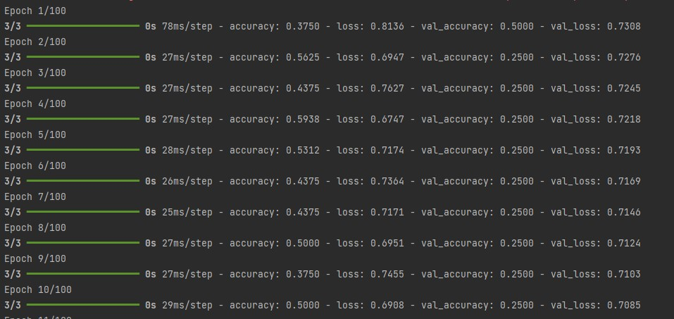
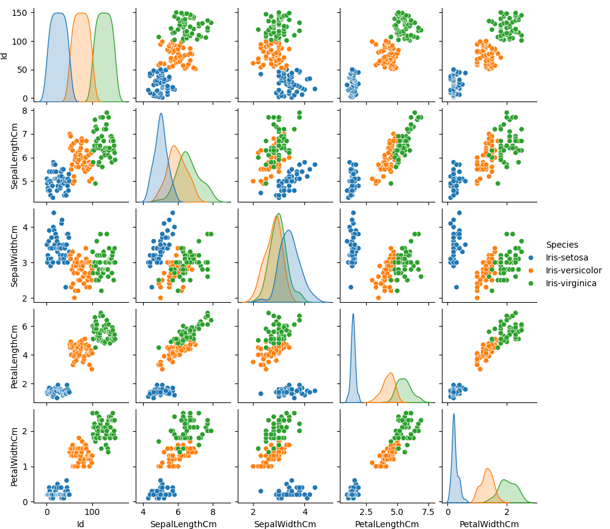
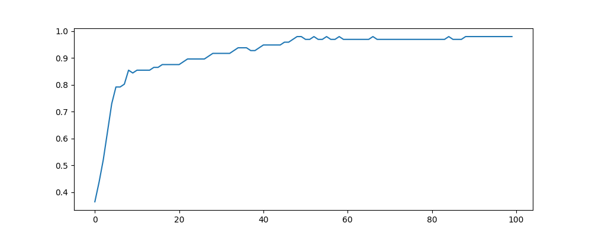
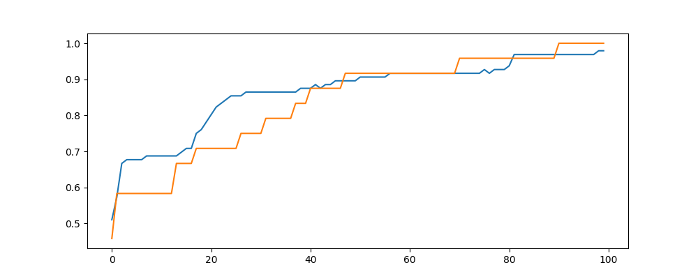
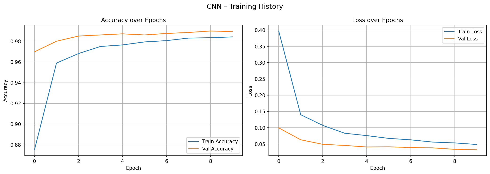
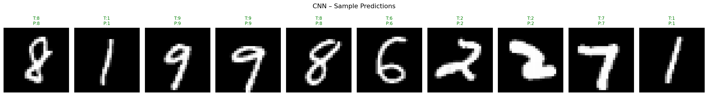
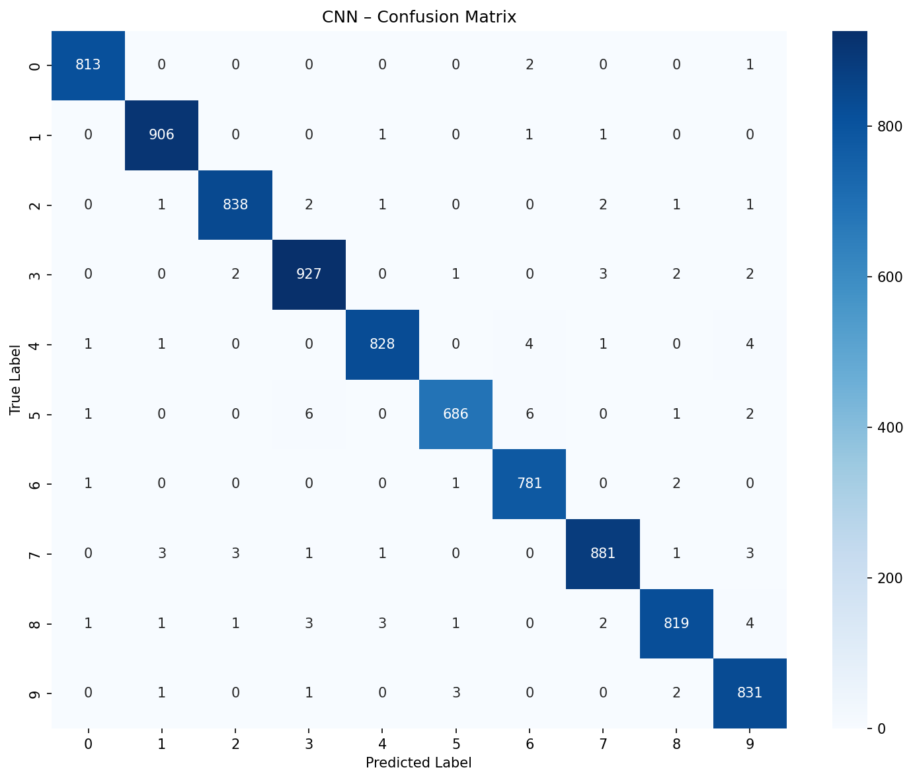
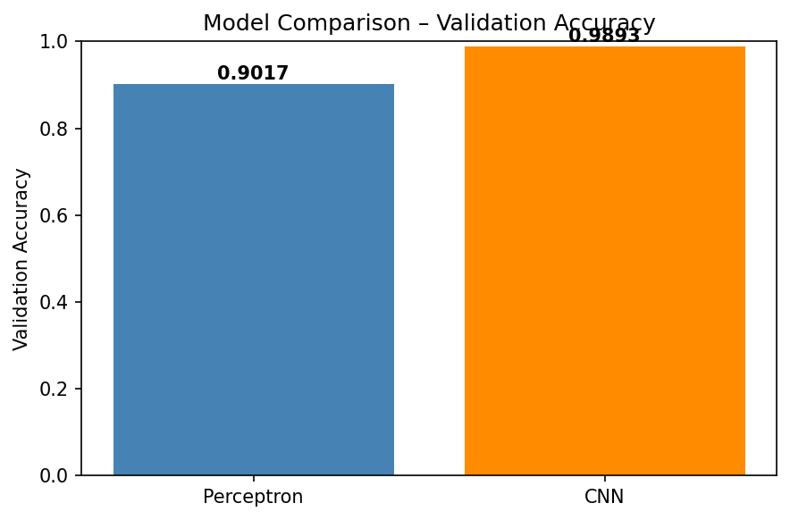

# Deep Learning — My Learning Notes

This repo is where I'm documenting everything I learn about Deep Learning — in plain English, no fancy jargon. Think of it as notes written by someone who is learning, for someone who is learning.

---

## What's in here

| Folder                          | What it covers                                     |
| ------------------------------- | -------------------------------------------------- |
| `Artificial_Neural_Network/`    | ANN basics and code — binary and multi-class       |
| `Convolutional_Neural_Network/` | CNN theory and code — handwritten digit classifier |

---

## The Basics — Starting with a Perceptron

### What even is a Perceptron?

Think of a perceptron as a single brain cell (neuron). It takes some numbers as input, does a simple calculation, and spits out an answer.

That's it. Super simple.

### A Real Example

Say we have patient data and we want to predict if someone has heart disease or not.

| Age | Cholesterol | Blood Pressure | Has Heart Disease? |
| --- | ----------- | -------------- | ------------------ |
| 28  | 150         | 110            | Yes (1)            |
| 36  | 120         | 90             | No (0)             |
| 42  | 180         | 160            | Yes (1)            |

- **Inputs** — Age, Cholesterol, Blood Pressure (these are the clues we give the model)
- **Output** — 0 or 1 (No disease or Yes disease)

---

## How a Perceptron Actually Works

### Step 1 — Multiply inputs by weights

Each input gets multiplied by a number called a **weight**. The weight decides how important that input is.

```
result = (Age × weight1) + (Cholesterol × weight2) + (BP × weight3) + bias
```

- **Weights** — how much importance to give each input
- **Bias** — a small extra number added so the model isn't stuck at zero

In math notation this looks like:

```
h(x) = x1*w1 + x2*w2 + x3*w3 + bias
```

This whole step — feeding inputs in and getting a result out — is called **Forward Propagation**.

### Step 2 — Pass through an Activation Function

The raw number we get from Step 1 could be anything — a huge positive number, a negative number, anything. We need to squeeze that into something useful.

That's what an **activation function** does.

**Sigmoid** is a common one. It takes any number and converts it to a value between 0 and 1. Perfect for yes/no predictions.

```
If result is very high  → sigmoid gives ~1 (Yes, heart disease)
If result is very low   → sigmoid gives ~0 (No heart disease)
```

It looks like an S-curve on a graph.

---

## How the Model Learns — Loss & Gradient Descent

When the model makes a prediction, it's probably wrong at first. That's fine. Here's how it fixes itself:

1. **Loss Function** — measures how wrong the prediction was. Higher the loss, worse the prediction.
2. **Gradient Descent** — a technique that nudges the weights in the right direction to reduce the loss.
3. Repeat many times → model gets better.

The goal is always: **make the loss as small as possible.**

---

## From Perceptron to Neural Network

A single perceptron can only do so much. It's like having just one brain cell.

When you stack multiple perceptrons in layers, you get an **Artificial Neural Network (ANN)**.

```
Input Layer  →  Hidden Layer(s)  →  Output Layer
```

- **Input layer** — receives the raw data
- **Hidden layers** — does the heavy lifting, finds patterns
- **Output layer** — gives the final answer

The more hidden layers, the deeper the network — that's why it's called **Deep Learning**.

---

## Limitation of a Basic Perceptron

- It can only say yes or no — there's nothing in between (no "maybe 70%")
- Can't predict numbers like house prices or temperatures — it only does yes/no
- Only works when the two groups being separated can be split by a straight line — anything more complex and it fails

That's why we move to full ANNs with better activation functions.

---

## Progress

- [x] Perceptron basics
- [x] Forward propagation
- [x] Activation functions — all 8 including Softmax (see `activation_functions.md`)
- [x] Loss functions — all 6 with graphs and pros/cons (see `loss_functions.md`)
- [x] Gradient Descent and all Optimizers — SGD, Adam, RMSProp and more (see `optimizers.md`)
- [x] ANN concept and theory (see `notes.md`)
- [x] First ANN model — binary classification (see `plant_water_predictor.py`)
- [x] Second ANN model — multi-class classification (see `iris_species_classifier.py`)
- [x] Black box vs white box models (see `blackbox_vs_whitebox.md`)
- [ ] Backpropagation deep dive
- [ ] Learning rate schedules
- [x] Why ANNs fail on images (see `Convolutional_Neural_Network/notes.md`)
- [x] CNN theory — filters, feature maps, pooling, padding, strides, flattening (see `Convolutional_Neural_Network/notes.md`)
- [x] Edge detection deep dive — step-by-step filter math with worked examples (see `Convolutional_Neural_Network/notes.md` Section 12)
- [x] Dropout — how to stop the model from memorising (see `Convolutional_Neural_Network/notes.md` Section 17)
- [x] Optimisers in CNNs — SGD vs Adam, why Adam is better for deep networks (see `Convolutional_Neural_Network/notes.md` Section 18)
- [x] CNN project walkthrough — how every line of code maps to the theory (see `Convolutional_Neural_Network/notes.md` Section 19)
- [x] CNN model — handwritten digit classifier, Perceptron vs CNN comparison (see `Convolutional_Neural_Network/cnn.py`)
- [ ] Batch Normalization — stabilising training
- [ ] Transfer Learning — reusing a pre-trained CNN instead of training from scratch
- [ ] Famous CNN architectures — LeNet, AlexNet, VGG, ResNet

---

## The Code — plant_water_predictor.py

The first working model is a plant watering predictor. Given three measurements about a plant's environment, it predicts whether the plant needs water or not.

```
Problem: Does this plant need water right now?

Inputs:
  - Soil Moisture  (how wet is the soil, 0.0 to 1.0)
  - Temperature    (degrees Celsius)
  - Sunlight Hours (how many hours of sun today)

Output:
  - 1 = Yes, water the plant
  - 0 = No, it's fine
```

### Model Architecture

```
  soil_moisture  ──┐
                   ├──►  [ Hidden: 8 neurons, ReLU ]  ──►  [ Output: 1 neuron, Sigmoid ]  ──►  needs_water (0 or 1)
  temperature_c  ──┤
                   │
  sunlight_hours ──┘

  Input Layer (3)      Hidden Layer (8)                    Output Layer (1)
```

- 3 inputs → 8 hidden neurons → 1 output
- Hidden layer uses **ReLU** (fast, works well for most problems)
- Output layer uses **Sigmoid** (gives a probability between 0 and 1)
- Trained with **SGD** optimizer and **Binary Cross-Entropy** loss
- Runs for **100 epochs** with a batch size of 4

### Key things happening in the code

| Step                    | What it does                                                       |
| ----------------------- | ------------------------------------------------------------------ |
| Normalization           | Scales all inputs to 0–1 so no feature dominates                   |
| Train/Test split        | 75% train, 25% test — keeps equal numbers of yes/no in both halves |
| model.fit               | Runs forward + backward propagation for 100 rounds                 |
| loss / val_loss         | How wrong the model is on training vs unseen test data             |
| accuracy / val_accuracy | % correct on training vs test data                                 |

If accuracy is high but val_accuracy is much lower → the model memorised the training data (overfitting). Both going up together means it's genuinely learning.



_Loss and accuracy across 100 training epochs._

---

## The Second Model — iris_species_classifier.py

The second project classifies Iris flowers into 3 species using 4 measurements.
This introduces multi-class classification with **Softmax** output and **Categorical Cross-Entropy** loss.

```
Problem: Which species is this Iris flower?

Inputs:
  - Sepal Length
  - Sepal Width
  - Petal Length
  - Petal Width

Output:
  - Iris-setosa     (0)
  - Iris-versicolor (1)
  - Iris-virginica  (2)
```

### Model Architecture

```
  sepal_length  ──┐
  sepal_width   ──┤──►  [ Dense: 16, ReLU ]  ──►  [ Dense: 8, ReLU ]  ──►  [ Dense: 3, Softmax ]  ──►  species
  petal_length  ──┤
  petal_width   ──┘

  Input (4)          Hidden 1 (16)            Hidden 2 (8)             Output (3)
```

- 2 hidden layers (16 then 8 neurons) — deeper than the first model
- Output uses **Softmax** — gives a probability per class, all adding to 100%
- Loss: **Categorical Cross-Entropy** — the right choice when Softmax is used
- Optimizer: **Adam** — faster and more reliable than SGD for multi-class problems

We also run a **Perceptron** first as a baseline to compare against the ANN.

### Training graphs



_Each species plotted against every other feature — shows how separable the classes are._



_Training accuracy per epoch — how the ANN improves over 100 rounds._



_Train vs validation accuracy — if both go up together the model is learning well._

---

## The CNN Project — Handwritten Digit Classifier (cnn.py)

The CNN project trains two models side by side on handwritten digit images and compares their accuracy.

```
Problem: What digit (0–9) is written in this image?

Inputs:
  - 28×28 grayscale image (784 pixel values, each between 0 and 255)

Output:
  - One of 10 classes: 0, 1, 2, 3, 4, 5, 6, 7, 8, 9
```

### Dataset

Source: [Kaggle Digit Recogniser Competition](https://www.kaggle.com/competitions/digit-recognizer)

| File                                          | Rows   | Description                                          |
| --------------------------------------------- | ------ | ---------------------------------------------------- |
| `Convolutional_Neural_Network/data/train.csv` | 42,000 | Labelled images — `label` column + 784 pixel columns |
| `Convolutional_Neural_Network/data/test.csv`  | 28,000 | Unlabelled images — 784 pixel columns only           |

### Model 1 — Perceptron (Baseline)

The simplest possible approach. Flattens the image into a single list of numbers and makes one linear guess. Used as a "dumb" comparison point.

```
  Input (28×28)
      ↓
  Flatten  →  784 numbers
      ↓
  Dense(10, Softmax)  →  10 class probabilities
```

- Optimizer: **SGD** | Loss: **Categorical Cross-Entropy** | Epochs: 10 | Batch: 32
- No hidden layers, no pattern detection — just a straight guess from raw pixels

### Model 2 — CNN

The real model. Uses convolutional layers to scan the image for edges and shapes before making a prediction.

```
  Input (28×28×1)
      ↓
  Conv2D(32 filters, 3×3, ReLU, padding=same)  →  28×28×32
  MaxPooling2D(2×2)                             →  14×14×32
  Dropout(0.25)
      ↓
  Conv2D(64 filters, 3×3, ReLU, padding=same)  →  14×14×64
  MaxPooling2D(2×2)                             →   7×7×64
  Dropout(0.25)
      ↓
  Flatten  →  3136 numbers
  Dense(128, ReLU)
  Dropout(0.5)
  Dense(10, Softmax)  →  10 class probabilities
```

- Optimizer: **Adam** | Loss: **Categorical Cross-Entropy** | Epochs: 10 | Batch: 64
- Two conv layers pick up low-level features (edges) then higher-level shapes
- Dropout at 0.25 and 0.5 prevents the model from memorising the training data

### Key things happening in the code

| Step             | What it does                                                           |
| ---------------- | ---------------------------------------------------------------------- |
| Normalisation    | Divides all pixel values by 255 to get values between 0.0 and 1.0      |
| Train/Val split  | 80% training, 20% validation (`random_state=42` for reproducibility)   |
| Reshape          | Perceptron uses `(N, 28, 28)` — CNN uses `(N, 28, 28, 1)` for channel  |
| One-hot encoding | Digit `3` becomes `[0, 0, 0, 1, 0, 0, 0, 0, 0, 0]`                     |
| Final comparison | Both models printed side by side — accuracy on the same validation set |

### Results


_Sample images from the dataset — each 28×28 grayscale image is one digit the model must classify._



_CNN loss and accuracy across 10 training epochs — both training and validation improving together._



_CNN predictions on unseen validation images — the predicted label shown above each digit._



_Confusion matrix for the CNN — each row is the true digit, each column is what the model predicted. The diagonal shows correct predictions; off-diagonal cells show where it got confused._



_Side-by-side accuracy comparison of the Perceptron baseline vs the CNN — shows how much the CNN improves over the simple baseline._

---

## Files in this repo

| File                                                   | What it is                                                    |
| ------------------------------------------------------ | ------------------------------------------------------------- |
| `Artificial_Neural_Network/plant_water_predictor.py`   | First ANN — binary classification, plant watering             |
| `Artificial_Neural_Network/iris_species_classifier.py` | Second ANN — multi-class classification, Iris species         |
| `Artificial_Neural_Network/Iris.csv`                   | Dataset used by iris_species_classifier.py                    |
| `Artificial_Neural_Network/notes.md`                   | Core ANN theory — forward prop, backprop, training loop       |
| `Artificial_Neural_Network/activation_functions.md`    | All activation functions with graphs and formulas             |
| `Artificial_Neural_Network/loss_functions.md`          | All loss functions with graphs and pros/cons                  |
| `Artificial_Neural_Network/optimizers.md`              | All optimizers with graphs, formulas and code examples        |
| `Artificial_Neural_Network/blackbox_vs_whitebox.md`    | What black box and white box models mean in plain words       |
| `Convolutional_Neural_Network/cnn.py`                  | CNN project — Perceptron baseline + CNN, training, evaluation |
| `Convolutional_Neural_Network/data/train.csv`          | 42,000 labelled handwritten digit images (Kaggle MNIST)       |
| `Convolutional_Neural_Network/data/test.csv`           | 28,000 unlabelled digit images (Kaggle submission format)     |
| `Convolutional_Neural_Network/notes.md`                | Full CNN theory — filters, pooling, padding, dropout and more |
| `Convolutional_Neural_Network/README.md`               | CNN project overview — models, architecture, how to run       |
