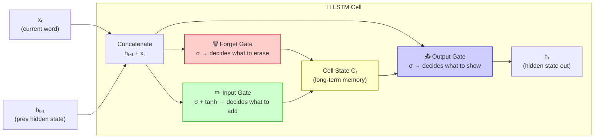
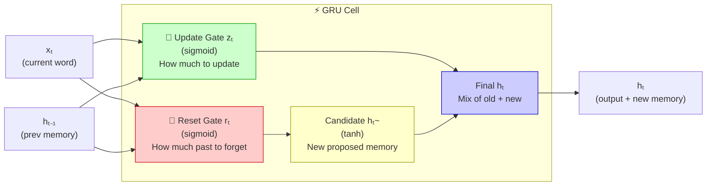

# Recurrent Neural Network (RNN) — Notes

---

## 1. Why Neural Networks for Certain Tasks?

Not all machine learning problems are the same. Some tasks — like recognising a handwritten digit or predicting whether a plant needs water — work fine with a standard ANN. You feed in a fixed set of numbers and get an answer out.

But some tasks are completely different. The input is not a fixed table of numbers — it is a **sequence**. A sentence. A series of events over time. Something where the **order matters**.

For tasks like these, a standard ANN breaks down. That's where an RNN (Recurrent Neural Network) comes in.

```
Task type                 Best tool         Why
─────────────────────────────────────────────────────────────────
Predict house price       ANN               Fixed input — just numbers
Classify an image         CNN               Spatial patterns in pixels
Classify a sentence       RNN               Order of words matters
Predict next word         RNN               Context builds up over time
─────────────────────────────────────────────────────────────────
```

---

## 2. What Is Sequential Data?

Sequential data is any data where the **order of the items matters and cannot be changed** without changing the meaning.

The clearest example is text. Take a simple sentence:

```
"The cat sat on the mat"
```

If you shuffle the words randomly:

```
"mat the on sat cat the"
```

It means nothing. The sequence — the order — is what carries the meaning.

Other examples where order matters in the same way:

| Type of data       | Example values                | Why order matters                          |
| ------------------ | ----------------------------- | ------------------------------------------ |
| Sentence or review | "I did not enjoy this"        | Swap "not" and "enjoy" — meaning changes   |
| Salary history     | 22k → 28k → 35k → 50k         | The progression over time tells a story    |
| Location tracking  | Home → Office → Gym → Home    | Order shows the route, not just the places |
| Music notes        | C, E, G, E, C                 | Change the order and the melody is gone    |
| Stock prices       | Mon $100 → Tue $102 → Wed $98 | Trend only visible in order                |

The key point: **you cannot treat each item in isolation**. Item 5 in the sequence means something different depending on what came before it.

```
Example — same words, different order, completely different meaning:

  "The food was good, not bad"   →  Positive
  "The food was bad, not good"   →  Negative

  Same words. Order changed. Meaning flipped.
```

---

## 3. Why a Plain ANN Cannot Handle Sequential Data

A standard ANN takes a fixed set of inputs, processes them all at once, and gives an answer. There is no concept of "what came before."

When you try to use an ANN on text or any sequential data, you immediately hit four big problems:

### Problem 1 — Variable Length Input

A review written by one person might be 10 words long. Another might be 300 words long. An ANN has a fixed number of input neurons — it cannot handle different-sized inputs. You would need a separate model for every possible sentence length, which is impossible.

```
  "Good film"                                           →  2 words
  "This was one of the best films I have ever seen"     →  11 words

  ANN input layer:  [ ●  ●  ●  ●  ●  ●  ●  ●  ●  ●  ●  ●  ●  ●  ●  ●  ●  ●  ●  ●  ● ]
                      └────────────── fixed size ─────────────────────────────────────┘
                                          ↑
                      What if a new sentence has 25 words? ANN breaks.
```

### Problem 2 — Massive Computational Load

To give an ANN any chance of understanding long sentences, you'd have to make the input layer enormous. One neuron per word, across the entire vocabulary — potentially 50,000+ neurons. Each connected to a hidden layer. The number of weights explodes instantly.

```
  Vocabulary = 50,000 words
  Hidden neurons = 512

  Weights = 50,000 × 512 = 25,600,000   ← just for one layer
                                           completely unmanageable
```

### Problem 3 — The Prediction Problem

Even if you handled training, there's a problem at test time. When someone submits a new piece of text, it might be longer than anything you trained on. The ANN has no way to deal with an input that doesn't match the exact size it was built for.

```
  Trained on:  sentences up to 10 words
  New input:   "I absolutely loved every single moment of this incredibly touching film"  →  12 words

  ANN:  ❌  does not fit the input layer — crashes
```

### Problem 4 — Sequence Is Not Maintained (Semantic Meaning Lost)

This is the biggest problem. An ANN has no memory of what it saw before the current input. Every input is treated independently.

```
  Sentence: "I did not enjoy the film at all"

  ANN sees each word in isolation:

  ┌──────┐  ┌─────┐  ┌─────┐  ┌────────┐  ┌─────┐  ┌──────┐
  │  "I" │  │"did"│  │"not"│  │"enjoy" │  │"the"│  │"film"│  ...
  └──┬───┘  └──┬──┘  └──┬──┘  └───┬────┘  └──┬──┘  └──┬───┘
     ↓         ↓         ↓         ↓           ↓         ↓
  processed  processed  processed  processed  processed  processed
  alone      alone      alone      alone      alone      alone

  "not" sits right next to "enjoy" — but ANN sees no connection between them.
  The negation is completely invisible. Meaning is lost.
```

```
  Summary of ANN's 4 failures on sequential data:

  ┌───────────────────────────────────────────────────────────────┐
  │  Problem 1  →  Cannot handle variable-length input            │
  │  Problem 2  →  Too many weights for large vocabularies        │
  │  Problem 3  →  Breaks on inputs longer than training examples │
  │  Problem 4  →  No memory — processes each word in isolation   │
  └───────────────────────────────────────────────────────────────┘
```

---

## 4. What Is an RNN?

An RNN is a type of neural network designed specifically to handle sequential data. The core idea is: **it has a memory.**

At each step, the RNN does not just look at the current input. It also looks at what it learned from all the **previous inputs in the sequence**. This memory is called the **hidden state**.

```
─────────────────────────────────────────────────────────────────────────
  Normal ANN — no memory:

  Input  ──►  [ Hidden Layer ]  ──►  Output

  Every input is treated completely fresh.
  No knowledge of what came before.

─────────────────────────────────────────────────────────────────────────
  RNN — has memory (hidden state):

  Input(t=1)  ──►  [ RNN Cell ]  ──►  Output(t=1)
                         │
                    hidden state h1
                         │
                         ▼
  Input(t=2)  ──►  [ RNN Cell ]  ──►  Output(t=2)
                         │           (h2 knows about t=1 + t=2)
                    hidden state h2
                         │
                         ▼
  Input(t=3)  ──►  [ RNN Cell ]  ──►  Final Output
                                       (knows about full sequence)

─────────────────────────────────────────────────────────────────────────
```

Think of it like reading a book. When you reach page 50, you understand it because you remember what happened on pages 1–49. You're not reading each page with a blank mind. An RNN does the same — it carries a running memory as it processes each item in the sequence one step at a time.

### The Full Flow — One Sentence, Step by Step

```
  Sentence:  "I   did   not   enjoy   the   film"

  ┌─────────┐     ┌─────────┐     ┌─────────┐     ┌─────────┐     ┌─────────┐     ┌─────────┐
  │  "I"    │     │  "did"  │     │  "not"  │     │ "enjoy" │     │  "the"  │     │  "film" │
  └────┬────┘     └────┬────┘     └────┬────┘     └────┬────┘     └────┬────┘     └────┬────┘
       │               │               │               │               │               │
       ▼               ▼               ▼               ▼               ▼               ▼
  ┌────────┐  h1  ┌────────┐  h2  ┌────────┐  h3  ┌────────┐  h4  ┌────────┐  h5  ┌────────┐
  │RNN Cell│ ───► │RNN Cell│ ───► │RNN Cell│ ───► │RNN Cell│ ───► │RNN Cell│ ───► │RNN Cell│
  └────────┘      └────────┘      └────────┘      └────────┘      └────────┘      └────┬───┘
                                                                                         │
                                                                                    Final h6
                                                                                         │
                                                                                         ▼
                                                                                   Dense Layer
                                                                                         │
                                                                                         ▼
                                                                                  0.12 → Negative ✓
```

The same cell is reused at each step — that's the "recurrent" in RNN. It loops back on itself, carrying memory forward.

---

## 5. How Text Is Fed Into an RNN — Vectorisation and One-Hot Encoding

A neural network only understands numbers — it cannot work with raw words. So before feeding any text into an RNN, you must convert every word into a number (or a list of numbers). This process is called **vectorisation**.

The most basic way to do this is called **One-Hot Encoding**.

### What One-Hot Encoding Does

First, you build a vocabulary — a list of every unique word in your dataset. Say your vocabulary has 5 words:

```
  Vocabulary — 5 words:

  Position 0  →  "I"
  Position 1  →  "love"
  Position 2  →  "not"
  Position 3  →  "hate"
  Position 4  →  "film"
```

Each word is turned into an array the same length as the vocabulary. Every position is 0, except the one that matches the word's position — that one is 1:

```
  Word     One-Hot Vector     Explanation
  ───────────────────────────────────────────────────────────────
  "I"    →  [1, 0, 0, 0, 0]  ← position 0 is hot, rest are 0
  "love" →  [0, 1, 0, 0, 0]  ← position 1 is hot, rest are 0
  "not"  →  [0, 0, 1, 0, 0]  ← position 2 is hot, rest are 0
  "hate" →  [0, 0, 0, 1, 0]  ← position 3 is hot, rest are 0
  "film" →  [0, 0, 0, 0, 1]  ← position 4 is hot, rest are 0
  ───────────────────────────────────────────────────────────────
  One word = one vector. Exactly one position is "hot" (1).
```

One word = one array. Only one position is "hot" (1), the rest are "cold" (0). That's why it's called **one-hot**.

### From Words to Arrays to the Network

Once every word is encoded, the sentence becomes a sequence of arrays:

```
  Sentence: "I love film"

  ┌──────────────────────────────────────────────────────────┐
  │  Step 1  →  "I"     →  [1, 0, 0, 0, 0]                  │
  │                              ↓                           │
  │              fed into RNN cell  +  hidden state [0,0,0]  │
  │                              ↓                           │
  │                          h1 produced   (memory of "I")   │
  ├──────────────────────────────────────────────────────────┤
  │  Step 2  →  "love"  →  [0, 1, 0, 0, 0]                  │
  │                              ↓                           │
  │              fed into RNN cell  +  h1                    │
  │                              ↓                           │
  │                          h2 produced   (memory of "I love") │
  ├──────────────────────────────────────────────────────────┤
  │  Step 3  →  "film"  →  [0, 0, 0, 0, 1]                  │
  │                              ↓                           │
  │              fed into RNN cell  +  h2                    │
  │                              ↓                           │
  │                          h3 produced   (memory of "I love film") │
  │                              ↓                           │
  │                      Final output  →  "positive"  ✓     │
  └──────────────────────────────────────────────────────────┘
```

### Timesteps and Input Features — How the Data Is Actually Structured

When you feed a sentence into an RNN, the data is organised into **timesteps**. Each timestep is one position in the sequence — word 1 is timestep 1, word 2 is timestep 2, and so on.

Let's walk through **"I love film"** step by step.

```
  Vocabulary (5 words):
    Position:  0="I"   1="love"   2="not"   3="hate"   4="film"

  Sentence:    "I         love      film"
  Timestep:    t=1        t=2       t=3
```

At each timestep the RNN gets one input feature vector and produces an updated hidden state:

```
  ┌────────────────────────────────────────────────────────────────────────────┐
  │  Timestep 1  (word = "I"):                                                 │
  │    Input features:   [1, 0, 0, 0, 0]   ← one-hot for "I"                  │
  │    Hidden state in:  [0, 0, 0, 0, 0]   ← blank — no memory yet            │
  │    Hidden state out: h1                ← memory now holds "I"              │
  ├────────────────────────────────────────────────────────────────────────────┤
  │  Timestep 2  (word = "love"):                                              │
  │    Input features:   [0, 1, 0, 0, 0]   ← one-hot for "love"               │
  │    Hidden state in:  h1                ← memory of "I" carried in         │
  │    Hidden state out: h2                ← memory now holds "I love"         │
  ├────────────────────────────────────────────────────────────────────────────┤
  │  Timestep 3  (word = "film"):                                              │
  │    Input features:   [0, 0, 0, 0, 1]   ← one-hot for "film"               │
  │    Hidden state in:  h2                ← memory of "I love" carried in    │
  │    Hidden state out: h3                ← memory now holds "I love film"    │
  │                           ↓                                                │
  │                   Final output  →  "positive sentiment"  ✓                │
  └────────────────────────────────────────────────────────────────────────────┘
```

The block of data fed into the RNN has the shape **[timesteps × features]**:

```
  Shape:  [ 3 timesteps  ×  5 features ]

  ┌──────────────────────────────────────┐
  │  Row 1 (t=1)  →  [1, 0, 0, 0, 0]    │  ← "I"
  │  Row 2 (t=2)  →  [0, 1, 0, 0, 0]    │  ← "love"
  │  Row 3 (t=3)  →  [0, 0, 0, 0, 1]    │  ← "film"
  └──────────────────────────────────────┘
       ↑ RNN reads one row at a time, top to bottom
```

The RNN reads one row at a time. At every row it updates the hidden state and moves to the next. By the last row it has seen the entire sentence in order.

---

## 6. Building an RNN with Keras and TensorFlow

To build and train an RNN in Python we use **Keras** — a high-level deep learning library that runs on top of **TensorFlow**.

Think of TensorFlow as the engine room — it handles all the heavyweight maths (matrix multiplications, gradients, GPU processing). Keras is the friendly layer on top of it — you describe the model in simple, readable steps without writing any of the low-level maths yourself.

```
  ┌──────────────────────────────────────────────────────────────┐
  │                   What each layer does                       │
  │                                                              │
  │   You (Keras)  ──────────────────────────────────────────►   │
  │   "Stack a SimpleRNN of size 64, then a Dense layer"         │
  │                                                              │
  │   TensorFlow  ◄──────────────────────────────────────────    │
  │   Runs all the matrix maths, backpropagation, GPU batches    │
  │                                                              │
  │   TensorFlow  =  the engine  (fast, powerful, invisible)     │
  │   Keras       =  the remote control  (you just press buttons)│
  └──────────────────────────────────────────────────────────────┘
```

Keras comes built into TensorFlow so you don't install them separately:

```python
import tensorflow as tf
from tensorflow import keras
```

### How an RNN Looks in Keras

Building an RNN in Keras follows the same pattern as the ANN and CNN projects — you stack layers inside a `Sequential` model. The new piece here is the `SimpleRNN` layer, which is the recurrent cell that processes one timestep at a time and carries the hidden state forward.

```python
model = keras.Sequential([
    keras.layers.Embedding(vocab_size, embedding_size, input_length=max_length),
    keras.layers.SimpleRNN(rnn_units),
    keras.layers.Dense(1, activation='sigmoid')
])
```

Breaking this down:

```
  ┌────────────────────────────────────────────────────────────────────────┐
  │  Layer 1 — Embedding                                                   │
  │                                                                        │
  │  Embedding(vocab_size, embedding_size, input_length=max_length)        │
  │    → converts word index numbers into dense vectors                    │
  │    → smarter than one-hot — similar words get similar vectors          │
  │    → e.g. "good" and "great" will be close in embedding space          │
  │    → output shape per sentence:  [max_length × embedding_size]          │
  ├────────────────────────────────────────────────────────────────────────┤
  │  Layer 2 — SimpleRNN                                                   │
  │                                                                        │
  │  SimpleRNN(rnn_units)                                                  │
  │    → the recurrent layer — loops through the sequence step by step     │
  │    → at each timestep: takes current word vector + previous memory     │
  │    → rnn_units = size of hidden state (how much memory the cell keeps) │
  │    → return_sequences=False (default) → only outputs final hidden state │
  ├────────────────────────────────────────────────────────────────────────┤
  │  Layer 3 — Dense (output)                                              │
  │                                                                        │
  │  Dense(1, activation='sigmoid')                                        │
  │    → takes final hidden state as input                                 │
  │    → sigmoid squishes output to 0–1 → 1 = positive, 0 = negative      │
  └────────────────────────────────────────────────────────────────────────┘
```

### Batch Size — How Many Sentences at Once

When training, you don't feed sentences to the RNN one by one — that would be extremely slow. Instead you group them into **batches** and process several sentences at the same time.

```
  Batch size = 32  →  32 sentences processed together in one go  (faster)
  Batch size = 8   →  8 sentences at a time  (smaller = more updates per epoch)
  Batch size = 1   →  one sentence at a time  (very slow — updated every sentence)

  Analogy: marking exam papers
    One at a time = slow, constant feedback
    Batch of 32   = mark 32 at once, then update your marking scheme
```

The full shape of the data block passed to Keras is:

```
  Shape:  [ batch_size  ×  timesteps  ×  features ]

  Example:  batch_size=8,  max_length=10,  embedding_size=16

  ┌──────────────────────────────────────────────────────┐
  │  8 sentences                                         │
  │  each sentence:  10 timesteps (words)                │
  │  each word:      16 numbers (embedding vector)       │
  │                                                      │
  │  Full shape:  [ 8  ×  10  ×  16 ]                   │
  │                 ↑     ↑      ↑                       │
  │                 │     │      └── 16 numbers per word │
  │                 │     └───────── 10 words per sentence│
  │                 └─────────────── 8 sentences at once │
  └──────────────────────────────────────────────────────┘
```

### Full Pipeline — From Raw Text to Prediction

```
  Raw text sentence:  "I love this film"
           ↓
  Tokenise (split into words and assign number IDs)
    →  [2, 7, 14, 5]
           ↓
  Pad to fixed length (max_length = 10)
    →  [0, 0, 0, 0, 0, 0, 2, 7, 14, 5]
           ↓
  Embedding layer  (convert IDs → dense vectors)
    →  shape: [10 × 16]
           ↓
  SimpleRNN  (process one timestep at a time, carry hidden state)
    →  t=1 → t=2 → ... → t=10 → final hidden state
           ↓
  Dense + Sigmoid
           ↓
  Output:  0.87  →  Positive sentiment  ✓
```

---

## 7. Use Cases of RNNs

RNNs shine on any task where the input or output is a sequence — especially text. The two main use cases:

### Sentiment Analysis

Given a piece of text (a product review, a tweet, a comment), predict whether the sentiment is positive or negative.

```
  ┌──────────────────────────────────────────────────────────────────────────┐
  │  Input:   "The service was absolutely terrible and I will never return"  │
  │                                   ↓                                      │
  │                          RNN reads word by word                          │
  │                                   ↓                                      │
  │  Output:  Negative  (confidence: 0.95)                                   │
  ├──────────────────────────────────────────────────────────────────────────┤
  │  Input:   "Had an amazing experience — will definitely come back"        │
  │                                   ↓                                      │
  │                          RNN reads word by word                          │
  │                                   ↓                                      │
  │  Output:  Positive  (confidence: 0.91)                                   │
  └──────────────────────────────────────────────────────────────────────────┘
```

The RNN reads the sentence word by word, building up context as it goes. By the time it reaches the last word, its hidden state carries the full meaning of the sentence and it can make a judgment.

### Sentence Completion

Given the start of a sentence, predict what word comes next — and keep going to complete the sentence.

```
  ┌────────────────────────────────────────────────────────────────┐
  │  Input:   "The weather today is very"                          │
  │                     ↓                                          │
  │              RNN predicts next word                            │
  │                     ↓                                          │
  │  Step 1:  → "hot"       │  Input now: "...is very hot"         │
  │  Step 2:  → "and"       │  Input now: "...very hot and"        │
  │  Step 3:  → "sunny"     │  (keeps going until end token)       │
  │                     ↓                                          │
  │  Full output:  "The weather today is very hot and sunny"       │
  └────────────────────────────────────────────────────────────────┘
```

Other places where RNNs are / were used:

```
  Task                       Input              Output
  ──────────────────────────────────────────────────────────────
  Sentiment analysis         Sentence           Positive / Negative
  Text generation            Start of text      Completed text
  Machine translation        English sentence   French sentence
  Speech recognition         Audio sequence     Text transcript
  Time series forecasting    Past stock prices  Next price prediction
  Video captioning           Video frames       Sentence description
  ──────────────────────────────────────────────────────────────
```

---

## 8. Where RNNs Stand Today

RNNs were the go-to approach for NLP tasks for several years. However, they have become **less common in recent times**.

The reason: **Transformers** came along and solved most of the same problems, but much better. Transformers (the architecture behind LLMs like ChatGPT) can process entire sequences at once instead of step by step, handle much longer sequences without losing track, and train far faster on modern hardware.

```
  Model Timeline — NLP history in one diagram:

  ─────────────────────────────────────────────────────────────────────────────
  1980s–2000s   ANN         Could not handle sequences at all.
                            Just fixed input → fixed output.

  ~2010s        RNN         Could finally handle sequences!
                            Word-by-word memory via hidden state.
                            Widely used for NLP, translation, speech.
                            Weakness: forgets early words in long sequences.

  ~2017         Transformers  Process the full sequence at once (no step-by-step).
                            Attention mechanism — every word can "look at" every
                            other word directly, no forgetting.
                            Became dominant fast.

  2020–now      LLMs (ChatGPT, GPT-4, Gemini, Claude)
                            Transformers at massive scale.
                            RNNs rarely used for mainstream NLP today.
  ─────────────────────────────────────────────────────────────────────────────
```

```
  RNN vs Transformer — quick comparison:

  Feature                  RNN                   Transformer
  ────────────────────────────────────────────────────────────────
  Processes sequence       One word at a time    All words at once
  Memory of early words    Fades with distance   Direct attention
  Training speed           Slow (sequential)     Fast (parallel)
  Long sequence handling   Weak                  Strong
  Used today               Niche uses only       Dominant in NLP
  ────────────────────────────────────────────────────────────────
```

RNNs are still useful to understand because:

- They explain **why sequential processing matters** and how hidden state works
- They are the foundation that led to LSTMs, GRUs, and eventually Transformers
- They are still used in some lightweight, resource-constrained settings

---

## 9. Quick Reference

| Concept             | What it means in plain English                                                |
| ------------------- | ----------------------------------------------------------------------------- |
| Sequential data     | Data where the order of items matters — change the order, change the meaning  |
| ANN limitation      | Fixed input size, no memory, loses sequence — fails on text                   |
| RNN                 | Neural network with a hidden state that carries memory across the sequence    |
| Hidden state        | The running memory of the RNN — updated at each timestep                      |
| Timestep            | One position in the sequence — the RNN processes one timestep at a time       |
| Input features      | The feature vector (e.g. embedding vector) fed into the RNN at each timestep  |
| Vectorisation       | Converting words (or any non-numeric data) into numbers before feeding in     |
| One-hot encoding    | Representing each word as an array with a single 1 and all other positions 0  |
| Embedding layer     | Smarter than one-hot — maps words to dense vectors where meaning is close     |
| TensorFlow          | The deep learning engine — handles all the maths and GPU work                 |
| Keras               | High-level interface on top of TensorFlow — stack layers simply               |
| SimpleRNN layer     | The Keras layer that processes one timestep at a time and carries memory      |
| return_sequences    | False = only output final hidden state; True = output hidden state every step |
| Sentiment analysis  | Classifying whether a piece of text is positive or negative                   |
| Sentence completion | Predicting the next word(s) given the start of a sentence                     |
| Transformers / LLMs | Newer architecture — processes entire sequences at once, dominates NLP today  |
| Batch size          | How many sentences the model processes at once during training                |
| tanh                | Activation function inside RNN hidden neurons — output range −1 to +1         |
| Vanishing gradient  | Problem where early words lose influence — basic RNN's biggest weakness       |
| LSTM / GRU          | Improved RNN variants designed to fix the vanishing gradient problem          |

---

## 10. RNN Architecture — How the Recurrent Part Actually Works

### Feed Forward vs Recurrent — What's the Difference?

A regular ANN is called a **feed forward** network. Data moves in one direction only — from the input layer, through the hidden layers, to the output. No looking back, no memory.

An RNN is a **recurrent** network. At every step, the hidden layer passes information forward to the next timestep — it loops back on itself. That loop is what gives the RNN its memory.


```
  ─────────────────────────────────────────────────────────────────────────
  Feed Forward Network (ANN):

    Input Layer  →  Hidden Layer  →  Output Layer
       [x1]            [h]               [y]
       [x2]        (no looping,          (final
       [x3]         no memory)           answer)

  Data flows left to right. That's it. No memory of previous inputs.
  ─────────────────────────────────────────────────────────────────────────
  Recurrent Network (RNN):

    Input(t=1) → [ Hidden Layer ] → Output
                       │    ↑
                       └────┘   ← hidden state loops back to itself
                       (memory)
                         ↓
    Input(t=2) → [ Hidden Layer ] → Output
                       │    ↑
                       └────┘
                         ...

  The hidden layer feeds its own output back in at the next timestep.
  That self-loop is the "recurrence".
  ─────────────────────────────────────────────────────────────────────────
```

### The Hidden Layer — The Heart of the RNN

In an RNN, the hidden layer does more than just process the current input — it also carries memory from every previous step. At every timestep it:

1. Takes the current word's vector as input
2. Takes the hidden state from the previous timestep (memory of everything seen so far)
3. Combines them, runs an activation function, and produces a new hidden state

```
  Formula inside the RNN hidden neuron:

  new hidden state = tanh( (current input × W_input) + (previous hidden × W_hidden) + bias )

  In plain English:
  ┌────────────────────────────────────────────────────────────────────────┐
  │  new memory  =  tanh(  what I see now  +  what I already remembered  ) │
  └────────────────────────────────────────────────────────────────────────┘
```

### tanh — The Activation Function Inside the Hidden Neurons

The default activation function inside an RNN's hidden neurons is **tanh** (hyperbolic tangent). It squishes any number into a range between −1 and +1:

```
  tanh output — what each value means:

  Input to tanh    Output    Meaning
  ──────────────────────────────────────────────────────
  Very large +ve   ≈ +1      Strong positive signal
  Around 0          ≈ 0      Neutral — no signal
  Very large -ve   ≈ -1      Strong negative signal
  ──────────────────────────────────────────────────────

  Visual:

  +1 ─────────────────────────────    ← ceiling
         ╱
        ╱
  ─────╱─────────────────────────     ← passes through 0
      ╱
     ╱
  -1 ─────────────────────────────    ← floor

  Input:   -∞ ───────────────────── +∞
```

This −1 to +1 range works better for recurrent networks than Sigmoid (0 to 1) because it lets the hidden state carry both positive and negative signals, which helps gradients flow better during training.

### Hidden State Starts at Zero

Before the first word is processed, the RNN has no memory of anything. So the hidden state is initialised as all zeros at the very start of every sentence.

```
  ┌──────────────────────────────────────────────────────────────────┐
  │  Before t=1:   hidden = [0, 0, 0, ..., 0]  ← blank, nothing seen │
  │  After  t=1:   hidden = h1                 ← memory of word 1    │
  │  After  t=2:   hidden = h2                 ← memory of words 1+2  │
  │  After  t=3:   hidden = h3                 ← memory of words 1+2+3│
  │    ...                                                            │
  │  After  t=N:   hidden = hN                 ← full sentence stored  │
  └──────────────────────────────────────────────────────────────────┘
```

### A Worked Example — "You are good"

Say we want to classify the sentiment of the sentence **"You are good"**. Here's exactly what happens step by step.

First, each word gets turned into a vector (using word embeddings or one-hot encoding):

```
  "you"  →  [1, 0, 0, 0, 0]
  "are"  →  [0, 1, 0, 0, 0]
  "good" →  [0, 0, 1, 0, 0]
```

These vectors are fed into the hidden layer one word at a time. Say the hidden layer has 3 neurons (rnn_units = 3):

```
  ┌────────────────────────────────────────────────────────────────────────────┐
  │  t=1  →  "you"                                                             │
  │    Input:   [1, 0, 0, 0, 0]                                                │
  │    Hidden:  [0, 0, 0]   ← blank start                                      │
  │    Formula: tanh( [1,0,0,0,0] × W  +  [0,0,0] × W_hidden  +  bias )       │
  │    Output:  h1 = [a, b, c]             ← now knows "you"                   │
  ├────────────────────────────────────────────────────────────────────────────┤
  │  t=2  →  "are"                                                             │
  │    Input:   [0, 1, 0, 0, 0]                                                │
  │    Hidden:  h1 = [a, b, c]   ← memory of "you" carried in                 │
  │    Formula: tanh( [0,1,0,0,0] × W  +  h1 × W_hidden  +  bias )            │
  │    Output:  h2 = [d, e, f]             ← now knows "you are"               │
  ├────────────────────────────────────────────────────────────────────────────┤
  │  t=3  →  "good"                                                            │
  │    Input:   [0, 0, 1, 0, 0]                                                │
  │    Hidden:  h2 = [d, e, f]   ← memory of "you are" carried in             │
  │    Formula: tanh( [0,0,1,0,0] × W  +  h2 × W_hidden  +  bias )            │
  │    Output:  h3 = [g, h, i]             ← now knows "you are good"          │
  └────────────────────────────────────────────────────────────────────────────┘
                                    ↓
                          h3 passed to Dense layer
                                    ↓
                           0.92  →  Positive  ✓
```

### Output Only Comes After the Last Timestep

The hidden layer does NOT send output to the next layer after each word. It processes every word silently, updating its memory each time. Only after all timesteps are done does it pass the final hidden state forward to the Dense output layer.

```
  ┌────────────────────────────────────────────────────────────────────────┐
  │  t=1  →  hidden updates  →  nothing passed forward yet                │
  │  t=2  →  hidden updates  →  nothing passed forward yet                │
  │  t=3  →  hidden updates  →  nothing passed forward yet                │
  │                 ↓                                                      │
  │       all timesteps finished                                           │
  │                 ↓                                                      │
  │   h3 (final hidden state) → Dense layer → output                      │
  │                 ↓                                                      │
  │         0.92  →  positive  ✓                                          │
  └────────────────────────────────────────────────────────────────────────┘

  In Keras:   SimpleRNN(units, return_sequences=False)
              ↑
              False means: give me only the last hidden state
              True  means: give me hidden state after every timestep
```

### Why It's Called "Recurrent" — The Same Weights Used Again and Again

The hidden layer uses the **exact same set of weights at every single timestep**. The same W and W_hidden that process word 1 are the same weights used at word 2, word 3, and every other word.

These weights are applied again and again at each step, looping back — that is the **recurrence**.

```
  t=1  →  W applied once    (word 1 processed)
  t=2  →  W applied again   (word 2 processed)
  t=3  →  W applied again   (word 3 processed)
   ↑
   The same W is reused at every step — that's why it's called RECURRENT.

  Analogy: a rubber stamp
    You press the same stamp at each step.
    The paper (hidden state) carries forward the impression from every press.
```

---

## 11. Problems With a Basic RNN

A basic RNN works well on short sequences but breaks down on longer ones. Here are the five main problems:

### Problem 1 — Weak Long-Term Memory

The hidden state is rewritten at every timestep. When a sentence gets long, the hidden state at the end is mostly shaped by the recent words — the early words have been diluted or completely overwritten.

```
  Sentence: "The food was absolutely amazing but the service at the counter was slow"

  By the time the RNN reaches "slow":
    → It clearly remembers "service was slow"  ✓
    → But "food was amazing" from earlier is nearly gone  ✗

  The RNN only reliably remembers the last ~5–10 words.
```

### Problem 2 — Vanishing Gradient

During training, the model learns by sending error signals backwards through time (backpropagation through time). But in a basic RNN, those signals get multiplied together at each timestep. If the multiplied values are smaller than 1, they shrink rapidly as they travel back.

```
  Error signal travelling backwards:

  t=10 → t=9 → t=8 → t=7 → ... → t=1

  Each step multiplies the signal by a small number (e.g. 0.5):

  0.5 × 0.5 × 0.5 × 0.5 × 0.5 × 0.5 × 0.5 × 0.5 × 0.5 = 0.002

  By t=1 the signal is almost 0 → early parts of the sequence
  barely get updated → they stop contributing to learning at all.

  This is the vanishing gradient problem.
```

### Problem 3 — Exploding Gradient

The opposite can also happen. If the multiplied values are larger than 1, the error signal grows exponentially as it travels backwards.

```
  Each step multiplies the signal by a large number (e.g. 2.0):

  2 × 2 × 2 × 2 × 2 × 2 × 2 × 2 × 2 = 512

  By t=1 the signal is enormous → weights get updated with
  massive values → training goes unstable → model diverges.

  Fix: gradient clipping (cap the gradient at a max value before applying it)
```

### Problem 4 — No Long-Range Dependencies

Because of weak memory and vanishing gradients, a basic RNN cannot connect information that is far apart in the sequence.

```
  Example — long-range dependency:

  "The cat, which had been sitting on the windowsill all morning, was hungry"
    ↑                                                                    ↑
   subject                                                           predicate
   ("cat")                                                         ("was hungry")

  12 words apart. By the time the RNN reaches "was hungry",
  it has mostly forgotten "cat". It cannot learn this connection.
```

### Problem 5 — Sequential Processing Is Slow

The RNN must process one word at a time and wait for the hidden state before starting the next step — it cannot be parallelised.

```
  RNN:          t=1 → t=2 → t=3 → ... → t=N   (must go in order, one at a time)
  Transformer:  all timesteps processed in parallel  →  much faster training
```

```
  Summary — the 5 weaknesses of a basic RNN:

  ┌──────────────────────────────────────────────────────────────────────────┐
  │  1. Weak long-term memory   → forgets early words in long sequences      │
  │  2. Vanishing gradient      → early steps barely learn during training   │
  │  3. Exploding gradient      → training goes unstable on long sequences   │
  │  4. No long-range capture   → can't connect things far apart in a text   │
  │  5. Sequential and slow     → cannot run timesteps in parallel           │
  └──────────────────────────────────────────────────────────────────────────┘

  → LSTM and GRU were invented to solve problems 1, 2, and 4
  → Transformers solved all five
```

---

## 12. LSTM and GRU — What Comes Next

A basic RNN's weakness is its simple hidden state — it gets overwritten every step and early information fades fast.

**LSTM (Long Short-Term Memory)** and **GRU (Gated Recurrent Unit)** are improved versions of the RNN that add **gates** — control mechanisms that decide what to remember, what to forget, and what to pass forward.

```
  Basic RNN cell:

    hidden state in  ──►  tanh(input + hidden)  ──►  hidden state out
                            (one simple operation — everything gets mixed together)


  LSTM cell (three gates):

    ┌─────────────────────────────────────────────────────────────────┐
    │  Forget Gate   →  "Should I forget anything from my old memory?"│
    │  Input Gate    →  "Should I store this new word into memory?"   │
    │  Output Gate   →  "What part of my memory should I output now?" │
    └─────────────────────────────────────────────────────────────────┘

    hidden state in  ──►  [ Forget Gate ]  ──►  what to throw away
    cell state in    ──►  [ Input Gate  ]  ──►  what new info to store
                          [ Output Gate ]  ──►  what to pass forward
                                 ↓
                    hidden state out  +  cell state out

    (two streams of memory — much richer than a basic RNN)
```

```
  Memory range comparison:

  Model         Reliable memory range     Notes
  ─────────────────────────────────────────────────────────────────
  Basic RNN     ~5–10 words               Simple, fast, forgets easily
  GRU           ~30–50 words              Simpler gates than LSTM, less compute
  LSTM          ~100+ words               Full gating — best at long sequences
  Transformer   Entire sequence at once   No step-by-step at all — attention
  ─────────────────────────────────────────────────────────────────
```

---

## Coming Next

- [x] LSTM — Long Short-Term Memory (fixes RNN's memory limitations over long sequences)
- [x] GRU — Gated Recurrent Unit (simpler and faster LSTM alternative)
- [x] RNN project — sentence completion model trained on 3,000+ famous quotes
- [ ] Vanishing gradient deep dive — the maths behind why memory fades
- [ ] Transformers — how attention replaced RNNs entirely

---

## LSTM — Long Short-Term Memory

> **Think of LSTM like your brain reading a book.** You remember the main character's name throughout the whole story, but you forget minor details like what they had for breakfast two chapters ago. LSTM does exactly this — it remembers what matters and lets go of what doesn't.

### The Problem LSTM Solves

A regular RNN struggles to remember things from way earlier in a sequence. LSTM fixes this by having **two separate memory channels** running through every step:

| Memory Type                          | Symbol | Analogy                             |
| ------------------------------------ | ------ | ----------------------------------- |
| **Long-term memory** (Cell State)    | $C_t$  | A notepad you carry throughout time |
| **Short-term memory** (Hidden State) | $h_t$  | What's currently in your head       |

> Both $C_t$ and $h_t$ always have the same length (same number of neurons).

---

### How Words Become Numbers

Before any processing, the input sentence is **vectorised** — every word becomes a number vector.

```
Sentence:    I       am      Bob
             ↓       ↓       ↓
Vectors:  [1,0,0] [0,1,0] [0,0,1]
```

Each word is then fed into the LSTM **one at a time**, step by step (each step = one timestamp).

---

### The 3 Gates of LSTM

At every timestamp, three gates decide what to remember, what to add, and what to output:

```
┌─────────────────────────────────────────────────────────┐
│                        LSTM CELL                        │
│                                                         │
│   ht-1 ──┐                                              │
│           ├──► [ Forget Gate ] ──► updates C_t          │
│   xt  ───┘           │                                  │
│                       ▼                                  │
│              [ Input Gate ] ──► adds new info to C_t    │
│                       │                                  │
│                       ▼                                  │
│             [ Output Gate ] ──► produces ht             │
│                                                         │
│   Inputs: ht-1 (prev hidden), xt (current word)         │
│   Outputs: ht (new hidden), Ct (updated cell state)     │
└─────────────────────────────────────────────────────────┘
```



---

### Gate-by-Gate Walkthrough (with Riya's Story)

**Example sentence:**

> _"Riya is a doctor. She lives in Delhi. She works at a hospital. Last year, Riya moved to London. Now she works at a research lab."_

---

#### 🗑️ Forget Gate — "What do I throw away?"

When the model reads _"moved to London"_, it realises Delhi is now old news. The forget gate **scores each memory from 0 to 1** — closer to 0 means forget, closer to 1 means keep.

$$f_t = \sigma(W_f \cdot [h_{t-1},\ x_t] + b_f)$$

| Memory Item         | Forget Score | Action                      |
| ------------------- | ------------ | --------------------------- |
| Gender (she/her)    | 0.99         | **Keep** — still relevant   |
| Profession (doctor) | 0.95         | **Keep** — still a doctor   |
| City (Delhi)        | 0.10         | **Forget** — she moved away |

---

#### ✏️ Input Gate — "What new info do I write in?"

After forgetting Delhi, the model now needs to **write London into memory**. The input gate handles this in two steps:

1. **Candidate Cell State $\tilde{C}_t$** — uses `tanh` to create new information (e.g., "London", "research lab")
2. **Input filter $i_t$** — uses `sigmoid` to decide how much of that new info to actually add

$$i_t = \sigma(W_i \cdot [h_{t-1},\ x_t] + b_i)$$
$$\tilde{C}_t = \tanh(W_C \cdot [h_{t-1},\ x_t] + b_C)$$
$$C_t = f_t \odot C_{t-1} + i_t \odot \tilde{C}_t$$

> $\odot$ means elementwise multiplication — each memory slot is updated independently.

---

#### 📤 Output Gate — "What do I say out loud?"

The output gate **decides what part of the cell state becomes the hidden state** (what the model "speaks" to the next step or the final output layer).

$$o_t = \sigma(W_o \cdot [h_{t-1},\ x_t] + b_o)$$
$$h_t = o_t \odot \tanh(C_t)$$

> The hidden state $h_t$ is a squished version of the cell state — only the relevant parts passed through.

---

### LSTM at a Glance

```
Timestamp 1: "Riya"       → remember: name=Riya
Timestamp 2: "is"         → skip (not important)
Timestamp 3: "a doctor"   → remember: job=doctor
Timestamp 4: "Delhi"      → remember: city=Delhi
Timestamp 5: "moved to"   → forget gate fires: city score drops
Timestamp 6: "London"     → input gate fires: write city=London
Timestamp 7: "research lab" → remember: new job context
```

---

### ⚠️ Problems with LSTM

| Problem              | Why it hurts                                              |
| -------------------- | --------------------------------------------------------- |
| Complex architecture | 4 neural networks inside one cell                         |
| Too many parameters  | Slow to train on large datasets                           |
| High time complexity | Each step depends on the previous one — can't parallelise |

---

---

## GRU — Gated Recurrent Unit

> **GRU is LSTM's younger, leaner sibling.** It does the same job but with fewer moving parts — making it faster and often just as good.

### The Big Idea

GRU noticed that LSTM has separate long-term and short-term memory, but actually **one well-managed memory** can do the trick. So GRU:

- Uses **only one memory vector**: $h_t$ (no separate cell state)
- Uses **only 2 gates** instead of 3

```
LSTM → 2 memory vectors (Cₜ and hₜ) + 3 gates
GRU  → 1 memory vector (hₜ)         + 2 gates   ✅ simpler!
```

---

### GRU Notation Cheat Sheet

| Symbol        | Name                   | What it means                 |
| ------------- | ---------------------- | ----------------------------- |
| $h_{t-1}$     | Previous hidden state  | Memory from last step         |
| $x_t$         | Current input          | Word at this timestamp        |
| $h_t$         | Current hidden state   | Updated memory                |
| $r_t$         | **Reset Gate**         | How much old memory to ignore |
| $z_t$         | **Update Gate**        | How much to update vs retain  |
| $\tilde{h}_t$ | Candidate hidden state | New info being proposed       |

---

### GRU Architecture



> Both gates run **at the same time** — they don't depend on each other, so GRU is more parallel-friendly than LSTM.

---

### Gate-by-Gate Walkthrough (with Riya's Story)

**Example sentence:**

> _"Riya lives in Delhi. Riya moved to London."_

Each word gets a timestamp, and the sentence is vectorised first.

---

#### 🔄 Reset Gate — "How much of the past should I forget when building new ideas?"

$$r_t = \sigma(W_r \cdot [h_{t-1},\ x_t])$$

- Output is between 0 and 1
- **0** = completely ignore old memory when forming a new idea
- **1** = use full old memory

---

#### 🔀 Update Gate — "How much do I actually update my memory?"

$$z_t = \sigma(W_z \cdot [h_{t-1},\ x_t])$$

| Update Gate value ($z_t$) | What happens                                    |
| ------------------------- | ----------------------------------------------- |
| **High (close to 1)**     | Retain old memory — **don't change much**       |
| **Low (close to 0)**      | Replace with new info — **update aggressively** |

**Example:**

```
Reading "Delhi"  → zₜ is high → remember Delhi
Reading "London" → zₜ is low  → update: replace Delhi with London
```

---

#### 🧪 Candidate Hidden State — "What new info am I proposing?"

$$\tilde{h}_t = \tanh(W \cdot [r_t \odot h_{t-1},\ x_t])$$

The reset gate $r_t$ controls how much old memory is used to build this new proposal. If $r_t$ is low, the new idea is built mostly from the current word alone.

---

#### 🔀 Final Mix — "What's my actual updated memory?"

$$h_t = (1 - z_t) \odot \tilde{h}_t + z_t \odot h_{t-1}$$

Think of it like a blender:

- $z_t$ controls **how much old memory** goes in
- $(1 - z_t)$ controls **how much new info** goes in

```
h_t = [  old memory × zₜ  ] + [  new proposal × (1 - zₜ)  ]
         "keep this much"           "add this much"
```

---

### GRU Memory Flow Over Time

```
Step 1: "Riya"    → hₜ: {name=Riya}
Step 2: "lives"   → hₜ: {name=Riya, verb=lives}
Step 3: "in"      → hₜ: (skip word — low update)
Step 4: "Delhi"   → hₜ: {name=Riya, city=Delhi}
Step 5: "Riya"    → hₜ: (already known — minimal update)
Step 6: "moved"   → hₜ: {name=Riya, city=Delhi, event=moved}
Step 7: "to"      → hₜ: (skip — low update)
Step 8: "London"  → zₜ LOW → hₜ: {name=Riya, city=London ✅}
```

No separate cell state needed. One vector, continuously sculpted.

---

### LSTM vs GRU — Side by Side

| Feature         | LSTM                                    | GRU                            |
| --------------- | --------------------------------------- | ------------------------------ |
| Memory vectors  | 2 ($C_t$ + $h_t$)                       | 1 ($h_t$)                      |
| Number of gates | 3 (forget, input, output)               | 2 (reset, update)              |
| Parameters      | More                                    | Fewer                          |
| Training speed  | Slower                                  | Faster                         |
| Long sequences  | Excellent                               | Very good                      |
| Use case        | Complex tasks (translation, captioning) | Simpler tasks, faster training |

> **Rule of thumb:** Start with GRU. Switch to LSTM only if you need more expressive power on complex tasks.

---

## Project — Sentence Completion with RNN and LSTM

> **What this project does in one line:** Feed the model 3,000+ famous quotes and teach it to guess the next word in any sentence you give it.

---

### The Goal

Imagine you're writing a sentence and you want the computer to suggest the next word — just like autocomplete on your phone. That is exactly what this project builds. We train on a collection of famous quotes, and after training the model has learned patterns in how words follow each other.

---

### The Dataset

We use a CSV file (`data/qoute_dataset.csv`) containing **3,038 famous quotes** from people like Albert Einstein, J.K. Rowling, and Marilyn Monroe. Each row has a quote and the author's name. We only use the quote text for training.

```
Sample rows:
  "The world as we have created it is a process of our thinking..."  →  Albert Einstein
  "It is our choices, Harry, that show what we truly are..."         →  J.K. Rowling
  "Imperfection is beauty, madness is genius..."                     →  Marilyn Monroe
```

---

### Step 1 — Clean the Text (Preprocessing)

Raw text is messy — capital letters, commas, full stops, quotation marks. We clean it up so the model only deals with simple lowercase words.

```
  Before:  "The World is Beautiful, isn't it?"
  After:   the world is beautiful isnt it
```

- Convert everything to **lowercase**
- **Strip all punctuation** (commas, full stops, apostrophes, etc.)

---

### Step 2 — Tokenisation (Give Every Word a Number)

Computers do not understand words — they only understand numbers. So we assign each unique word a number. This is called a **vocabulary**.

```
  Word index (first 10 most common words):
  'the' → 1,  'you' → 2,  'to' → 3,  'and' → 4,  'a' → 5
  'i'   → 6,  'is'  → 7,  'of' → 8,  'that'→ 9,  'it'→ 10
```

We cap the vocabulary at **10,000 words** — words beyond that are simply ignored. The full dataset has ~8,978 unique words, so we capture all of them.

Converting a quote to numbers:

```
  Quote:    "the world as we have created it is a process of our thinking..."
  Numbers:  [713, 62, 29, 19, 16, 946, 10, 7, 5, 1156, 8, 70, 293, ...]
```

---

### Step 3 — Build Training Pairs (Input → Next Word)

This is the most important step. For every quote, we slide a window across it and generate every possible **prefix → next word** pair. Think of it as teaching the model one step at a time.

```
  Quote:   "the world as we have"

  Training pairs generated:
  ┌─────────────────────────────┬─────────────┐
  │ Input (what the model sees) │ Target word │
  ├─────────────────────────────┼─────────────┤
  │ "the"                       │ "world"     │
  │ "the world"                 │ "as"        │
  │ "the world as"              │ "we"        │
  │ "the world as we"           │ "have"      │
  └─────────────────────────────┴─────────────┘
```

A 5-word quote produces 4 training pairs. A 20-word quote produces 19 pairs. From 3,038 quotes, this expansion gives us **85,271 training samples**.

---

### Step 4 — Padding (Make All Inputs the Same Length)

The model expects every input to be the same length. But our inputs range from 1 word to 745 words (the longest quote). We **pad** shorter sequences with zeros at the front.

```
  Longest sequence = 745 words  →  max_length = 745

  Input sequence "the"              → [0, 0, 0, ..., 0, 713]          (744 zeros + 1 word)
  Input sequence "the world"        → [0, 0, 0, ..., 0, 713, 62]      (743 zeros + 2 words)
  Input sequence "the world as we"  → [0, 0, 0, ..., 713, 62, 29, 19] (741 zeros + 4 words)

  Result shape: (85271 samples, 745 timesteps)
```

Zeros at the front are just "empty" slots — the model learns to ignore them.

---

### Step 5 — One-Hot Encode the Target Words

The target (the word the model should predict) is a single number like `62`. But for training classification, we need it as a vector of zeros with a single `1` in the position of the correct word. This is called **one-hot encoding**.

```
  Vocabulary size = 10,000

  Target word index 62:
  [0, 0, 0, ..., 1, 0, 0, ...]   ← index 62 is 1, everything else is 0
   ↑                  ↑
  index 0           index 62 = 1              (total length = 10,000)

  Full target matrix shape: (85,271 samples  ×  10,000 possible words)
```

Each training sample now tells the model exactly which word it should have predicted.

---

### Step 6 — Build the Models

We build two models side by side — a basic **RNN** and a more powerful **LSTM** — to compare them.

```
  Both models follow the same blueprint:

  Input words (padded sequence of length 745)
       ↓
  Embedding Layer   → maps each word-number to a 50-dimensional meaning vector
       ↓
  RNN / LSTM Layer  → reads the sequence step by step, builds up memory (128 units)
       ↓
  Dense Layer       → 10,000 outputs (one score per word in vocabulary)
       ↓
  Softmax           → converts scores to probabilities (which word is most likely next?)
```

**Why an Embedding layer?** A word-number like `62` is just an arbitrary integer — it carries no meaning. The Embedding layer converts it into a 50-number vector that captures meaning. Words with similar meanings end up near each other in that 50-dimensional space.

**SimpleRNN** — processes each word one step at a time, keeps one hidden state. Simple but forgetful on long sequences.

**LSTM** — processes each word one step at a time, but keeps both a hidden state **and** a cell state. The cell state carries long-range memory through the sequence without fading.

---

### Step 7 — Train the LSTM

We train the LSTM for **10 epochs** with a batch size of **128**. The RNN training code exists but is commented out — the LSTM is better and is the one we actually run.

```
  Training setup:
  - Epochs: 10  (the model sees all 85,271 samples 10 times)
  - Batch size: 128  (processes 128 samples before updating weights)
  - Validation split: 10%  (holds back 8,527 samples to check generalisation)
  - Loss: categorical_crossentropy  (standard for multi-class word prediction)
  - Optimiser: Adam
```

**Training takes a while** — this is expected. The model is looking at 85,271 training samples, each with a 745-step sequence, and adjusting millions of weights.


_RNN model training time — each epoch completes faster but accuracy is lower_


_LSTM model training time — each epoch takes longer but the model learns better patterns_

---

### Step 8 — Save the Model

After training, we save the model so we can load it later without retraining.

```python
  lstm_model.save('lstm_model.keras')   # ← recommended modern format
  lstm_model.save('lstm_model.h5')      # ← legacy format; may not work on newer TF
```

> **Why `.keras` and not `.h5`?** The `.h5` format is from an older version of Keras. With TensorFlow 2.20+, the `.keras` format is the correct one to use. Saving to `.h5` is kept for reference but the real saved model is `lstm_model.keras`.

---

### Step 9 — Make Predictions (The Predictor Function)

At the bottom of the file there is a commented-out `predictor` function. Once the model is trained and saved, you can uncomment this and use it to generate completions.

```python
  # How the predictor works:
  # 1. Take any text string as input (e.g. "the world is")
  # 2. Lowercase it and convert words to numbers using the same tokenizer
  # 3. Pad to max_length = 745
  # 4. Pass through the trained LSTM model
  # 5. Model outputs probabilities for all 10,000 words
  # 6. Pick the word with the highest probability (argmax)
  # 7. Convert the index back to a word using index_to_word
  # 8. Return that word as the predicted next word
```

Example usage:

```
  predictor(lstm_model, tokenizer, "the world is", max_length)
  → "beautiful"   (or whatever word the model learned follows this pattern)
```

---

### Summary — The Full Pipeline

```
  CSV file (3,038 quotes)
       ↓
  Clean text → lowercase, no punctuation
       ↓
  Tokenise → each word gets a number (vocab size = 10,000)
       ↓
  Build input/output pairs → 85,271 training samples
       ↓
  Pad sequences → all inputs = length 745
       ↓
  One-hot encode targets → shape (85271, 10000)
       ↓
  Build model: Embedding → LSTM(128) → Dense(10000) → Softmax
       ↓
  Train: 10 epochs, batch=128, validation=10%
       ↓
  Save: lstm_model.keras
       ↓
  Predict: give a phrase, get the next word back
```
