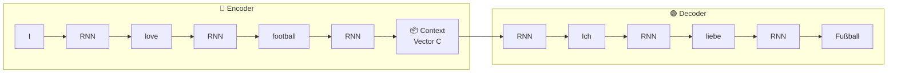

# Transformers and Attention Mechanism

> **The big idea in one sentence:** Transformers are neural networks that can read an entire sentence all at once — instead of one word at a time — and figure out which words are most important for understanding the meaning.

---

## Table of Contents

1. [Quick Recap — ANN, CNN, RNN and Where They Fall Short](#1-quick-recap)
2. [The Seq2Seq Problem — Why We Need Something New](#2-the-seq2seq-problem)
3. [Generation 1 — RNN Encoder-Decoder](#3-generation-1--rnn-encoder-decoder)
4. [The Bottleneck Problem](#4-the-bottleneck-problem)
5. [Generation 2 — Attention Mechanism](#5-generation-2--attention-mechanism)
6. [Generation 3 — The Transformer](#6-generation-3--the-transformer)
7. [Self-Attention — The Heart of the Transformer](#7-self-attention--the-heart-of-the-transformer)
8. [Multi-Head Attention](#8-multi-head-attention)
9. [Positional Encoding](#9-positional-encoding)
10. [Full Transformer Architecture](#10-full-transformer-architecture)
11. [Why Transformers Beat RNNs](#11-why-transformers-beat-rnns)
12. [Quick Reference](#12-quick-reference)
13. [Coming Next](#coming-next)

---

## 1. Quick Recap

Before we talk about Transformers, let's remind ourselves why each previous model type exists and where each breaks down.

```
  Model       What it learned                           Where it breaks down
  ─────────────────────────────────────────────────────────────────────────
  ANN         Patterns in fixed-size, tabular data      Can't handle sequences or images
              (age, salary, temperature)                 Order of inputs doesn't matter to it

  CNN         Patterns in grid-like data (images)        Can't handle variable-length text
              Detects edges → shapes → faces             Doesn't understand word order

  RNN         Patterns in ordered sequences (text)       Forgets early context in long sequences
              Reads word by word, keeps memory           Slow to train (sequential, not parallel)
              LSTM/GRU improved memory, not speed        Still struggles with very long sequences
  ─────────────────────────────────────────────────────────────────────────
```

All three models are great at their own thing. But what happens when you need to **translate a sentence**? Or **summarise a paragraph**? Or **answer a question from a document**?

You have a sequence going **in** and a totally different sequence coming **out**. None of the three models above handle this naturally.

That problem is called **Sequence-to-Sequence** — and it's what we need to solve next.

---

## 2. The Seq2Seq Problem

**Sequence-to-Sequence** (Seq2Seq) means: given a variable-length input, produce a variable-length output.

Real examples:

```
  Task                Input (sequence in)            Output (sequence out)
  ──────────────────────────────────────────────────────────────────────
  Translation         "I love football"              "Ich liebe Fußball"   (German)
  Summarisation       A 500-word article             A 2-sentence summary
  Question answering  "What is the capital of..."    "Paris"
  Chatbot             "How are you?"                 "I'm doing great, thanks!"
  Speech to text      Audio waveform                 Text transcript
  ──────────────────────────────────────────────────────────────────────
```

The tricky part: **the input and output can be different lengths**. The input might be 8 words and the translation might be 6 words — the model has to figure out the mapping.

Over time, three generations of solutions were developed:

```
  Generation 1  →  RNN Encoder-Decoder        (2014)
  Generation 2  →  Seq2Seq + Attention        (2015)
  Generation 3  →  Transformer                (2017 — "Attention Is All You Need")
```

Each one fixed the problems of the last.

---

## 3. Generation 1 — RNN Encoder-Decoder

The first idea was clever: use **two RNNs** — one to read the input, and one to produce the output.

```
  Input sentence:  "I love football"
  Output sentence: "Ich liebe Fußball"
```

### How it works

**Encoder** — an RNN that reads the input word by word.
At each step it updates its hidden state. When it finishes reading the last word, it produces one final vector called the **context vector** — a single fixed-size summary of the entire input.

**Decoder** — another RNN that takes the context vector and generates one output word at a time, using each new word as input for the next step.

```
  ┌─────────────────────────────────────────────────────────────────────────┐
  │                      ENCODER (reads input)                              │
  │                                                                         │
  │  "I"  →  [ RNN ]  →  "love"  →  [ RNN ]  →  "football"  →  [ RNN ]    │
  │             h₁                     h₂                        h₃        │
  │                                                                ↓        │
  │                                                      Context Vector (C) │
  └─────────────────────────────────────────────────────────────────────────┘
                                             ↓
  ┌─────────────────────────────────────────────────────────────────────────┐
  │                      DECODER (produces output)                          │
  │                                                                         │
  │  C  →  [ RNN ]  →  "Ich"    →  [ RNN ]  →  "liebe"  →  [ RNN ]  → ... │
  │                                                                         │
  └─────────────────────────────────────────────────────────────────────────┘
```



### What's good about this

- Clean and simple — one RNN encodes, another decodes
- Works reasonably well for **short sentences**
- First real solution to the seq2seq problem

### But there's a big problem...

---

## 4. The Bottleneck Problem

> **Imagine asking someone to read a 100-page book and then summarise the entire thing by writing exactly one Post-it note. Then you give that Post-it to another person who has never read the book and ask them to translate it into Chinese.**

That's exactly what the RNN Encoder-Decoder is doing. The entire meaning of the input sentence must fit into a **single fixed-size context vector**. This is called the **bottleneck problem**.

```
  Input:   "The cat sat on the mat because it was tired and wanted to rest"
                                    ↓
                         [ fixed-size context vector ]    ← only ~256 numbers
                                                             to capture EVERYTHING
                                    ↓
  Output:  ???   (good luck translating a long sentence from a tiny summary)
```

**What goes wrong:**

- For short sentences: fine → the context vector has enough room
- For long sentences: the model forgets early words by the time it reads the end
- The decoder has to rely entirely on one vector — no way to "look back" at specific words

The decoder generates "Ich" and needs to know it came from "I" — but the context vector doesn't tell it that clearly. It just gives a blurry average of the whole sentence.

```
  Long sentence problem:

  "The bank by the river where we used to fish as children was flooded last year"

  By the time the encoder reaches "flooded", the hidden state has almost
  forgotten "bank" and "river" from the beginning.

  The context vector ends up remembering the end of the sentence most clearly
  — like a person who forgets the first half of a conversation.
```

This is what **Attention** was designed to fix.

---

## 5. Generation 2 — Attention Mechanism

> **The idea:** Instead of giving the decoder just one blurry context vector, let it look at **all the encoder hidden states** — and for each output word, decide which input words it should be paying attention to most.

Think of it like this: when translating the word "liebe", the decoder should be **focusing on** the word "love" from the input. When translating "Fußball", it should focus on "football". Attention lets the model do this automatically.

### A real-world analogy

Imagine you're a translator sitting in a room with a big whiteboard. Every word of the original sentence is written on the whiteboard. When you're about to write the next translated word, you look at the whiteboard and circle the words that are most relevant for what you're about to write. That's attention.

```
  Encoding:  "I love football"
  ─────────────────────────────────────────────────────────────
  Word          Hidden state saved
  "I"      →   h₁   (meaning of "I" at position 1)
  "love"   →   h₂   (meaning of "love" at position 2)
  "football" → h₃   (meaning of "football" at position 3)
  ─────────────────────────────────────────────────────────────

  Now the decoder needs to generate "Fußball" (Football in German).
  Instead of looking at one context vector, it looks at h₁, h₂, h₃
  and asks: "Which of these is most relevant right now?"

  Attention scores:
    h₁ ("I")        →  0.05   (not very relevant for "Fußball")
    h₂ ("love")     →  0.10   (a little relevant)
    h₃ ("football") →  0.85   ← most relevant!

  The decoder forms a weighted sum:
    context = 0.05 × h₁  +  0.10 × h₂  +  0.85 × h₃

  This context is now specific to the word being generated — not a blurry
  average of the whole sentence.
```

### Attention score calculation

For each decoder step, the attention mechanism computes a score between the decoder's current state and each encoder hidden state.

$$\text{score}(s_t, h_i) = s_t^T \cdot h_i$$

Where:

- $s_t$ = decoder hidden state at current step $t$
- $h_i$ = encoder hidden state for input word $i$

Then these scores are normalised with **softmax** to get weights that sum to 1:

$$\alpha_{ti} = \frac{\exp(\text{score}(s_t, h_i))}{\sum_j \exp(\text{score}(s_t, h_j))}$$

And the weighted context is:

$$c_t = \sum_i \alpha_{ti} \cdot h_i$$

In plain English: **softmax turns the scores into percentages**. The encoder hidden states are then blended together based on those percentages. Words with high scores contribute more to the context.

```
  Attention weights visualised (for each output word):
  ──────────────────────────────────────────────────────
  Output word     I      love   football
  ─────────────────────────────────────────────────────
  "Ich"         [0.80]  [0.10]  [0.10]   ← focuses on "I"
  "liebe"       [0.15]  [0.75]  [0.10]   ← focuses on "love"
  "Fußball"     [0.05]  [0.10]  [0.85]   ← focuses on "football"
  ─────────────────────────────────────────────────────
```

### With attention — the full diagram

```
  ┌────────────────────────────────────────────────────────────┐
  │                     ENCODER                                │
  │  "I" → [h₁]  "love" → [h₂]  "football" → [h₃]           │
  └────────────────────────────────────────────────────────────┘
         │              │                │
         ↓              ↓                ↓
  ┌────────────────────────────────────────────────────────────┐
  │              ATTENTION LAYER                               │
  │  For each decoder step, compute a weighted sum of h₁,h₂,h₃│
  │  The weights are learned — high weight = pay attention here│
  └────────────────────────────────────────────────────────────┘
         ↓
  ┌────────────────────────────────────────────────────────────┐
  │                     DECODER                                │
  │  Uses the attention context at each step instead of        │
  │  one fixed context vector                                  │
  └────────────────────────────────────────────────────────────┘
```

Attention was a massive improvement. But the model was still built on top of an RNN — meaning it still had to process words **one at a time** in order. Training was still slow.

That's when researchers asked: what if we **got rid of the RNN entirely** and just used attention?

---

## 6. Generation 3 — The Transformer

> **Paper:** _"Attention Is All You Need"_ — Vaswani et al., Google Brain, 2017

> **The breakthrough:** You don't need recurrence at all. Attention alone — applied in the right way — can process the entire sequence at once, learn which words relate to each other, and produce better results than any RNN.

```
  Timeline:
  ─────────────────────────────────────────────────────────────────────────
  ~2014   RNN Encoder-Decoder          Process one word at a time.
                                       Context vector bottleneck.

  ~2015   RNN + Attention              Fixed bottleneck.
                                       But still sequential — slow training.

  ~2017   Transformer                  Process ALL words at once.
                                       No recurrence at all.
                                       Train much faster on modern GPUs.
                                       Better results on almost every task.

  ~2018+  BERT, GPT, T5, ChatGPT       Transformers at massive scale.
          all built on Transformers
  ─────────────────────────────────────────────────────────────────────────
```

---

## 7. Self-Attention — The Heart of the Transformer

Regular attention was between the **decoder** and the **encoder's hidden states**. The decoder was asking: "which input word should I focus on when producing this output word?"

**Self-attention** is different — it happens within the **same sentence**. Every word in the sentence looks at every other word and asks: "which words in this sentence are important for understanding me?"

### A real example — why self-attention matters

```
  Sentence: "The animal didn't cross the street because it was too tired"

  What does "it" refer to? The animal? Or the street?

  A human knows it's "the animal" — because animals get tired, streets don't.

  Self-attention lets the model figure this out by:
    - "it" looks at "animal" → high attention score (likely the referent)
    - "it" looks at "street" → lower attention score
    - "it" looks at "tired" → high score (confirms — tired relates to animal)
```

### Query, Key, Value — the building blocks

Self-attention is implemented using three vectors for each word: **Query (Q)**, **Key (K)**, and **Value (V)**.

Think of it like a search engine:

```
  You type a search query.
  Each webpage has a title (key) and content (value).
  The engine compares your query against all the keys,
  finds the best matches, and returns the weighted content (values).

  In self-attention:
  ┌──────────┬────────────────────────────────────────────────┐
  │  Query Q │  "What am I looking for?"                       │
  │  Key K   │  "What do I contain / represent?"              │
  │  Value V │  "The actual information I carry"               │
  └──────────┴────────────────────────────────────────────────┘
```

For each word, we compute three vectors by multiplying the word's embedding by three learned weight matrices:

$$Q = X \cdot W_Q, \quad K = X \cdot W_K, \quad V = X \cdot W_V$$

Then the attention output for each word is:

$$\text{Attention}(Q, K, V) = \text{softmax}\!\left(\frac{QK^T}{\sqrt{d_k}}\right) \cdot V$$

where $d_k$ is the dimension of the key vectors — we divide by $\sqrt{d_k}$ to keep the scores from getting too large before softmax.

In plain English:

1. Multiply Q and K to get a similarity score between every pair of words
2. Divide by $\sqrt{d_k}$ to scale down
3. Apply softmax to turn scores into percentages
4. Multiply by V to get a weighted blend of information

```
  Example with 3 words: "I love football"

  Step 1 — Compute Q, K, V for each word
  ──────────────────────────────────────────────────────
  Word         Q (query)    K (key)      V (value)
  "I"          q₁           k₁           v₁
  "love"       q₂           k₂           v₂
  "football"   q₃           k₃           v₃

  Step 2 — Compute attention scores (Q·Kᵀ)
  ──────────────────────────────────────────────────────
           "I"    "love"  "football"
  "I"     [1.2]   [0.4]   [0.2]
  "love"  [0.5]   [1.5]   [0.8]
  "foot." [0.3]   [0.7]   [1.8]

  Each row = how much that word attends to every other word

  Step 3 — Softmax each row → attention weights
  (rows sum to 1, each value is between 0 and 1)

  Step 4 — Weighted sum of Values
  New representation of "football" =
    0.1 × v₁("I")  +  0.2 × v₂("love")  +  0.7 × v₃("football")
```

Every word ends up with a new, richer representation that includes context from the whole sentence — in **one single parallel operation**.

---

## 8. Multi-Head Attention

One round of self-attention is useful. But what if the model needs to capture **multiple types of relationships** at the same time?

For example, in "The bank by the river was flooded":

- One attention head might focus on **grammatical structure** (which word is the subject?)
- Another head might focus on **meaning** (what kind of bank? Financial or riverbank?)
- Another head might focus on **coreferences** (what does "the" refer to?)

**Multi-head attention** runs self-attention **several times in parallel**, each with different learned weight matrices. Then all the outputs are concatenated and projected together.

```
  Multi-Head Attention (h=8 heads means 8 parallel attention operations):

  Input (word embeddings)
       ↓           ↓           ↓           ↓ ... (8 times)
  [Head 1]    [Head 2]    [Head 3]    [Head 8]
  Attention   Attention   Attention   Attention
       ↓           ↓           ↓           ↓
  Concatenate all 8 outputs
       ↓
  Linear projection (combine them back into one representation)
       ↓
  Final output — each word now has a rich representation
                 informed by 8 different perspectives
```

$$\text{MultiHead}(Q,K,V) = \text{Concat}(\text{head}_1, ..., \text{head}_h) \cdot W^O$$

where each head is:

$$\text{head}_i = \text{Attention}(QW_i^Q,\ KW_i^K,\ VW_i^V)$$

---

## 9. Positional Encoding

Self-attention looks at all words **at the same time** — but this means it doesn't naturally know the **order** of the words. RNNs had order built in (they read one word at a time). Transformers need to add this information manually.

> **Problem:** "Dog bites man" and "Man bites dog" have the same words but very different meanings. The Transformer needs to know word order.

**Positional encoding** adds a unique pattern to each word's embedding based on its position in the sentence. Position 1 gets one pattern, position 2 gets a slightly different one, and so on.

```
  Without positional encoding:
  "I love football" → the model sees 3 words, has no idea which came first

  With positional encoding:
  "I"        →  embedding + position_1_pattern
  "love"     →  embedding + position_2_pattern
  "football" →  embedding + position_3_pattern

  Now even though all words are processed in parallel, the model
  can distinguish position 1 from position 2 from position 3.
```

The formulas used are sine and cosine waves of different frequencies:

$$PE_{(pos, 2i)} = \sin\!\left(\frac{pos}{10000^{2i/d_{model}}}\right)$$

$$PE_{(pos, 2i+1)} = \cos\!\left(\frac{pos}{10000^{2i/d_{model}}}\right)$$

The key insight — using waves means **relative positions** can be inferred. The model can figure out "word 5 is 3 positions after word 2" just from the pattern of the values, even for sentences longer than it has seen before.

---

## 10. Full Transformer Architecture

The Transformer is made of two stacks: an **Encoder** (understands the input) and a **Decoder** (generates the output).

```
  Full Transformer — Translation Example
  Input:  "I love football"  →  Output: "Ich liebe Fußball"

  ┌─────────────────────────────────────────────────────────────┐
  │                      ENCODER STACK                          │
  │  (Repeated N times — typically N=6)                         │
  │                                                             │
  │  Input Embeddings  +  Positional Encoding                   │
  │            ↓                                                │
  │  ┌─────────────────────────────────┐                        │
  │  │  Multi-Head Self-Attention      │  ← words attend to     │
  │  │                                 │    each other          │
  │  │  Add & Norm  (residual)         │                        │
  │  │                                 │                        │
  │  │  Feed-Forward Network           │  ← each word processed │
  │  │                                 │    independently       │
  │  │  Add & Norm  (residual)         │                        │
  │  └─────────────────────────────────┘                        │
  │            ↓  (repeat × N)                                  │
  │  Encoder Output (rich representations of every input word)  │
  └─────────────────────────────────────────────────────────────┘
                               ↓
  ┌─────────────────────────────────────────────────────────────┐
  │                      DECODER STACK                          │
  │  (Repeated N times — typically N=6)                         │
  │                                                             │
  │  Output Embeddings  +  Positional Encoding  (so far)        │
  │            ↓                                                │
  │  ┌─────────────────────────────────┐                        │
  │  │  Masked Multi-Head Attention    │  ← output words only   │
  │  │                                 │    attend to earlier   │
  │  │  Add & Norm                     │    output words        │
  │  │                                 │                        │
  │  │  Cross-Attention                │  ← output attends to   │
  │  │  (Encoder-Decoder Attention)    │    encoder output      │
  │  │                                 │                        │
  │  │  Add & Norm                     │                        │
  │  │                                 │                        │
  │  │  Feed-Forward Network           │                        │
  │  │                                 │                        │
  │  │  Add & Norm                     │                        │
  │  └─────────────────────────────────┘                        │
  │            ↓  (repeat × N)                                  │
  │  Linear + Softmax → next word probabilities                 │
  └─────────────────────────────────────────────────────────────┘
```

### Key components explained

| Component                  | What it does                                        | Plain English                                                  |
| -------------------------- | --------------------------------------------------- | -------------------------------------------------------------- |
| Input Embedding            | Turns each word into a vector of numbers            | Gives every word a 512-number identity card                    |
| Positional Encoding        | Adds position info to each word's vector            | Stamps each word with its position number                      |
| Multi-Head Self-Attention  | Each word attends to all other words                | Every word figures out which other words to care about         |
| Masked Attention (Decoder) | Prevents future words from influencing current word | While generating word 3, don't peek at words 4, 5, 6           |
| Cross-Attention            | Decoder attends to encoder output                   | When generating each output word, look at relevant input words |
| Feed-Forward Network       | Applies transformations word-by-word                | A small two-layer ANN run on each word's representation        |
| Add & Norm                 | Adds the input back and normalises                  | Residual connection — keeps gradients flowing during training  |

### The "masking" in masked attention

During training, the decoder sees the correct output sentence all at once. But we don't want it to cheat — when predicting word 3, it shouldn't be able to see words 4, 5, 6. Masking sets the attention scores for future positions to negative infinity before softmax, so they become 0.

```
  Generating "liebe" (word 2):
  Can attend to:  "Ich" (word 1)               ✅
  Cannot attend:  "Fußball" (word 3)           ❌  masked out

  (This is called causal masking or autoregressive decoding)
```

---

## 11. Why Transformers Beat RNNs

```
  ┌───────────────────────────────────────────────────────────────────────┐
  │  Feature              RNN / LSTM           Transformer                │
  ├───────────────────────────────────────────────────────────────────────┤
  │  Processing order     Sequential           Parallel (all at once)     │
  │  Long-range memory    Fades with distance  Direct — any word to any   │
  │  Training speed       Slow                 Fast on GPU/TPU            │
  │  Max context length   ~100–200 tokens      1000s of tokens            │
  │  Parallelisable       ❌ No               ✅ Yes                      │
  │  Handles ambiguity    Limited              Multi-head attention helps  │
  └───────────────────────────────────────────────────────────────────────┘
```

**The key parallelism advantage:**

```
  RNN training:   word1 → word2 → word3 → ... → wordN   (must go in order)
                  Can't start word3 until word2 is done.

  Transformer:    [word1, word2, word3, ..., wordN]  processed all at once
                  All pairs of words attend to each other simultaneously.
                  Modern GPUs are designed for exactly this kind of matrix math.

  Result: Training that took days on RNNs takes hours on Transformers.
```

**The long-range dependency advantage:**

```
  "The trophy didn't fit in the suitcase because it was too big"

  What does "it" refer to? Trophy or suitcase?

  RNN:         By the time it reads "big", the word "trophy" at the start
               is a faint echo in the hidden state. Hard to connect them.

  Transformer: "it" directly attends to both "trophy" and "suitcase" with
               explicit attention scores. Easily learns the correct link.
```

---

## 12. Quick Reference

### The three generations

```
  Generation    Architecture              Main advancement
  ──────────────────────────────────────────────────────────────────────
  1 (2014)      RNN Encoder-Decoder       Fixed-size context vector
  2 (2015)      RNN + Attention           Dynamic context per output word
  3 (2017)      Transformer               No RNN — full parallel attention
  ──────────────────────────────────────────────────────────────────────
```

### Attention formula

$$\text{Attention}(Q, K, V) = \text{softmax}\!\left(\frac{QK^T}{\sqrt{d_k}}\right) \cdot V$$

### Key terms

| Term                | What it means                                                           |
| ------------------- | ----------------------------------------------------------------------- |
| Seq2Seq             | Input sequence → Output sequence (translation, summarisation)           |
| Context vector      | Single fixed summary of encoder output (bottleneck in Gen 1)            |
| Attention           | Let decoder focus on different input words for each output word         |
| Self-attention      | Each word attends to all other words in the same sentence               |
| Q, K, V             | Query, Key, Value — the three vectors used to compute attention scores  |
| Multi-head          | Run attention several times in parallel, capture multiple relationships |
| Positional encoding | Add position information since Transformer has no built-in word order   |
| Masked attention    | Prevents decoder from peeking at future output words during training    |
| Cross-attention     | Decoder attends to the encoder output (bridges encoder and decoder)     |
| Feed-forward block  | Small ANN applied to each word's representation independently           |
| Residual connection | Add the layer's input back to its output — keeps training stable        |

### Famous Transformer-based models

| Model               | Company | What it does                                          |
| ------------------- | ------- | ----------------------------------------------------- |
| BERT                | Google  | Reads text both ways — great for understanding tasks  |
| GPT-2, GPT-3, GPT-4 | OpenAI  | Generates text one word at a time — great for writing |
| ChatGPT             | OpenAI  | GPT fine-tuned for conversation                       |
| T5                  | Google  | Text-to-text: reframes every NLP task as seq2seq      |
| LLaMA               | Meta    | Open-source large language model                      |
| Gemini              | Google  | Multimodal — handles text, images, audio              |

---

## Coming Next

- [ ] BERT deep dive — bidirectional encoding, masked language modelling, fine-tuning
- [ ] GPT architecture — how autoregressive generation works
- [ ] Transformer code — building a simple Transformer from scratch
- [ ] Positional encoding — visualising the sine/cosine patterns
- [ ] Scaled dot-product attention — implementing it with NumPy
