# Transformers and Attention Mechanism

> **The big idea in one sentence:** Transformers are neural networks that can read an entire sentence all at once — instead of one word at a time — and figure out which words are most important for understanding the meaning.

---

## Table of Contents

### Part 1 — The Story So Far (Historical Progression)

1. [Quick Recap — ANN, CNN, RNN and Where They Fall Short](#1-quick-recap)
2. [The Seq2Seq Problem — Why We Need Something New](#2-the-seq2seq-problem)
3. [Generation 1 — RNN Encoder-Decoder](#3-generation-1--rnn-encoder-decoder)
4. [The Bottleneck Problem](#4-the-bottleneck-problem)
5. [Generation 2 — Attention Mechanism](#5-generation-2--attention-mechanism)
6. [Generation 3 — The Transformer](#6-generation-3--the-transformer)

### Part 2 — Core Transformer Mechanics

7. [Self-Attention — The Heart of the Transformer](#7-self-attention--the-heart-of-the-transformer)
8. [Multi-Head Attention](#8-multi-head-attention)
9. [Positional Encoding](#9-positional-encoding)
10. [Full Transformer Architecture](#10-full-transformer-architecture)
11. [Why Transformers Beat RNNs](#11-why-transformers-beat-rnns)
12. [Quick Reference](#12-quick-reference)

### Part 3 — Encoder and Decoder in Depth

13. [Why Old Models Were Not Enough](#why-old-models-were-not-enough)
14. [3 Types of Models (Based on Input/Output)](#3-types-of-models-based-on-inputoutput)
15. [Encoder–Decoder Architecture](#encoderdecoder-architecture)
16. [The Encoder](#the-encoder)
17. [The Decoder](#the-decoder)
18. [Problems with the Basic Encoder–Decoder](#problems-with-the-basic-encoderdecoder)
19. [Attention Mechanism — The Fix](#attention-mechanism--the-fix)
20. [How Attention Weights Are Calculated](#how-attention-weights-are-calculated)
21. [A Real-World Analogy for Attention](#a-real-world-analogy-for-attention)
22. [Types of Attention](#types-of-attention)
23. [Self-Attention — Words Talking to Each Other](#self-attention--words-talking-to-each-other)
24. [Multi-Head Attention — Several Perspectives at Once](#multi-head-attention--several-perspectives-at-once)
25. [The Transformer — Putting It All Together](#the-transformer--putting-it-all-together)
26. [Positional Encoding — Giving Words a Sense of Order](#positional-encoding--giving-words-a-sense-of-order)
27. [Residual Connections and Layer Normalisation](#residual-connections-and-layer-normalisation)
28. [Why Attention + RNN Still Had Problems](#why-attention--rnn-still-had-problems)
29. [How the Transformer Removed the Last Bottleneck](#how-the-transformer-removed-the-last-bottleneck)
30. [What Can a Transformer Do?](#what-can-a-transformer-do)

### Part 4 — Deep Dives

31. [Transformer Architecture — Layer by Layer](#transformer-architecture--layer-by-layer)
32. [Inside One Encoder Block](#inside-one-encoder-block)
33. [Self-Attention — A Worked Example with Real Numbers](#self-attention--a-worked-example-with-real-numbers)
34. [Multi-Head Attention — Eight Perspectives at Once](#multi-head-attention--eight-perspectives-at-once)
35. [After Multi-Head Attention — Concatenate, Project, Normalise](#after-multi-head-attention--concatenate-project-normalise)
36. [Positional Encoding — Why Parallel Processing Needs It](#positional-encoding--why-parallel-processing-needs-it)
37. [Feed-Forward Network (FFN) — Deepening Each Word's Understanding](#feed-forward-network-ffn--deepening-each-words-understanding)
38. [Multiple Encoder Layers — Building Up Understanding Gradually](#multiple-encoder-layers--building-up-understanding-gradually)
39. [The Decoder Stack — Generating the Output](#the-decoder-stack--generating-the-output)
40. [Training vs Inference — Two Very Different Modes](#training-vs-inference--two-very-different-modes)
41. [Masked Multi-Head Attention — Stopping the Decoder from Cheating](#masked-multi-head-attention--stopping-the-decoder-from-cheating)
42. [Cross-Attention — The Bridge Between Encoder and Decoder](#cross-attention--the-bridge-between-encoder-and-decoder)
43. [Reference Material](#reference-material)
44. [Coming Next](#coming-next)

---

## 1. Quick Recap

Before we talk about Transformers, let's remind ourselves why each previous model type exists and where each breaks down.

```
  Model       What it learned                           Where it breaks down
  ─────────────────────────────────────────────────────────────────────────
  ANN         Patterns in fixed-size, tabular data      Can't handle sequences or images
              (age, salary, temperature)                 Order of inputs doesn't matter to it

  CNN         Patterns in grid-like data (images)        Can't handle variable-length text
              Detects edges → shapes → faces             Doesn't understand word order

  RNN         Patterns in ordered sequences (text)       Forgets early context in long sequences
              Reads word by word, keeps memory           Slow to train (sequential, not parallel)
              LSTM/GRU improved memory, not speed        Still struggles with very long sequences
  ─────────────────────────────────────────────────────────────────────────
```

All three models are great at their own thing. But what happens when you need to **translate a sentence**? Or **summarise a paragraph**? Or **answer a question from a document**?

You have a sequence going **in** and a totally different sequence coming **out**. None of the three models above handle this naturally.

That problem is called **Sequence-to-Sequence** — and it's what we need to solve next.

---

## 2. The Seq2Seq Problem

**Sequence-to-Sequence** (Seq2Seq) means: given a variable-length input, produce a variable-length output.

Real examples:

```
  Task                Input (sequence in)            Output (sequence out)
  ──────────────────────────────────────────────────────────────────────
  Translation         "I love football"              "Ich liebe Fußball"   (German)
  Summarisation       A 500-word article             A 2-sentence summary
  Question answering  "What is the capital of..."    "Paris"
  Chatbot             "How are you?"                 "I'm doing great, thanks!"
  Speech to text      Audio waveform                 Text transcript
  ──────────────────────────────────────────────────────────────────────
```

The tricky part: **the input and output can be different lengths**. The input might be 8 words and the translation might be 6 words — the model has to figure out the mapping.

Over time, three generations of solutions were developed:

```
  Generation 1  →  RNN Encoder-Decoder        (2014)
  Generation 2  →  Seq2Seq + Attention        (2015)
  Generation 3  →  Transformer                (2017 — "Attention Is All You Need")
```

Each one fixed the problems of the last.

---

## 3. Generation 1 — RNN Encoder-Decoder

The first idea was clever: use **two RNNs** — one to read the input, and one to produce the output.

```
  Input sentence:  "I love football"
  Output sentence: "Ich liebe Fußball"
```

### How it works

**Encoder** — an RNN that reads the input word by word.
At each step it updates its hidden state. When it finishes reading the last word, it produces one final vector called the **context vector** — a single fixed-size summary of the entire input.

**Decoder** — another RNN that takes the context vector and generates one output word at a time, using each new word as input for the next step.

```
  ┌─────────────────────────────────────────────────────────────────────────┐
  │                      ENCODER (reads input)                              │
  │                                                                         │
  │  "I"  →  [ RNN ]  →  "love"  →  [ RNN ]  →  "football"  →  [ RNN ]    │
  │             h₁                     h₂                        h₃        │
  │                                                                ↓        │
  │                                                      Context Vector (C) │
  └─────────────────────────────────────────────────────────────────────────┘
                                             ↓
  ┌─────────────────────────────────────────────────────────────────────────┐
  │                      DECODER (produces output)                          │
  │                                                                         │
  │  C  →  [ RNN ]  →  "Ich"    →  [ RNN ]  →  "liebe"  →  [ RNN ]  → ... │
  │                                                                         │
  └─────────────────────────────────────────────────────────────────────────┘
```

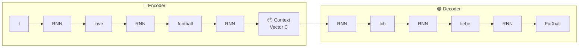

### What's good about this

- Clean and simple — one RNN encodes, another decodes
- Works reasonably well for **short sentences**
- First real solution to the seq2seq problem

### But there's a big problem...

---

## 4. The Bottleneck Problem

> **Imagine asking someone to read a 100-page book and then summarise the entire thing by writing exactly one Post-it note. Then you give that Post-it to another person who has never read the book and ask them to translate it into Chinese.**

That's exactly what the RNN Encoder-Decoder is doing. The entire meaning of the input sentence must fit into a **single fixed-size context vector**. This is called the **bottleneck problem**.

```
  Input:   "The cat sat on the mat because it was tired and wanted to rest"
                                    ↓
                         [ fixed-size context vector ]    ← only ~256 numbers
                                                             to capture EVERYTHING
                                    ↓
  Output:  ???   (good luck translating a long sentence from a tiny summary)
```

**What goes wrong:**

- For short sentences: fine → the context vector has enough room
- For long sentences: the model forgets early words by the time it reads the end
- The decoder has to rely entirely on one vector — no way to "look back" at specific words

The decoder generates "Ich" and needs to know it came from "I" — but the context vector doesn't tell it that clearly. It just gives a blurry average of the whole sentence.

```
  Long sentence problem:

  "The bank by the river where we used to fish as children was flooded last year"

  By the time the encoder reaches "flooded", the hidden state has almost
  forgotten "bank" and "river" from the beginning.

  The context vector ends up remembering the end of the sentence most clearly
  — like a person who forgets the first half of a conversation.
```

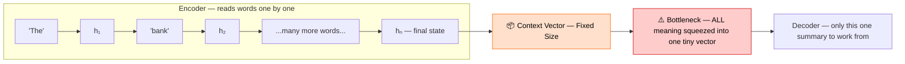

This is what **Attention** was designed to fix.

---

## 5. Generation 2 — Attention Mechanism

> **The idea:** Instead of giving the decoder just one blurry context vector, let it look at **all the encoder hidden states** — and for each output word, decide which input words it should be paying attention to most.

Think of it like this: when translating the word "liebe", the decoder should be **focusing on** the word "love" from the input. When translating "Fußball", it should focus on "football". Attention lets the model do this automatically.

### A real-world analogy

Imagine you're a translator sitting in a room with a big whiteboard. Every word of the original sentence is written on the whiteboard. When you're about to write the next translated word, you look at the whiteboard and circle the words that are most relevant for what you're about to write. That's attention.

```
  Encoding:  "I love football"
  ─────────────────────────────────────────────────────────────
  Word          Hidden state saved
  "I"      →   h₁   (meaning of "I" at position 1)
  "love"   →   h₂   (meaning of "love" at position 2)
  "football" → h₃   (meaning of "football" at position 3)
  ─────────────────────────────────────────────────────────────

  Now the decoder needs to generate "Fußball" (Football in German).
  Instead of looking at one context vector, it looks at h₁, h₂, h₃
  and asks: "Which of these is most relevant right now?"

  Attention scores:
    h₁ ("I")        →  0.05   (not very relevant for "Fußball")
    h₂ ("love")     →  0.10   (a little relevant)
    h₃ ("football") →  0.85   ← most relevant!

  The decoder forms a weighted sum:
    context = 0.05 × h₁  +  0.10 × h₂  +  0.85 × h₃

  This context is now specific to the word being generated — not a blurry
  average of the whole sentence.
```

### Attention score calculation

For each decoder step, the attention mechanism computes a score between the decoder's current state and each encoder hidden state.

$$\text{score}(s_t, h_i) = s_t^T \cdot h_i$$

Where:

- $s_t$ = decoder hidden state at current step $t$
- $h_i$ = encoder hidden state for input word $i$

Then these scores are normalised with **softmax** to get weights that sum to 1:

$$\alpha_{ti} = \frac{\exp(\text{score}(s_t, h_i))}{\sum_j \exp(\text{score}(s_t, h_j))}$$

And the weighted context is:

$$c_t = \sum_i \alpha_{ti} \cdot h_i$$

In plain English: **softmax turns the scores into percentages**. The encoder hidden states are then blended together based on those percentages. Words with high scores contribute more to the context.

```
  Attention weights visualised (for each output word):
  ──────────────────────────────────────────────────────
  Output word     I      love   football
  ─────────────────────────────────────────────────────
  "Ich"         [0.80]  [0.10]  [0.10]   ← focuses on "I"
  "liebe"       [0.15]  [0.75]  [0.10]   ← focuses on "love"
  "Fußball"     [0.05]  [0.10]  [0.85]   ← focuses on "football"
  ─────────────────────────────────────────────────────
```

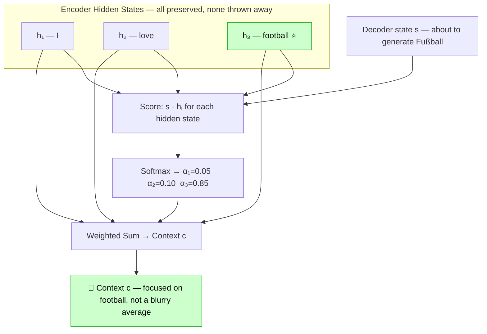


### With attention — the full diagram

```
  ┌────────────────────────────────────────────────────────────┐
  │                     ENCODER                                │
  │  "I" → [h₁]  "love" → [h₂]  "football" → [h₃]           │
  └────────────────────────────────────────────────────────────┘
         │              │                │
         ↓              ↓                ↓
  ┌────────────────────────────────────────────────────────────┐
  │              ATTENTION LAYER                               │
  │  For each decoder step, compute a weighted sum of h₁,h₂,h₃│
  │  The weights are learned — high weight = pay attention here│
  └────────────────────────────────────────────────────────────┘
         ↓
  ┌────────────────────────────────────────────────────────────┐
  │                     DECODER                                │
  │  Uses the attention context at each step instead of        │
  │  one fixed context vector                                  │
  └────────────────────────────────────────────────────────────┘
```

Attention was a massive improvement. But the model was still built on top of an RNN — meaning it still had to process words **one at a time** in order. Training was still slow.

That's when researchers asked: what if we **got rid of the RNN entirely** and just used attention?

---

## 6. Generation 3 — The Transformer

> **Paper:** _"Attention Is All You Need"_ — Vaswani et al., Google Brain, 2017

> **The breakthrough:** You don't need recurrence at all. Attention alone — applied in the right way — can process the entire sequence at once, learn which words relate to each other, and produce better results than any RNN.

```
  Timeline:
  ─────────────────────────────────────────────────────────────────────────
  ~2014   RNN Encoder-Decoder          Process one word at a time.
                                       Context vector bottleneck.

  ~2015   RNN + Attention              Fixed bottleneck.
                                       But still sequential — slow training.

  ~2017   Transformer                  Process ALL words at once.
                                       No recurrence at all.
                                       Train much faster on modern GPUs.
                                       Better results on almost every task.

  ~2018+  BERT, GPT, T5, ChatGPT       Transformers at massive scale.
          all built on Transformers
  ─────────────────────────────────────────────────────────────────────────
```

---

## 7. Self-Attention — The Heart of the Transformer

Regular attention was between the **decoder** and the **encoder's hidden states**. The decoder was asking: "which input word should I focus on when producing this output word?"

**Self-attention** is different — it happens within the **same sentence**. Every word in the sentence looks at every other word and asks: "which words in this sentence are important for understanding me?"

### A real example — why self-attention matters

```
  Sentence: "The animal didn't cross the street because it was too tired"

  What does "it" refer to? The animal? Or the street?

  A human knows it's "the animal" — because animals get tired, streets don't.

  Self-attention lets the model figure this out by:
    - "it" looks at "animal" → high attention score (likely the referent)
    - "it" looks at "street" → lower attention score
    - "it" looks at "tired" → high score (confirms — tired relates to animal)
```

### Query, Key, Value — the building blocks

Self-attention is implemented using three vectors for each word: **Query (Q)**, **Key (K)**, and **Value (V)**.

Think of it like a search engine:

```
  You type a search query.
  Each webpage has a title (key) and content (value).
  The engine compares your query against all the keys,
  finds the best matches, and returns the weighted content (values).

  In self-attention:
  ┌──────────┬────────────────────────────────────────────────┐
  │  Query Q │  "What am I looking for?"                       │
  │  Key K   │  "What do I contain / represent?"              │
  │  Value V │  "The actual information I carry"               │
  └──────────┴────────────────────────────────────────────────┘
```

For each word, we compute three vectors by multiplying the word's embedding by three learned weight matrices:

$$Q = X \cdot W_Q, \quad K = X \cdot W_K, \quad V = X \cdot W_V$$

Then the attention output for each word is:

$$\text{Attention}(Q, K, V) = \text{softmax}\!\left(\frac{QK^T}{\sqrt{d_k}}\right) \cdot V$$

where $d_k$ is the dimension of the key vectors — we divide by $\sqrt{d_k}$ to keep the scores from getting too large before softmax.

In plain English:

1. Multiply Q and K to get a similarity score between every pair of words
2. Divide by $\sqrt{d_k}$ to scale down
3. Apply softmax to turn scores into percentages
4. Multiply by V to get a weighted blend of information

```
  Example with 3 words: "I love football"

  Step 1 — Compute Q, K, V for each word
  ──────────────────────────────────────────────────────
  Word         Q (query)    K (key)      V (value)
  "I"          q₁           k₁           v₁
  "love"       q₂           k₂           v₂
  "football"   q₃           k₃           v₃

  Step 2 — Compute attention scores (Q·Kᵀ)
  ──────────────────────────────────────────────────────
           "I"    "love"  "football"
  "I"     [1.2]   [0.4]   [0.2]
  "love"  [0.5]   [1.5]   [0.8]
  "foot." [0.3]   [0.7]   [1.8]

  Each row = how much that word attends to every other word

  Step 3 — Softmax each row → attention weights
  (rows sum to 1, each value is between 0 and 1)

  Step 4 — Weighted sum of Values
  New representation of "football" =
    0.1 × v₁("I")  +  0.2 × v₂("love")  +  0.7 × v₃("football")
```

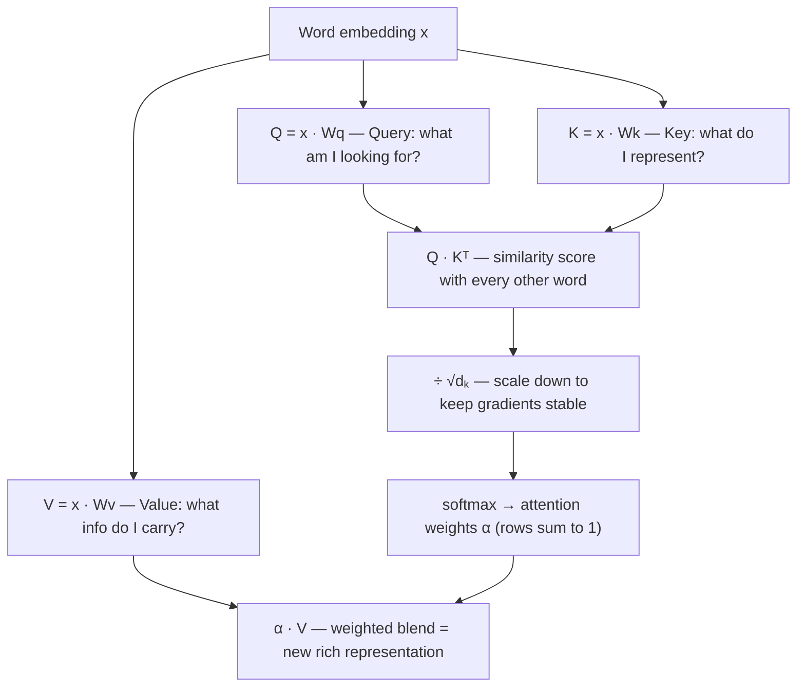

Every word ends up with a new, richer representation that includes context from the whole sentence — in **one single parallel operation**.

---

## 8. Multi-Head Attention

One round of self-attention is useful. But what if the model needs to capture **multiple types of relationships** at the same time?

For example, in "The bank by the river was flooded":

- One attention head might focus on **grammatical structure** (which word is the subject?)
- Another head might focus on **meaning** (what kind of bank? Financial or riverbank?)
- Another head might focus on **coreferences** (what does "the" refer to?)

**Multi-head attention** runs self-attention **several times in parallel**, each with different learned weight matrices. Then all the outputs are concatenated and projected together.

```
  Multi-Head Attention (h=8 heads means 8 parallel attention operations):

  Input (word embeddings)
       ↓           ↓           ↓           ↓ ... (8 times)
  [Head 1]    [Head 2]    [Head 3]    [Head 8]
  Attention   Attention   Attention   Attention
       ↓           ↓           ↓           ↓
  Concatenate all 8 outputs
       ↓
  Linear projection (combine them back into one representation)
       ↓
  Final output — each word now has a rich representation
                 informed by 8 different perspectives
```

$$\text{MultiHead}(Q,K,V) = \text{Concat}(\text{head}_1, ..., \text{head}_h) \cdot W^O$$

where each head is:

$$\text{head}_i = \text{Attention}(QW_i^Q,\ KW_i^K,\ VW_i^V)$$

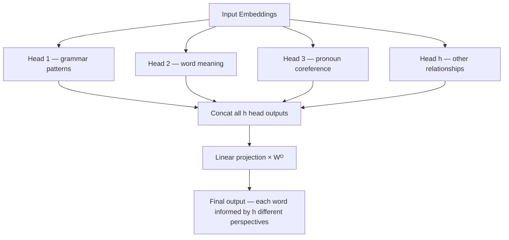

---

## 9. Positional Encoding

Self-attention looks at all words **at the same time** — but this means it doesn't naturally know the **order** of the words. RNNs had order built in (they read one word at a time). Transformers need to add this information manually.

> **Problem:** "Dog bites man" and "Man bites dog" have the same words but very different meanings. The Transformer needs to know word order.

**Positional encoding** adds a unique pattern to each word's embedding based on its position in the sentence. Position 1 gets one pattern, position 2 gets a slightly different one, and so on.

```
  Without positional encoding:
  "I love football" → the model sees 3 words, has no idea which came first

  With positional encoding:
  "I"        →  embedding + position_1_pattern
  "love"     →  embedding + position_2_pattern
  "football" →  embedding + position_3_pattern

  Now even though all words are processed in parallel, the model
  can distinguish position 1 from position 2 from position 3.
```

The formulas used are sine and cosine waves of different frequencies:

$$PE_{(pos, 2i)} = \sin\!\left(\frac{pos}{10000^{2i/d_{model}}}\right)$$

$$PE_{(pos, 2i+1)} = \cos\!\left(\frac{pos}{10000^{2i/d_{model}}}\right)$$

The key insight — using waves means **relative positions** can be inferred. The model can figure out "word 5 is 3 positions after word 2" just from the pattern of the values, even for sentences longer than it has seen before.

---

## 10. Full Transformer Architecture

The Transformer is made of two stacks: an **Encoder** (understands the input) and a **Decoder** (generates the output).

```
  Full Transformer — Translation Example
  Input:  "I love football"  →  Output: "Ich liebe Fußball"

  ┌─────────────────────────────────────────────────────────────┐
  │                      ENCODER STACK                          │
  │  (Repeated N times — typically N=6)                         │
  │                                                             │
  │  Input Embeddings  +  Positional Encoding                   │
  │            ↓                                                │
  │  ┌─────────────────────────────────┐                        │
  │  │  Multi-Head Self-Attention      │  ← words attend to     │
  │  │                                 │    each other          │
  │  │  Add & Norm  (residual)         │                        │
  │  │                                 │                        │
  │  │  Feed-Forward Network           │  ← each word processed │
  │  │                                 │    independently       │
  │  │  Add & Norm  (residual)         │                        │
  │  └─────────────────────────────────┘                        │
  │            ↓  (repeat × N)                                  │
  │  Encoder Output (rich representations of every input word)  │
  └─────────────────────────────────────────────────────────────┘
                               ↓
  ┌─────────────────────────────────────────────────────────────┐
  │                      DECODER STACK                          │
  │  (Repeated N times — typically N=6)                         │
  │                                                             │
  │  Output Embeddings  +  Positional Encoding  (so far)        │
  │            ↓                                                │
  │  ┌─────────────────────────────────┐                        │
  │  │  Masked Multi-Head Attention    │  ← output words only   │
  │  │                                 │    attend to earlier   │
  │  │  Add & Norm                     │    output words        │
  │  │                                 │                        │
  │  │  Cross-Attention                │  ← output attends to   │
  │  │  (Encoder-Decoder Attention)    │    encoder output      │
  │  │                                 │                        │
  │  │  Add & Norm                     │                        │
  │  │                                 │                        │
  │  │  Feed-Forward Network           │                        │
  │  │                                 │                        │
  │  │  Add & Norm                     │                        │
  │  └─────────────────────────────────┘                        │
  │            ↓  (repeat × N)                                  │
  │  Linear + Softmax → next word probabilities                 │
  └─────────────────────────────────────────────────────────────┘
```

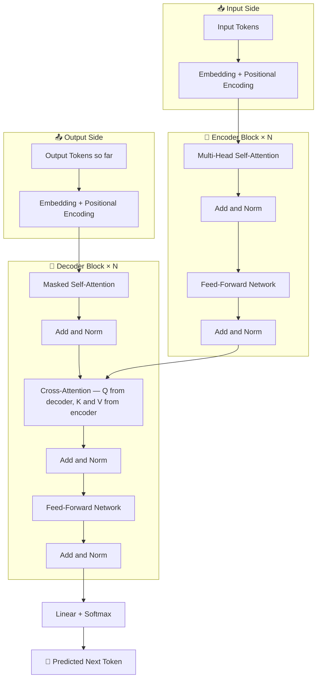

### Key components explained

| Component                  | What it does                                        | Plain English                                                  |
| -------------------------- | --------------------------------------------------- | -------------------------------------------------------------- |
| Input Embedding            | Turns each word into a vector of numbers            | Gives every word a 512-number identity card                    |
| Positional Encoding        | Adds position info to each word's vector            | Stamps each word with its position number                      |
| Multi-Head Self-Attention  | Each word attends to all other words                | Every word figures out which other words to care about         |
| Masked Attention (Decoder) | Prevents future words from influencing current word | While generating word 3, don't peek at words 4, 5, 6           |
| Cross-Attention            | Decoder attends to encoder output                   | When generating each output word, look at relevant input words |
| Feed-Forward Network       | Applies transformations word-by-word                | A small two-layer ANN run on each word's representation        |
| Add & Norm                 | Adds the input back and normalises                  | Residual connection — keeps gradients flowing during training  |

### The "masking" in masked attention

During training, the decoder sees the correct output sentence all at once. But we don't want it to cheat — when predicting word 3, it shouldn't be able to see words 4, 5, 6. Masking sets the attention scores for future positions to negative infinity before softmax, so they become 0.

```
  Generating "liebe" (word 2):
  Can attend to:  "Ich" (word 1)               ✅
  Cannot attend:  "Fußball" (word 3)           ❌  masked out

  (This is called causal masking or autoregressive decoding)
```

---

## 11. Why Transformers Beat RNNs

```
  ┌───────────────────────────────────────────────────────────────────────┐
  │  Feature              RNN / LSTM           Transformer                │
  ├───────────────────────────────────────────────────────────────────────┤
  │  Processing order     Sequential           Parallel (all at once)     │
  │  Long-range memory    Fades with distance  Direct — any word to any   │
  │  Training speed       Slow                 Fast on GPU/TPU            │
  │  Max context length   ~100–200 tokens      1000s of tokens            │
  │  Parallelisable       ❌ No               ✅ Yes                      │
  │  Handles ambiguity    Limited              Multi-head attention helps  │
  └───────────────────────────────────────────────────────────────────────┘
```

**The key parallelism advantage:**

```
  RNN training:   word1 → word2 → word3 → ... → wordN   (must go in order)
                  Can't start word3 until word2 is done.

  Transformer:    [word1, word2, word3, ..., wordN]  processed all at once
                  All pairs of words attend to each other simultaneously.
                  Modern GPUs are designed for exactly this kind of matrix math.

  Result: Training that took days on RNNs takes hours on Transformers.
```

**The long-range dependency advantage:**

```
  "The trophy didn't fit in the suitcase because it was too big"

  What does "it" refer to? Trophy or suitcase?

  RNN:         By the time it reads "big", the word "trophy" at the start
               is a faint echo in the hidden state. Hard to connect them.

  Transformer: "it" directly attends to both "trophy" and "suitcase" with
               explicit attention scores. Easily learns the correct link.
```

---

## 12. Quick Reference

### The three generations

```
  Generation    Architecture              Main advancement
  ──────────────────────────────────────────────────────────────────────
  1 (2014)      RNN Encoder-Decoder       Fixed-size context vector
  2 (2015)      RNN + Attention           Dynamic context per output word
  3 (2017)      Transformer               No RNN — full parallel attention
  ──────────────────────────────────────────────────────────────────────
```

### Attention formula

$$\text{Attention}(Q, K, V) = \text{softmax}\!\left(\frac{QK^T}{\sqrt{d_k}}\right) \cdot V$$

### Key terms

| Term                | What it means                                                           |
| ------------------- | ----------------------------------------------------------------------- |
| Seq2Seq             | Input sequence → Output sequence (translation, summarisation)           |
| Context vector      | Single fixed summary of encoder output (bottleneck in Gen 1)            |
| Attention           | Let decoder focus on different input words for each output word         |
| Self-attention      | Each word attends to all other words in the same sentence               |
| Q, K, V             | Query, Key, Value — the three vectors used to compute attention scores  |
| Multi-head          | Run attention several times in parallel, capture multiple relationships |
| Positional encoding | Add position information since Transformer has no built-in word order   |
| Masked attention    | Prevents decoder from peeking at future output words during training    |
| Cross-attention     | Decoder attends to the encoder output (bridges encoder and decoder)     |
| Feed-forward block  | Small ANN applied to each word's representation independently           |
| Residual connection | Add the layer's input back to its output — keeps training stable        |

### Famous Transformer-based models

| Model               | Company | What it does                                          |
| ------------------- | ------- | ----------------------------------------------------- |
| BERT                | Google  | Reads text both ways — great for understanding tasks  |
| GPT-2, GPT-3, GPT-4 | OpenAI  | Generates text one word at a time — great for writing |
| ChatGPT             | OpenAI  | GPT fine-tuned for conversation                       |
| T5                  | Google  | Text-to-text: reframes every NLP task as seq2seq      |
| LLaMA               | Meta    | Open-source large language model                      |
| Gemini              | Google  | Multimodal — handles text, images, audio              |

---

## Why Old Models Were Not Enough

ANNs, RNNs, and CNNs each had their own limitations. To solve harder language tasks — especially ones where the output is a completely new sequence — we needed a new design.

---

## 3 Types of Models (Based on Input/Output)

| Type                         | What it does                      | Example                         |
| ---------------------------- | --------------------------------- | ------------------------------- |
| Single input → Single output | One thing in, one thing out       | Spam detection                  |
| Sequence → Label             | A sentence in, one label out      | Sentiment analysis              |
| Sequence → Sequence          | A sentence in, a new sentence out | Translation, Q&A, summarisation |

The third type — **Sequence to Sequence (Seq2Seq)** — is what powers most Generative AI today. It uses two parts: an **Encoder** and a **Decoder**.

---

## Encoder–Decoder Architecture

Think of it like a two-person relay:

1. The **Encoder** reads the full input and summarises it into a single compact representation called the **Context Vector**.
2. The **Decoder** takes that context vector and generates the output one word at a time.

```
Input Sentence → Encoder → Context Vector → Decoder → Output Sentence
```

---

## The Encoder

The encoder's only job is to **understand the input** — it does not produce any output words.

- Can use RNN, LSTM, GRU, etc. under the hood
- Reads the input from left to right
- Compresses everything into a fixed-size context vector

---

## The Decoder

The decoder's job is to **generate the output**, one word at a time. But it behaves differently depending on whether it is training or predicting.

**During Training (Teacher Forcing):**

- The decoder is shown the correct previous word at every step
- It gets "helped" — like a student using an answer key while practising

**During Prediction:**

- The decoder is on its own — no answer key
- It uses its own previously generated word as the next input
- Starts with a special `<start>` token

**Other key facts about the decoder:**

- It is probability-based — it always ends with a Softmax to pick the most likely next word
- It depends on the previous word at every step

---

## Problems with the Basic Encoder–Decoder

| Problem                       | What it means                                                                                                    |
| ----------------------------- | ---------------------------------------------------------------------------------------------------------------- |
| **Information Bottleneck**    | The entire input is squeezed into one fixed-size vector — too small for long sentences                           |
| **No word-to-word alignment** | The decoder has no way to know which input word is most relevant right now                                       |
| **Exposure Bias**             | During training the decoder got "helped" (teacher forcing), but at prediction time it is on its own — a mismatch |
| **Long sentence failure**     | The longer the input, the harder it is for the encoder to capture everything in one vector                       |

---

## Attention Mechanism — The Fix

> _"What if the decoder could look back at the input whenever it needed, instead of relying on just one context vector?"_

That is exactly what **Attention** does.

Instead of one fixed context vector for the whole sentence, attention lets the decoder create a **fresh, custom context vector for each output word** — by looking at all encoder hidden states and deciding which ones matter most right now.

**How it works (simplified):**

- The encoder produces a hidden state at every input word: `h1, h2, h3, h4`
- For each output word, attention assigns a weight (`α`) to each hidden state — higher weight = more relevant
- A weighted sum is computed:

```
c1 = α1·h1 + α2·h2 + α3·h3 + α4·h4
```

- These weights change for every output word — so when translating "bank", the model pays more attention to the word "money" in the input than to "river"

This small change made a massive difference in translation quality for long sentences.

---

## How Attention Weights Are Calculated

You might wonder — how does the model decide _how much attention_ to give each word?

It uses a small scoring function that compares the **decoder's current state** with each **encoder hidden state**. The score tells us: "how relevant is this encoder word to what the decoder is trying to generate right now?"

The steps are:

1. **Score** — compare decoder state `s` with each encoder hidden state `h`:

   ```
   score(s, hᵢ) = sᵀ · hᵢ        (dot product — simplest form)
   ```

2. **Normalise** — run all scores through Softmax so they add up to 1:

   ```
   αᵢ = softmax(score(s, hᵢ))
   ```

3. **Weighted sum** — multiply each hidden state by its weight and add them up:
   ```
   context vector c = Σ αᵢ · hᵢ
   ```

This is repeated fresh for every single output word the decoder generates.

---

## A Real-World Analogy for Attention

Imagine you are translating the sentence:

> _"The cat sat on the mat"_

When generating the French word for "cat" (→ _le chat_), you naturally focus your eyes on the word **"cat"** in the English sentence, not on "mat" or "sat".

That is exactly what attention does — it tells the decoder _where to look_ in the input at each step.

Without attention, the decoder was like a student who had to memorise the entire paragraph before answering a question. With attention, the student can flip back to the relevant paragraph while answering. Much easier.

---

## Types of Attention

Over time, researchers came up with different flavours of attention:

| Type                                 | Description                                                                          |
| ------------------------------------ | ------------------------------------------------------------------------------------ |
| **Bahdanau Attention** (Additive)    | The original attention — uses a small neural network to compute scores               |
| **Luong Attention** (Multiplicative) | Simpler — uses dot product between decoder and encoder states                        |
| **Self-Attention**                   | A word attends to _other words in the same sentence_ — used in Transformers          |
| **Multi-Head Attention**             | Run attention multiple times in parallel, each "head" learns different relationships |

Self-attention and multi-head attention are the core building blocks of the **Transformer** architecture.

---

## Self-Attention — Words Talking to Each Other

In a regular sentence, words depend on each other:

> _"The animal didn't cross the street because **it** was too tired"_

What does "it" refer to — the animal or the street? Humans understand it is the animal. Self-attention lets the model figure this out too, by letting every word look at every other word in the same sentence.

**How self-attention works:**

Each word is turned into three vectors:

- **Query (Q)** — "what am I looking for?"
- **Key (K)** — "what do I contain?"
- **Value (V)** — "what information do I carry?"

The attention score between two words is:

```
Attention(Q, K, V) = softmax( Q·Kᵀ / √dₖ ) · V
```

- `Q·Kᵀ` — how well does this word match each other word?
- `/ √dₖ` — divide by square root of key size to prevent huge numbers (keeps gradients stable)
- `softmax(...)` — convert scores to weights that sum to 1
- `· V` — use those weights to take a weighted mix of all values

The result is a new representation for each word — now enriched with context from all other words.

---

## Multi-Head Attention — Several Perspectives at Once

Running attention once gives you one perspective. But a sentence can have multiple kinds of relationships:

- Subject–verb agreement
- Pronoun–reference ("it" → "animal")
- Modifier–noun ("tired" → "animal")

**Multi-head attention** runs self-attention several times in parallel, each with different Q, K, V weight matrices. Each "head" learns to focus on a different type of relationship. The results are then concatenated and projected back.

```
MultiHead(Q, K, V) = Concat(head₁, head₂, ..., headₕ) · Wᴼ
```

Think of it like a panel of reviewers — each one reads the sentence with a different lens, and their observations are combined at the end.

---

## The Transformer — Putting It All Together

The Transformer was introduced in the 2017 paper **"Attention Is All You Need"** (Vaswani et al.). It threw away RNNs completely and built everything on attention.

**Key differences from RNN-based seq2seq:**

| Feature                 | RNN Seq2Seq                | Transformer                    |
| ----------------------- | -------------------------- | ------------------------------ |
| Processes words         | One at a time (sequential) | All at once (parallel)         |
| Long-range dependencies | Struggles                  | Handles easily via attention   |
| Training speed          | Slow                       | Much faster (parallelisable)   |
| Memory of context       | Fades over distance        | Attention covers full sequence |

**High-level Transformer structure:**

```
Input Tokens
    ↓
Embedding + Positional Encoding
    ↓
[ Encoder Block × N ]
  - Multi-Head Self-Attention
  - Feed Forward Network
  - Add & Norm (residual connections)
    ↓
Context Representations
    ↓
[ Decoder Block × N ]
  - Masked Multi-Head Self-Attention
  - Cross-Attention (looks at encoder output)
  - Feed Forward Network
  - Add & Norm
    ↓
Linear + Softmax
    ↓
Output Tokens
```

---

## Positional Encoding — Giving Words a Sense of Order

Self-attention sees all words at once — but that means it has no idea about _order_. The word "dog bites man" and "man bites dog" would look identical without some notion of position.

**Positional encoding** adds a position signal to each word embedding before it enters the Transformer. The original paper used sine and cosine functions at different frequencies:

```
PE(pos, 2i)   = sin(pos / 10000^(2i/dmodel))
PE(pos, 2i+1) = cos(pos / 10000^(2i/dmodel))
```

- `pos` = position of the word in the sequence
- `i` = dimension index
- `dmodel` = size of the embedding

Each position gets a unique pattern of values. The model learns to use these patterns to understand word order.

Think of it like seat numbers in a cinema — the movie (word content) is the same, but the seat number (positional encoding) tells you exactly where each person sits.

---

## Residual Connections and Layer Normalisation

Inside each Transformer block, there are two small but important tricks:

**Residual Connection (Add):**
Instead of just passing the output forward, the input is _added back_ to the output:

```
output = LayerNorm(x + SubLayer(x))
```

This helps gradients flow during training and prevents information from being completely lost as it passes through many layers.

**Layer Normalisation (Norm):**
Normalises the values across features for each token individually. This stabilises training and helps the model learn faster.

---

## Why Attention + RNN Still Had Problems

> You gave the decoder eyes — but the encoder was still reading word-by-word, one step at a time.

Attention fixed the **decoder's** problem beautifully. It could now look at every encoder hidden state and pick the relevant ones. But the **encoder itself** was still an RNN under the hood — it still had to process one word at a time, left to right, step by step.

That single constraint caused five cascading problems:

| Problem                         | What it means in practice                                                                                                                 |
| ------------------------------- | ----------------------------------------------------------------------------------------------------------------------------------------- |
| **Still sequential**            | The encoder cannot process word 3 until it finishes word 2. No matter how fast your hardware is, you are waiting for each step to finish. |
| **Signal decays over distance** | Information from early words must travel through many hidden states to reach the end. A little gets lost at each step.                    |
| **Memory bottleneck**           | Each hidden state has a fixed size. As sentences grow longer, older information gets slowly overwritten.                                  |
| **Wasted GPU power**            | GPUs are built for massive parallel matrix operations. A sequential RNN uses only a tiny fraction of that capacity at any moment.         |
| **Patchy design**               | Attention was bolted on top of the RNN as an add-on. It worked, but the architecture was messy — not clean, not scalable.                 |

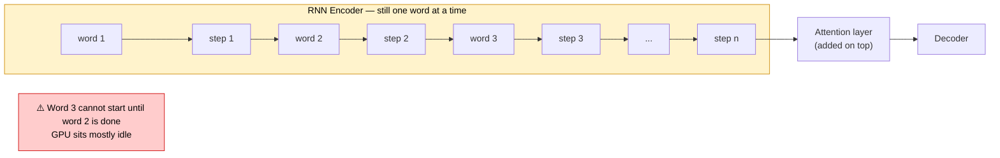

The conclusion researchers reached: **stop using an RNN at all**.

---

## How the Transformer Removed the Last Bottleneck

> **The big idea:** Skip the sequential reading entirely. Apply attention directly — between all words at once — right from the start.

This was the core insight of the 2017 paper **"Attention Is All You Need"** (Vaswani et al., Google Brain). Instead of reading words one-by-one and then letting the decoder look back, the Transformer reads the **entire sentence in parallel** using attention from the very first layer.

```
  RNN + Attention:
  ─────────────────────────────────────────────────────────────
  Encode word 1 → word 2 → word 3 → ... → word N   (sequential)
  Then apply attention on top of these hidden states.
  Time: proportional to sequence length.

  Transformer:
  ─────────────────────────────────────────────────────────────
  Embed ALL words at once.
  Apply self-attention between ALL word pairs — one matrix op.
  Repeat N times (stacked layers, all parallelisable).
  Time: one pass per layer regardless of sentence length.
```

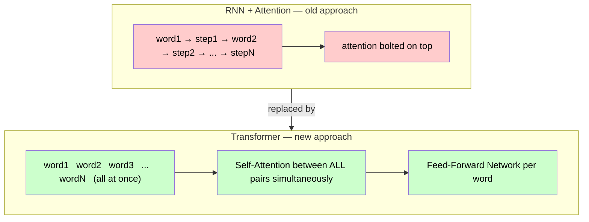

Result: faster training, better long-range connections, a cleaner and more scalable architecture.

---

## What Can a Transformer Do?

A Transformer is a general-purpose sequence machine. It is not limited to text — any data that can be broken into a sequence of tokens works.

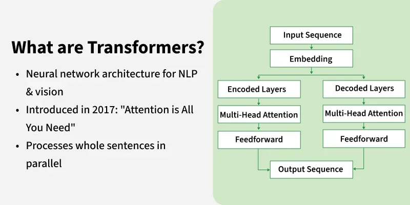

| Input | Output | Real-world example                                 |
| ----- | ------ | -------------------------------------------------- |
| Text  | Text   | Translation, summarisation, Q&A, chatbots          |
| Image | Text   | Image captioning, visual question-answering        |
| Text  | Image  | DALL·E, Stable Diffusion                           |
| Audio | Text   | Whisper (speech-to-text)                           |
| Text  | Code   | GitHub Copilot                                     |
| Text  | Text   | BERT (understanding tasks), GPT (generation tasks) |

---

## Transformer Architecture — Layer by Layer

A Transformer has two stacks — an **Encoder** that understands the input, and a **Decoder** that generates the output. Each stack contains multiple identical layers. The original paper used **6 encoder layers and 6 decoder layers**.

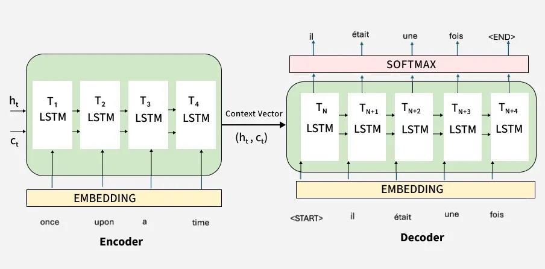


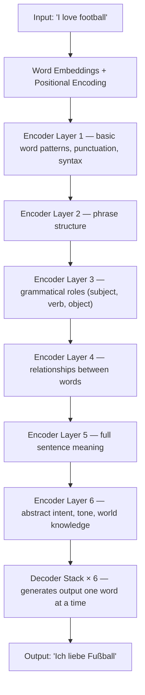

Think of each layer as a progressively smarter analyst reading the same document. The first analyst spots individual words. By the sixth, they understand the full meaning, tone, and intent.

| Layer depth             | What the model is learning                                  |
| ----------------------- | ----------------------------------------------------------- |
| **Lower layers (1–2)**  | Spelling, common word patterns, basic syntax                |
| **Middle layers (3–4)** | How words relate — phrases, grammar roles                   |
| **Higher layers (5–6)** | Abstract meaning — sentiment, intent, real-world references |

---

## Inside One Encoder Block

Every single encoder layer — whether layer 1 or layer 6 — has the same two sub-layers:

1. **Multi-Head Self-Attention** — every word looks at every other word and builds context from the whole sentence
2. **Feed-Forward Network** — each word's representation is refined independently

Between each sub-layer there is an **Add & Norm** step: the layer's input is added back to its output (residual connection) and then normalised. This keeps training stable even across many stacked layers.

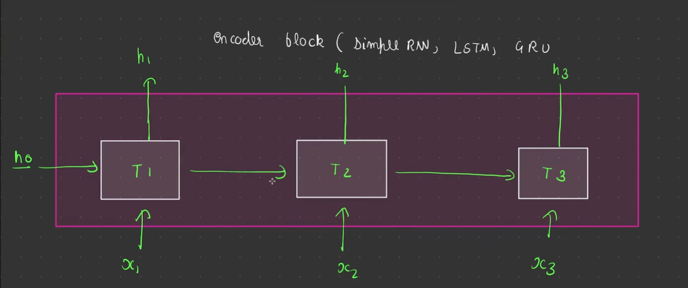

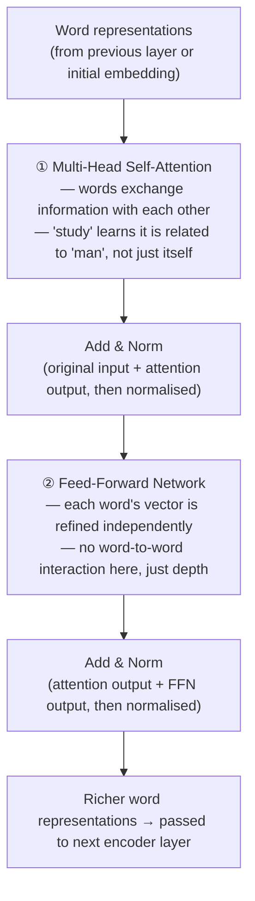

The **FFN** is a simple two-layer neural network applied to each word separately — all word interaction already happened in self-attention. The FFN just gives the model extra capacity to transform each word's updated representation.

---

## Self-Attention — A Worked Example with Real Numbers

Let's walk through the entire self-attention calculation step by step using the sentence: **"please study man"**

Each word starts as a 2-dimensional embedding (we use 2D to keep the maths small and readable):

```
  Word       Embedding
  ─────────────────────
  please     [1, 0]
  study      [0, 2]
  man        [1, 1]
```

We also have three 2×2 weight matrices — $W_Q$, $W_K$, $W_V$ — which are **learned during training**:

$$W_Q = \begin{bmatrix}1 & 0 \\ 0 & 1\end{bmatrix} \qquad W_K = \begin{bmatrix}1 & 1 \\ 0 & 1\end{bmatrix} \qquad W_V = \begin{bmatrix}1 & 0 \\ 1 & 1\end{bmatrix}$$

---

### Step 1 — Create Q, K, V for Each Word

Multiply each word's embedding by each weight matrix. This gives every word three different vectors:

```
  Word      Query (Q)    Key (K)      Value (V)
  ───────────────────────────────────────────────
  please    [1, 0]       [1, 1]       [1, 0]
  study     [0, 2]       [0, 2]       [2, 2]
  man       [1, 1]       [1, 2]       [2, 1]
```

Think of each word now having three "faces":

| Vector      | Plain English                                         |
| ----------- | ----------------------------------------------------- |
| **Query Q** | "What am I searching for in this sentence?"           |
| **Key K**   | "What kind of information do I hold?"                 |
| **Value V** | "The actual content I will share if someone needs me" |

---

### Step 2 — Raw Attention Scores (Q · Kᵀ)

For every word, compute the dot product of its **Query** with every word's **Key**. The score tells us: how relevant is word $j$ to word $i$?

$$\text{score}(i, j) = Q_i \cdot K_j$$

```
  Score matrix:
              please   study   man
  please  →  [  1   ]  [  0  ]  [  1  ]     ← Q_please · each K
  study   →  [  2   ]  [  4  ]  [  4  ]     ← Q_study  · each K
  man     →  [  2   ]  [  2  ]  [  3  ]     ← Q_man    · each K
```

Row "study" scores [2, 4, 4] — meaning from study's point of view, "study" itself and "man" are equally highly relevant (both score 4), while "please" is less so (score 2).

---

### Step 3 — Softmax → Attention Weights

Raw scores are just numbers. **Softmax** converts each row into percentages that sum to 1 — so we can interpret them as "how much attention to pay to each word":

$$\alpha_{ij} = \text{softmax}(\text{score}_{ij}) = \frac{e^{\text{score}_{ij}}}{\sum_k e^{\text{score}_{ik}}}$$

```
  Row "please"  [1, 0, 1]  →  [0.42, 0.16, 0.42]
  Row "study"   [2, 4, 4]  →  [0.06, 0.47, 0.47]
  Row "man"     [2, 2, 3]  →  [0.24, 0.24, 0.52]
```

Reading row "study": the model pays **6%** attention to "please", **47%** to itself, **47%** to "man". Study cares mostly about itself and "man".

---

### Step 4 — Weighted Sum of Values → Context Vector

Each word's new representation = blend all Value vectors weighted by the attention percentages:

$$\text{context}(\text{study}) = \sum_j \alpha_j \cdot V_j$$

```
  context(study) =  0.06 × [1, 0]   ← please's value
                  + 0.47 × [2, 2]   ← study's value
                  + 0.47 × [2, 1]   ← man's value

                 =  [0.06, 0.00]
                  + [0.94, 0.94]
                  + [0.94, 0.47]
                  ─────────────────
                 =  [1.94, 1.41]
```

"study" started as `[0, 2]`. After self-attention it becomes `[1.94, 1.41]` — a completely new vector shaped by the whole sentence, not just the word itself.

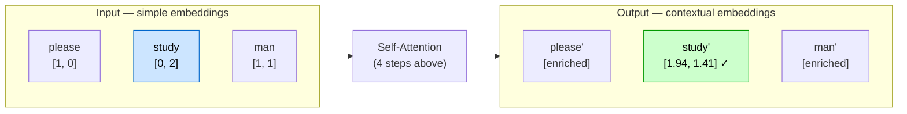

Every word goes in as a simple vector and comes out as a **context-aware vector** shaped by what it found in the whole sentence.

> **Scaling note:** In practice, the raw scores are divided by $\sqrt{d_k}$ (square root of the key vector dimension) before softmax. Here $d_k = 2$, so scores would be divided by $\sqrt{2} \approx 1.41$. This prevents very large numbers from making the softmax too sharp and killing the gradients during training.

---

### Summarising the 4 Steps

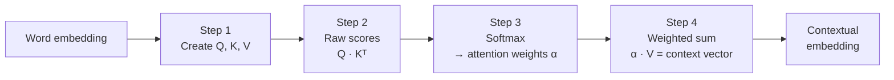

---

## Multi-Head Attention — Eight Perspectives at Once

One pass of self-attention gives you one perspective on the sentence. But a sentence carries multiple types of meaning simultaneously:

```
  "The animal didn't cross the street because it was too tired"

  Perspective 1 — Coreference:  "it" refers to "animal", not "street"
  Perspective 2 — Grammar:      "was tired" modifies the subject "it"
  Perspective 3 — Causality:    "tired" is the reason for "didn't cross"
  Perspective 4 — World knowledge: animals get tired, streets do not
```

**Multi-head attention** runs self-attention **h times in parallel**, each time with its own $W_Q, W_K, W_V$ matrices. Each "head" independently learns to focus on a different type of relationship.

```
  Embedding size = 512
  Number of heads = 8
  Each head works on: 512 ÷ 8 = 64 dimensions

  Head 1  → grammatical subject-verb links
  Head 2  → pronoun coreference ("it" → "animal")
  Head 3  → semantic similarity between words
  Head 4  → positional adjacency (nearby words)
  Head 5–8 → whatever relationships the training data taught each head
```

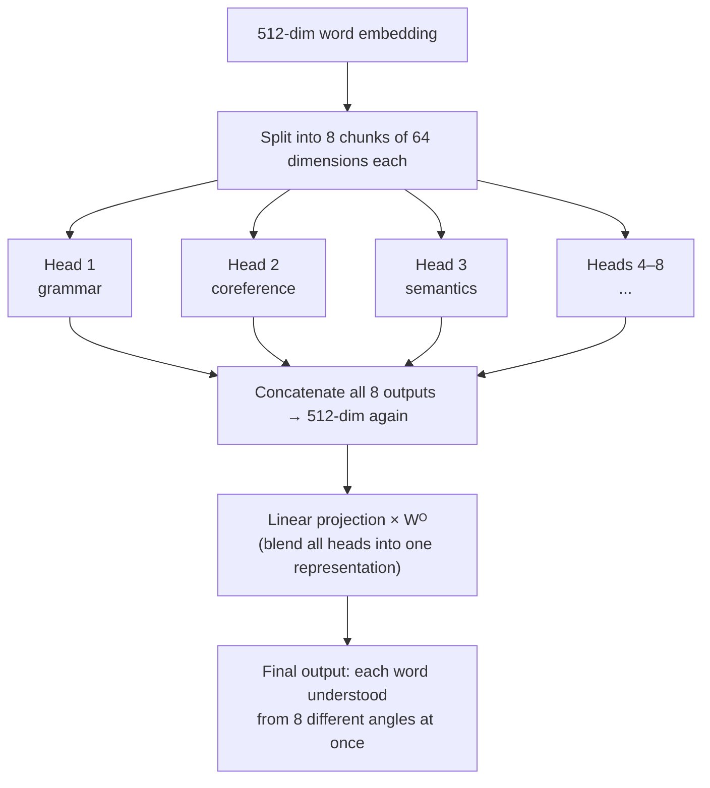

$$\text{MultiHead}(Q,K,V) = \text{Concat}(\text{head}_1, \ldots, \text{head}_h) \cdot W^O$$

Think of it like sending the same document to 8 specialist reviewers simultaneously — a grammarian, a fact-checker, a tone analyst, a coreference expert... — and combining all their notes into one final assessment. That is richer than anything one expert could produce alone.

---

## After Multi-Head Attention — Concatenate, Project, Normalise

Before the output of multi-head attention moves on to the Feed-Forward Network, three quick but important steps happen:

### Step 1 — Concatenate the Heads

Each of the 8 attention heads produced its own 64-dimensional output. We simply stack them side by side to get one big vector again:

```
  Head 1 output   [64 values]
  Head 2 output   [64 values]
       ...
  Head 8 output   [64 values]
                  ─────────────
  Concatenated    [512 values]   ← back to original embedding size
```

### Step 2 — Linear Projection (Output Weights W⁰)

The concatenated 512-dim vector is multiplied by a learned weight matrix $W^O$. This blends all the heads' perspectives into one coherent representation — rather than leaving them as 8 separate opinions sitting next to each other.

$$\text{MultiHead output} = \text{Concat}(\text{head}_1, \ldots, \text{head}_8) \cdot W^O$$

Think of it like 8 specialist reviewers handing in separate reports. The linear projection is the editor who reads all 8 and writes one final, integrated summary.

### Step 3 — Add & Norm (Residual Connection + Layer Normalisation)

$$z = \text{LayerNorm}(\text{output} + \text{original input})$$

Two things happen here in one formula:

**Residual connection (the `+ original input` part):**
The word's original representation before attention is **added back** to the attention output. This means the model always keeps hold of what the word was before — it never fully overwrites it.

> Why? Because the Transformer processes all words **in parallel**. There is no step-by-step flow like an RNN to carry information forward. Without residuals, information could be lost or distorted through many layers. Adding the original input back acts like a safety rope — the model can always "fall back" to what it started with.

**Layer normalisation (the `LayerNorm(...)` part):**
After adding, the values are normalised so they don't grow too large or too small. This keeps training stable and fast.

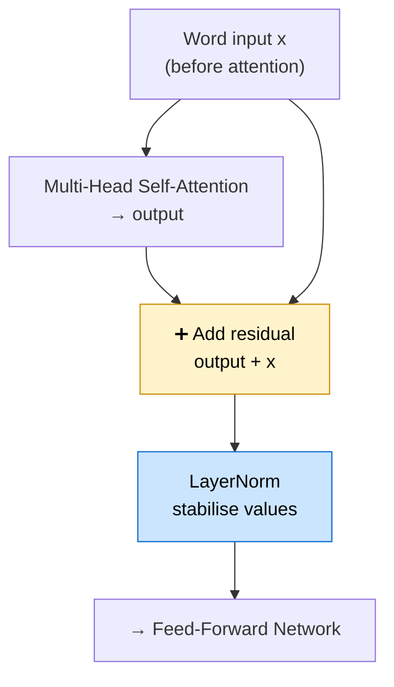

---

## Positional Encoding — Why Parallel Processing Needs It

The Transformer reads **all words at once** in parallel. That's fast — but it means the model has no built-in sense of order. The words "dog bites man" and "man bites dog" would look identical without extra information.

**Positional encoding** solves this by adding a unique position signal to each word's embedding _before_ it enters any layer. Every position gets a distinct pattern of sine and cosine values at different frequencies:

$$PE_{(pos,\ 2i)} = \sin\!\left(\frac{pos}{10000^{2i/d_{model}}}\right) \qquad PE_{(pos,\ 2i+1)} = \cos\!\left(\frac{pos}{10000^{2i/d_{model}}}\right)$$

```
  Word         Embedding      + Positional encoding   = What enters the model
  ──────────────────────────────────────────────────────────────────────────
  "I"          [0.2, 0.5, ...]  + [sin(1/...), cos(1/...)]  = unique vector at pos 1
  "love"       [0.8, 0.1, ...]  + [sin(2/...), cos(2/...)]  = unique vector at pos 2
  "football"   [0.4, 0.9, ...]  + [sin(3/...), cos(3/...)]  = unique vector at pos 3
```

The key insight: using periodic waves means the model can infer **relative distance** between words, not just their absolute positions. It can figure out "these two words are 3 positions apart" just from the pattern — even for sentences it has never seen before.

> **Analogy:** Think of seats in a cinema. The movie (word meaning) is the same, but the seat number (positional encoding) tells you exactly where each person is sitting. Same film, different seats — different coordinates.

---

## Feed-Forward Network (FFN) — Deepening Each Word's Understanding

After self-attention, every word has a new context-aware representation. The **Feed-Forward Network** then processes each word _independently_ to extract deeper patterns and enrich its meaning further.

It is a small two-layer neural network applied identically to every word:

$$\text{FFN}(x) = \text{ReLU}(x \cdot W_1 + b_1) \cdot W_2 + b_2$$

```
  Input embedding   (512 dimensions)
          ↓
  Linear layer      (expand to 2048 dimensions)   ← more capacity
          ↓
  ReLU activation   (non-linearity — lets model learn complex patterns)
          ↓
  Linear layer      (compress back to 512 dimensions)
          ↓
  Output embedding  (512 dimensions — same size, richer meaning)
```

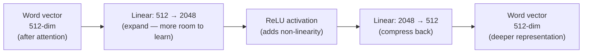

**Key difference from attention:** There is zero communication between words here. Attention is where words _talk to each other_. FFN is where each word _thinks for itself_ — same network weights, applied separately to every token.

> **Analogy:** Attention is the team meeting where everyone exchanges ideas. The FFN is the individual work time afterwards — each person privately processes what they learned and develops it further.

---

## Multiple Encoder Layers — Building Up Understanding Gradually

A single encoder layer gives you one round of context + refinement. The Transformer stacks **6 of these layers** (in the original paper) and the understanding deepens at every level:

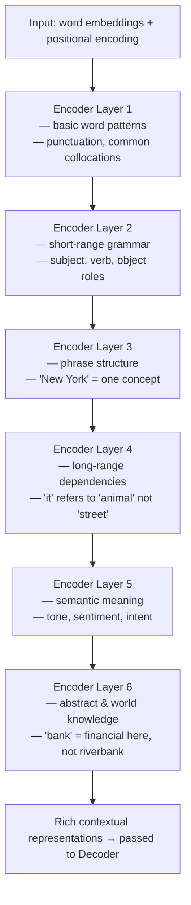

| Layer | What it learns                                               |
| ----- | ------------------------------------------------------------ |
| 1–2   | Basic syntax, spelling patterns, adjacent-word relationships |
| 3–4   | Phrase boundaries, grammatical roles, medium-range links     |
| 5–6   | Abstract meaning, real-world knowledge, full sentence intent |

Just like a deep ANN learns more abstract features in deeper layers (edges → shapes → faces in a CNN), a Transformer's encoder learns more abstract language features layer by layer.

---

## The Decoder Stack — Generating the Output

The decoder's job is to produce the output sequence one token at a time. It has **three sub-layers** per block (vs. two in the encoder):

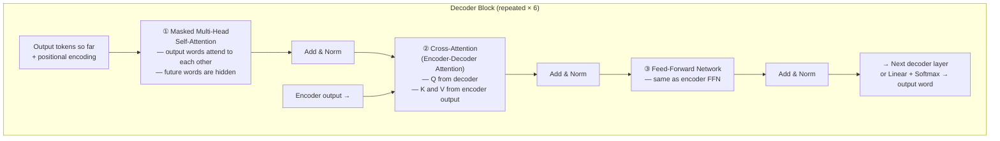

| Sub-layer                 | Purpose                                                                 |
| ------------------------- | ----------------------------------------------------------------------- |
| **Masked Self-Attention** | Output words understand each other — but cannot peek at future words    |
| **Cross-Attention**       | Each output word looks at the encoder's full understanding of the input |
| **Feed-Forward**          | Deepen each output word's representation independently                  |

---

## Training vs Inference — Two Very Different Modes

This is one of the most important and often-overlooked aspects of how Transformers work. The model behaves **differently** during training vs. when you actually use it.

### Training — Fast, Parallel, Non-Autoregressive

During training, the model sees the **entire correct output sentence at once**. All output words are fed in parallel — this is called **teacher forcing**.

```
  Target (correct translation):  "Ich liebe Fußball"

  Training input to decoder:     [<start>] [Ich]   [liebe]
  Training target from decoder:  [Ich]     [liebe] [Fußball]

  All three predictions happen simultaneously — one forward pass.
  Very fast. Uses the full power of the GPU.
```

**Problem without masking:** If all words are fed in parallel, word 3 ("Fußball") could see its own answer while predicting it. That is **data leakage** — the model would learn to cheat, not to generate. It would overfit badly and fail completely at inference time.

### Inference — Slow, Sequential, Autoregressive

At inference (when you actually use the model), there is no correct answer to feed in. The model must generate word-by-word, using its own previous outputs as input:

```
  Step 1:  [<start>]              → predict "Ich"
  Step 2:  [<start>] [Ich]        → predict "liebe"
  Step 3:  [<start>] [Ich] [liebe] → predict "Fußball"
  Step 4:  → predict "<end>"       → stop
```

This is **autoregressive** — each step depends on all previous steps. It is slower, but there is no leakage problem because the future simply doesn't exist yet.

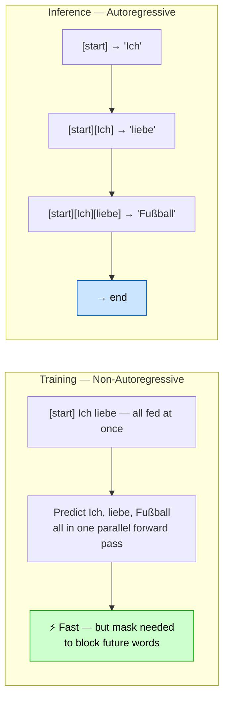

---

## Masked Multi-Head Attention — Stopping the Decoder from Cheating

The decoder uses self-attention just like the encoder — every output word can look at every other output word. But during training this creates a **data leakage problem**.

> Imagine you are a student taking an exam. You write your answer to question 3, but you can already see the model answer for question 3 right next to it. You would just copy it — no learning happens.

The fix is **masking**: before applying softmax to the attention scores, all future positions are set to $-\infty$:

$$\text{score}(i, j) = -\infty \quad \text{if } j > i$$

After softmax, $-\infty$ becomes 0 — those positions contribute nothing to the context vector.

```
  Generating word 2 ("liebe"):

  Attention scores for word 2:
                word1    word2    word3
                [Ich]  [liebe]  [Fußball]
  word2 sees:   [2.1]   [1.8]    [-∞]      ← Fußball is masked

  After softmax:
                [0.57]  [0.43]   [0.00]    ← 0% attention to future word

  Result: "liebe" only draws context from past and present — never future.
```

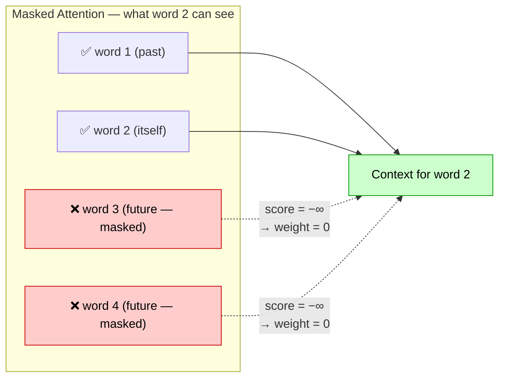

This is called **causal masking** (or autoregressive masking). It makes training fast (parallel) while keeping it honest (no leakage).

---

## Cross-Attention — The Bridge Between Encoder and Decoder

After masked self-attention, the decoder runs a second attention layer called **cross-attention** (also called encoder-decoder attention). This is where the decoder finally looks at the encoder's output — the full understanding of the input sentence.

The key difference from self-attention: **Q, K, V come from different sources**.

```
  Self-Attention:    Q, K, V all come from the same sequence
  Cross-Attention:   Q comes from the decoder's current state
                     K and V come from the encoder's output
```

| Vector      | Where it comes from              | What it means                                 |
| ----------- | -------------------------------- | --------------------------------------------- |
| **Query Q** | Decoder's current output word    | "What input information do I need right now?" |
| **Key K**   | Encoder output (all input words) | "What does each input word contain?"          |
| **Value V** | Encoder output (all input words) | "The actual input content to borrow from"     |

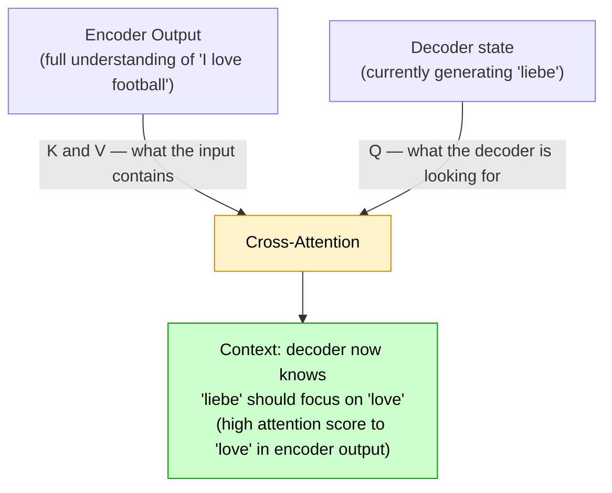

This is what allows translation to work. When generating "liebe", the decoder's query matches the encoder's key for "love" — high attention score — and borrows its value. The decoder is essentially asking the encoder: "which of your words is most relevant to what I am producing right now?"

---

## Reference Material

> [transformer_and_attention_mechanism.pdf](transformer_and_attention_mechanism.pdf) — full paper and diagrams

> [transformer_illusterated.pdf](transformer_illusterated.pdf) — illustrated step-by-step Transformer walkthrough

---
